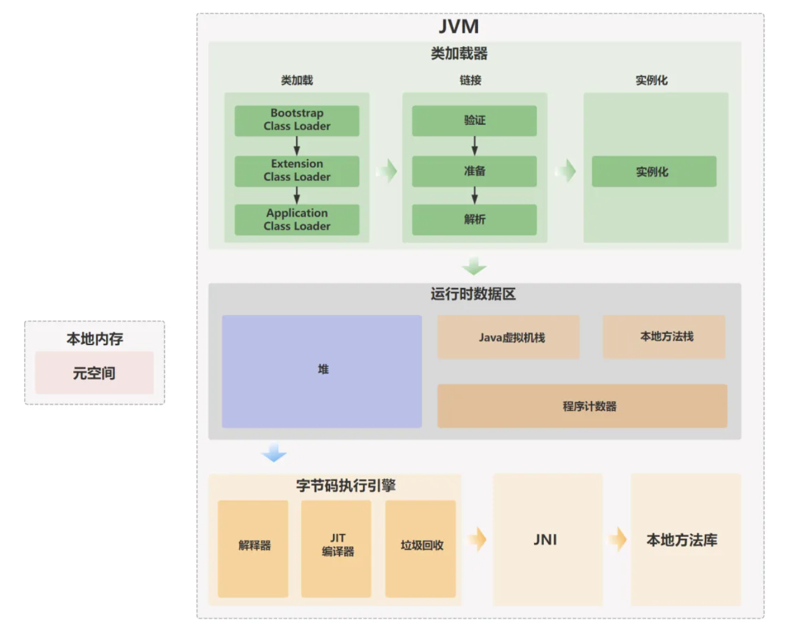

# 👌JVM主要组成部分有哪些？

# 题目详细答案


## 类加载子系统
类加载子系统负责将 .class 文件加载到内存中，并进行验证、准备、解析和初始化。

**主要功能**：

**加载**：从文件系统或网络中读取 .class 文件。

**验证**：确保字节码文件的正确性和安全性。

**准备**：为类的静态变量分配内存并设置默认初始值。

**解析**：将符号引用转换为直接引用。

**初始化**：执行类的静态初始化块和静态变量的初始化。

## 运行时数据区
JVM 在运行时将内存划分为多个不同的数据区域，每个区域都有特定的用途。

**方法区（Method Area）**：存储已加载的类信息、常量、静态变量、即时编译器编译后的代码等。

**堆（Heap）**：存储所有对象实例和数组，是垃圾收集的主要区域。

**Java 栈（Java Stacks）**：每个线程都有自己的 Java 栈，存储局部变量表、操作数栈、动态链接、方法返回地址等信息。

**本地方法栈（Native Method Stacks）**：为本地方法调用服务，存储本地方法调用的状态。

**程序计数器（Program Counter Register）**：每个线程都有自己的程序计数器，指示当前线程执行的字节码行号。

## 执行引擎
执行引擎负责执行字节码指令。

**主要组件**：

**解释器（Interpreter）**：逐条解释执行字节码指令，速度较慢。

**即时编译器（Just-In-Time Compiler, JIT）**：将热点代码（频繁执行的代码）编译为本地机器码，提高执行速度。

**垃圾收集器（Garbage Collector, GC）**：自动管理内存，回收不再使用的对象，防止内存泄漏。

## 本地接口
本地接口（通常是 Java Native Interface, JNI）允许 Java 代码与本地（非 Java）代码进行交互。

**主要功能**：

调用本地方法（通常是用 C 或 C++ 编写的）。

允许 Java 代码使用操作系统特性或访问硬件。

## 本地方法库
本地方法库是存储本地方法实现的动态链接库（如 .dll 文件或 .so 文件）。

**主要功能**：

提供本地方法的具体实现。

由本地接口调用以执行本地代码。

### JVM 主要组成部分的图示
```plain
+---------------------------+
|     类加载子系统 (Class Loader Subsystem)    |
+---------------------------+
|         运行时数据区 (Runtime Data Area)         |
|  - 方法区 (Method Area)                        |
|  - 堆 (Heap)                                   |
|  - Java 栈 (Java Stacks)                       |
|  - 本地方法栈 (Native Method Stacks)           |
|  - 程序计数器 (Program Counter)                |
+---------------------------+
|          执行引擎 (Execution Engine)           |
|  - 解释器 (Interpreter)                        |
|  - 即时编译器 (Just-In-Time Compiler, JIT)      |
|  - 垃圾收集器 (Garbage Collector, GC)          |
+---------------------------+
|         本地接口 (Native Interface)            |
+---------------------------+
|     本地方法库 (Native Method Libraries)      |
+---------------------------+
```


> 原文: <https://www.yuque.com/jingdianjichi/xyxdsi/aepvyqpgg2nlmgh4>