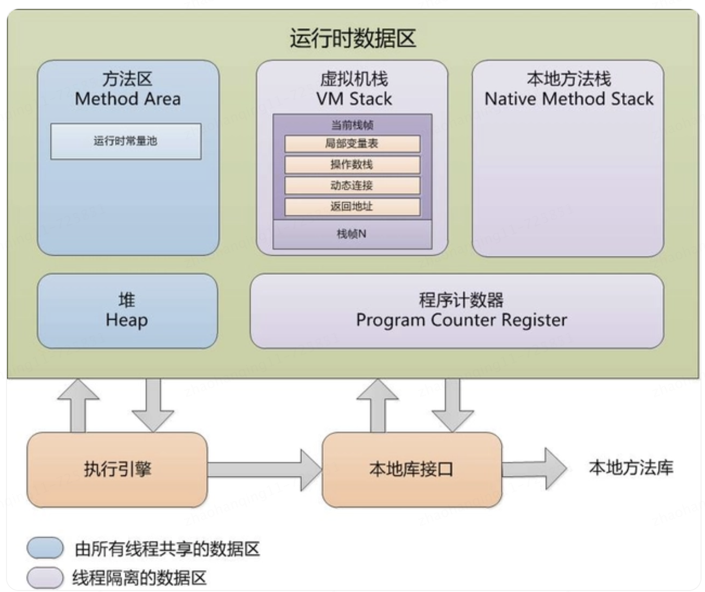

# 👌jvm 运行时的数据区域如何理解?

# 题目详细答案
Java 虚拟机（JVM）在运行时将内存划分为若干不同的数据区域，每个区域都有特定的用途。

## JVM 运行时数据区域
JVM 运行时数据区域主要包括以下几个部分：

**方法区 (Method Area)**

**堆 (Heap)**

**Java 栈 (Java Stacks)**

**本地方法栈 (Native Method Stacks)**

**程序计数器 (Program Counter Register)**

### 方法区 (Method Area)
方法区是所有线程共享的内存区域，用于存储已被 JVM 加载的类信息、常量、静态变量、即时编译器编译后的代码等数据。

**功能**：

存储类的结构信息（如类的名称、访问修饰符、字段描述、方法描述等）。

存储运行时常量池，包括字面量和符号引用。

存储静态变量。

存储编译后的代码。

在 HotSpot JVM 中，方法区的一部分实现为永久代（PermGen），在 Java 8 及以后版本中被称为元空间（Metaspace）。

### 堆 (Heap)
堆是所有线程共享的内存区域，用于存储所有对象实例和数组。

**功能**：

动态分配对象内存。

垃圾收集器主要在堆上工作，回收不再使用的对象内存。

堆通常分为年轻代（Young Generation）和老年代（Old Generation），年轻代又进一步划分为 Eden 区和两个 Survivor 区（S0 和 S1）。

### Java 栈 (Java Stacks)
每个线程都有自己的 Java 栈，栈帧（Stack Frame）在栈中按顺序存储。

**功能**：

存储局部变量表、操作数栈、动态链接、方法返回地址等信息。

每调用一个方法，就会创建一个新的栈帧，方法执行完毕后栈帧被销毁。

栈帧包括：

局部变量表：存储方法的局部变量，包括参数和方法内部的局部变量。

操作数栈：用于操作数的临时存储。

动态链接：指向常量池的方法引用。

方法返回地址：方法调用后的返回地址。

### 本地方法栈 (Native Method Stacks)
本地方法栈与 Java 栈类似，但它为本地（Native）方法服务。

**功能**：

存储本地方法调用的状态。

一些 JVM 使用 C 栈来支持本地方法调用。

### 程序计数器 (Program Counter Register)
每个线程都有自己的程序计数器，是一个很小的内存区域。

**功能**：

当前线程所执行的字节码的行号指示器。

如果当前执行的是本地方法，这个计数器值为空（Undefined）。

> 原文: <https://www.yuque.com/jingdianjichi/xyxdsi/lq96p70epgghevqw>