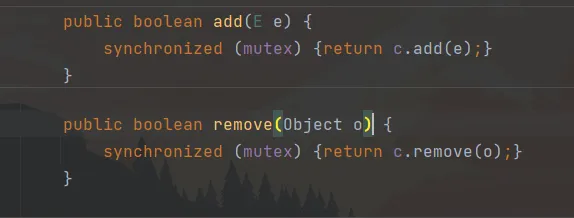

# 👌ArrayList如何保证线程安全？

# 题目详细答案
## 借助锁
可以通过在访问 ArrayList 的代码块上使用 synchronized 关键字来手动同步对 ArrayList 的访问。这要求所有访问 ArrayList 的代码都知道并使用相同的锁。

```plain
List<String> list = new ArrayList<>();
// ... 填充列表 ...

synchronized(list) {
    Iterator<String> it = list.iterator();
    while (it.hasNext()) {
        String element = it.next();
        // 处理元素...
    }
}
```


## 使用 Collections.synchronizedList
Collections.synchronizedList 方法返回一个线程安全的列表，该列表是通过在每个公共方法（如 add(), get(), iterator() 等）上添加同步来实现的，其中同步是基于里面的同步代码块实现。但是，和手动同步一样，它也不能解决在迭代过程中进行结构修改导致的问题。



```plain
List<String> list = Collections.synchronizedList(new ArrayList<>());
```

## 使用并发集合
Java 并发包 java.util.concurrent 提供了一些线程安全的集合类，如 CopyOnWriteArrayList。这些类提供了不同的线程安全保证和性能特性。

CopyOnWriteArrayList是一个线程安全的变体，其中所有可变操作（add、set 等等）都是通过对底层数组进行新的复制来实现的。因此，迭代器不会受到并发修改的影响，并且遍历期间不需要额外的同步。但是，当有很多写操作时，这种方法可能会很昂贵，因为它需要在每次修改时复制整个底层数组。

```plain
List<String> list = new CopyOnWriteArrayList<>();
```

选择解决方案时，需要考虑并发模式、读写比例以及性能需求。如果你的应用主要是读操作并且偶尔有写操作，CopyOnWriteArrayList是一个好选择。如果你的应用有大量的写操作，那么可能需要使用其他并发集合或手动同步策略。


> 原文: <https://www.yuque.com/jingdianjichi/xyxdsi/hkx8lgbi0mny13uc>