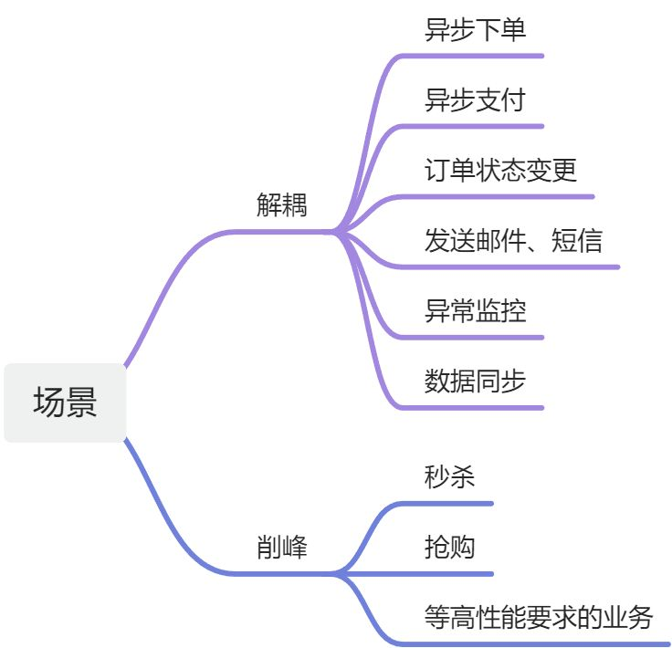

# 👌MQ 使用场景有哪些？

[此处为语雀卡片，点击链接查看](https://www.yuque.com/jingdianjichi/xyxdsi/gsgm1foh2g55bdcf#GkNRq)

# 口语化回答
好的，面试官，mq 更多应用于分布式的服务架构，起到流量削峰和系统解耦的作用。作为发送方是告知其他系统（或者是自产自销）自身的业务数据发生变化，而不过多在意消费方的业务细节。而作为消费方需要关注消息发送的实际场景，以及实现自己的业务细节。

具体场景比如用户下完单后对外通知订单状态的变更，实现了功能的解耦、秒杀场景通过MQ来处理已经获取秒杀资格的订单，保证实时秒杀的性能、对于一些可以从主流程剥离出来且不需要立即处理的场景都可以使用MQ 比如发送邮件短信、另外数据同步的场景也可以使用MQ来实现。

以上

# 题目解析
这是一道基础必会题，如果不会的话，后面可能基本不会问MQ相关了。重点考察MQ到底是为了解决实际业务中什么问题。也就是说在用的同时，要知道为什么用，什么情况可以用，什么情况不适合用。

# 面试得分点
重点的削峰、解耦举几个场景

# 题目详细答案

## 异步通信场景：
MQ可以实现消息的异步传递，避免了请求等待的时间，提高了系统的响应速度和吞吐量。

常见的应用场景有异步下单、异步支付等，例如在电商平台中，当用户下单或支付后，这些操作可以被转化为消息发送至MQ，由后台服务异步处理，而用户无需等待操作完成即可进行其他操作。

## 分布式系统场景：
MQ可以在分布式系统中实现各个节点之间的高效通信，解决网络延迟、网络抖动等问题。

常见的应用场景有分布式任务调度、分布式事务等。例如，在微服务架构中，服务之间的数据交互可以通过MQ实现，降低服务的耦合度，提高系统的可扩展性和可维护性。

## 解耦系统场景：
MQ可以将系统各个模块之间的耦合度降低，实现系统的解耦。

常见的应用场景有日志收集、异常监控等。通过使用MQ，可以将这些操作从主业务逻辑中分离出来，降低系统的复杂性。

## 流量削峰场景：
MQ可以在高并发场景下，实现流量的削峰，避免系统崩溃或响应变慢。

常见的应用场景有秒杀、活动抢购等。通过使用MQ缓存请求，后台服务可以按顺序处理，避免大量请求直接冲击系统。

## 消息通知场景：
MQ可以实现消息的实时通知，提高用户体验。

常见的应用场景有订单状态变更通知、短信验证码发送等。用户可以在无需主动查询的情况下，实时获取到最新的信息。

## 数据同步场景：
MQ可以实现不同系统之间数据的同步，保证数据的一致性。

常见的应用场景有缓存同步、库存同步等。当某个系统修改了共享数据后，可以通过MQ通知其他系统同步数据。

> 原文: <https://www.yuque.com/jingdianjichi/xyxdsi/gsgm1foh2g55bdcf>