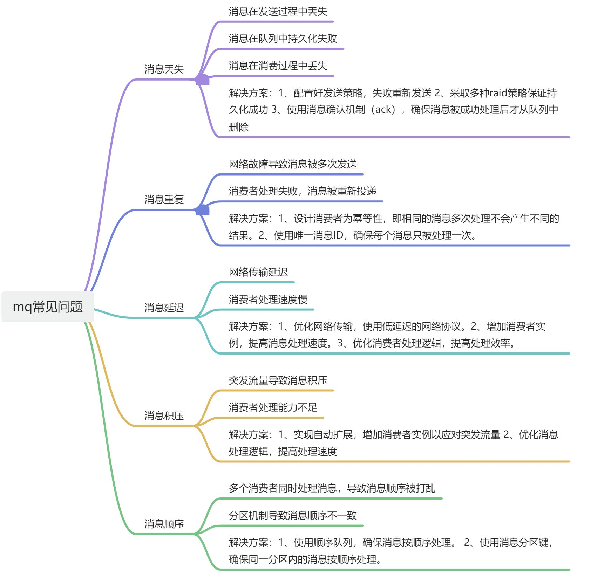

# 👌Mq可能会有哪些常见问题？

# 口语化回答
好的面试官，mq 主要问题就是消息丢失，重复，顺序性等问题，像消息丢失，常见的可能是发送的时候丢失，或者队列丢失，或者消费失败，导致丢失。这种情况下，我们可以采取好发送的时候，做好验证，持久化一般 mq 都有响应的 raid 策略，消费的时候做好 ack 机制，可以处理。像重复问题，我们要做好幂等性处理，防止消息多次发送和重复消费。顺序问题，我们可以用队列的顺序模式，也可以确保使用分区机制，来保证消费。以上

# 题目解析
这道题还是很长考的，面试官会根据你说的常见问题的情况，来深入的进行讨论。所以大家选择的时候，要达以下几个点，比较熟悉的问题来说。

# 面试得分点
丢失，延迟，积压，顺序性。

# 题目详细答案
常见问题以下几类：

> 原文: <https://www.yuque.com/jingdianjichi/xyxdsi/gw5caws637aug43x>