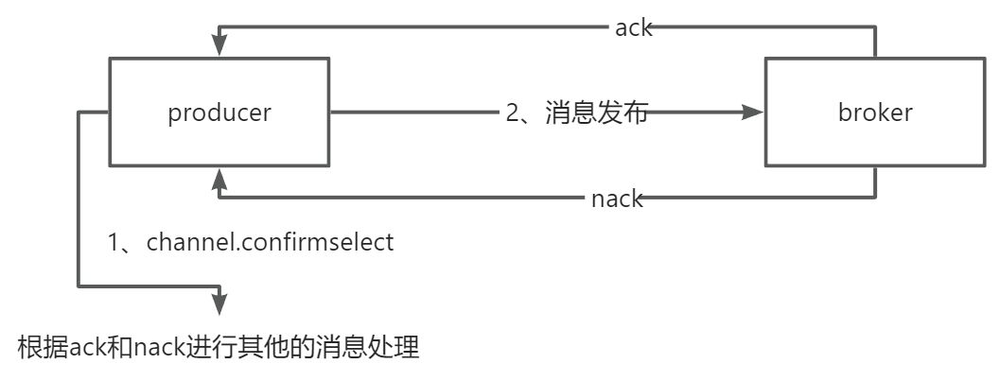
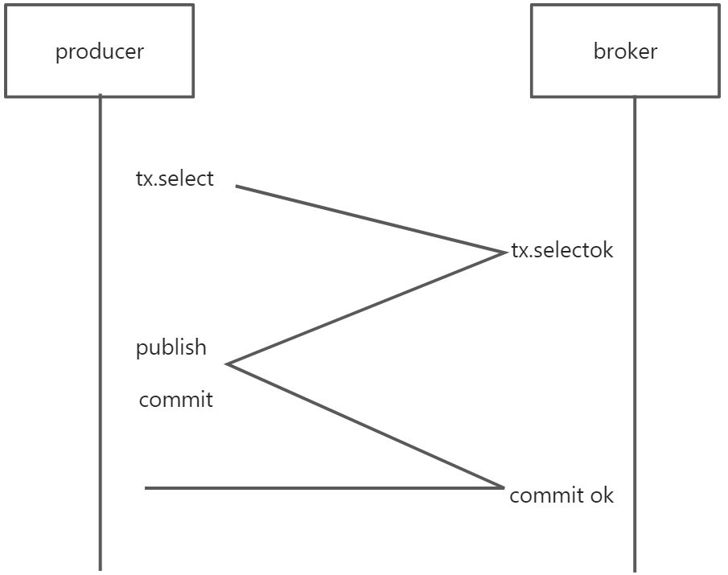

# 👌RabbitMQ如何保障消息正确发送?如何确保消息正常消费?

[此处为语雀卡片，点击链接查看](https://www.yuque.com/jingdianjichi/xyxdsi/gmh1oks0b5c7smma#YGImB)

# 口语化答案
好的，面试官。先来说，如何保障正确发送。最常见的方式就是使用发送者确认机制，我们可以通过客户端开启确认，可以使用同步或者异步等待 broker 告诉我们是否收到了消息。另一种就是事务机制，事务机制类似于 mysql 的事务，保证消息的全部成功或者失败回滚。关于消息正常消费，就是 ack 机制，所有的消息在消费者如果消费成功之后，就会发送一个 ack 的信号，broker 收到之后，就认为消息正常消费了，否则会进行重试等，继续找到消费者消费。以上。

# 题目解析
非常常考的一道题，大家在答的时候，答出确认机制和 ack 机制，基本就成功一大半了。事务机制可以锦上添花。

# 面试得分点
确认机制，事务机制，ack 机制

# 题目详细答案
## 确保消息正确地发送至 RabbitMQ
RabbitMQ 提供了确认模式，发布者可以在消息成功到达 Broker 时收到确认。在 Java 客户端中，可以通过Channel.confirmSelect()开启确认模式，并使用Channel.waitForConfirms()或异步方式Channel.addConfirmListener()来处理确认回调。

如果说 rabbitmq 发生了故障，也会告诉发送者一个不确认的消息，生产者得到消息后，可以进行其他的业务操作。



```plain
ConnectionFactory factory = new ConnectionFactory();
factory.setHost("localhost");
try (Connection connection = factory.newConnection();
    Channel channel = connection.createChannel()) {
    channel.confirmSelect();
    String message = "Hello, RabbitMQ!";
    channel.basicPublish("", "queue_name", null, message.getBytes());

    if (channel.waitForConfirms()) {
        System.out.println("Message sent successfully.");
    } else {
        System.out.println("Message sending failed.");
    }
}
```

另一种确保消息发送成功的方法是使用事务模式。在事务模式下，消息只有在事务提交后才会被发送。这种方法会带来额外的开销，因此一般在需要强一致性的场景下使用。

首先要使用 channel 开启 txselect。broker 一旦收到了命令就会返回一个 select-ok 命令。然后在发送消息的时候，执行 commit。

这就很像 mysql 的事务机制。成功或者回滚。



```plain
ConnectionFactory factory = new ConnectionFactory();
factory.setHost("localhost");
try (Connection connection = factory.newConnection();
    Channel channel = connection.createChannel()) {
    channel.txSelect();
    String message = "Hello, RabbitMQ!";
    channel.basicPublish("", "queue_name", null, message.getBytes());
    channel.txCommit();
    System.out.println("Message sent successfully.");
} catch (IOException | TimeoutException e) {
    channel.txRollback();
    e.printStackTrace();
}
```

## 确保消息接收方消费了消息
消费者在成功处理消息后，发送一个确认（ACK）给 RabbitMQ，以告知 Broker 该消息已经被成功处理。如果消费者未能确认消息（例如，消费者崩溃），RabbitMQ 会重新将消息投递给其他消费者。

```plain
ConnectionFactory factory = new ConnectionFactory();
factory.setHost("localhost");
try (Connection connection = factory.newConnection();
    Channel channel = connection.createChannel()) {
    boolean autoAck = false;
    channel.basicConsume("queue_name", autoAck, (consumerTag, delivery) -> {
        String message = new String(delivery.getBody(), "UTF-8");
        System.out.println("Received message: " + message);
        channel.basicAck(delivery.getEnvelope().getDeliveryTag(), false);
    }, consumerTag -> {});
}
```


> 原文: <https://www.yuque.com/jingdianjichi/xyxdsi/gmh1oks0b5c7smma>