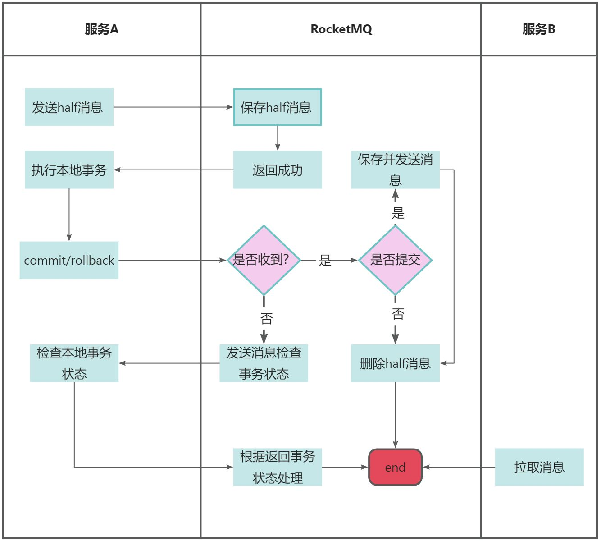

# 👌RocketMQ在分布式事务下的底层原理？

# 口语化回答
好的，面试官。RocketMQ的事务主要是通过两阶段提交来实现的，首先生产者会先发送一条预备消息，这个消息会被持久化但不会被消费者感知。生产者在发送预备消息后，可以继续执行本地事务，比如更新数据库。如果本地事务执行成功，生产者会向RocketMQ发送一个提交请求，把预备消息转换为正式消息，此时会被消费方感知，如果执行失败则会删除预备消息。如果生产者提交预备消息后，没有给MQ提交或者回滚的消息，那MQ还有一个回查的机制，来反查事务的最终机制。

以上

# 题目解析
MQ分布式事务的必考题。

# 面试得分点
两阶段提交、预备消息、提交或回滚消息、回查机制。

# 题目详细答案
RocketMQ 提供了分布式事务支持，主要通过两阶段提交（Two-Phase Commit）协议来实现。





## 事务消息发送流程
分布式事务消息发送过程分为三个阶段：准备阶段、提交/回滚阶段和事务状态检查阶段。

### 准备阶段（Prepare Phase）
在这个阶段，消息生产者发送一条预备消息（Prepare Message）到 RocketMQ Broker。预备消息会被持久化到 Broker，但不会被消费者消费。

```plain
TransactionMQProducer producer = new TransactionMQProducer("ProducerGroupName");
producer.setNamesrvAddr("localhost:9876");
producer.start();

// 定义事务监听器
TransactionListener transactionListener = new TransactionListenerImpl();
producer.setTransactionListener(transactionListener);

Message msg = new Message("TopicTest", "TagA", ("Hello RocketMQ").getBytes());
TransactionSendResult result = producer.sendMessageInTransaction(msg, null);
System.out.printf("%s%n", result);
```

### 提交/回滚阶段（Commit/Rollback Phase）
在本地事务执行完毕后，生产者会根据本地事务的执行结果来提交（Commit）或回滚（Rollback）之前的预备消息。提交消息会使得消息对消费者可见，而回滚消息则会删除预备消息。

```plain
public class TransactionListenerImpl implements TransactionListener {
    @Override
    public LocalTransactionState executeLocalTransaction(Message msg, Object arg) {
        // 执行本地事务逻辑
        boolean success = executeLocalBusinessLogic();
        if (success) {
            return LocalTransactionState.COMMIT_MESSAGE;
        } else {
            return LocalTransactionState.ROLLBACK_MESSAGE;
        }
    }

    @Override
    public LocalTransactionState checkLocalTransaction(MessageExt msg) {
        // 检查本地事务状态
        boolean success = checkLocalTransactionStatus();
        if (success) {
            return LocalTransactionState.COMMIT_MESSAGE;
        } else {
            return LocalTransactionState.ROLLBACK_MESSAGE;
        }
    }
}
```

### 事务状态检查阶段（Transaction Status Check Phase）
如果在预备消息发送之后，由于网络或其他原因导致生产者未能及时提交或回滚事务，Broker 会定期向生产者询问事务的状态。生产者需要实现checkLocalTransaction方法来返回事务的实际状态。

## 事务消息的存储和状态管理
RocketMQ 在 Broker 端会持久化预备消息，并在消息的元数据中记录其状态（准备中、已提交、已回滚）。当生产者提交或回滚事务时，Broker 会更新消息的状态。

## 消费者处理事务消息
消费者在消费消息时，不会区分事务消息和普通消息。事务消息在被提交后，消费者才能消费到这些消息。

## 事务消息的可靠性保证
**消息持久化**：RocketMQ 对预备消息进行持久化存储，确保消息不会丢失。

**事务状态检查**：通过事务状态检查机制，确保最终事务的一致性。

**重试机制**：在事务消息的各个阶段都有重试机制，确保消息的可靠传递和处理。

### 事务消息的示例代码
```plain
public class TransactionProducer {
    public static void main(String[] args) throws MQClientException {
        TransactionMQProducer producer = new TransactionMQProducer("ProducerGroupName");
        producer.setNamesrvAddr("localhost:9876");
        producer.setTransactionListener(new TransactionListenerImpl());
        producer.start();

        try {
            Message msg = new Message("TopicTest", "TagA", ("Hello RocketMQ").getBytes());
            TransactionSendResult result = producer.sendMessageInTransaction(msg, null);
            System.out.printf("%s%n", result);
        } catch (MQClientException e) {
            e.printStackTrace();
        }

        // 保持生产者运行，模拟执行本地事务
        Runtime.getRuntime().addShutdownHook(new Thread(producer::shutdown));
    }
}

class TransactionListenerImpl implements TransactionListener {
    @Override
    public LocalTransactionState executeLocalTransaction(Message msg, Object arg) {
        // 执行本地事务逻辑
        boolean success = executeLocalBusinessLogic();
        if (success) {
            return LocalTransactionState.COMMIT_MESSAGE;
        } else {
            return LocalTransactionState.ROLLBACK_MESSAGE;
        }
    }

    @Override
    public LocalTransactionState checkLocalTransaction(MessageExt msg) {
        // 检查本地事务状态
        boolean success = checkLocalTransactionStatus();
        if (success) {
            return LocalTransactionState.COMMIT_MESSAGE;
        } else {
            return LocalTransactionState.ROLLBACK_MESSAGE;
        }
    }

    private boolean executeLocalBusinessLogic() {
        // 模拟本地事务执行
        return true; // 返回事务执行结果
    }

    private boolean checkLocalTransactionStatus() {
        // 模拟检查本地事务状态
        return true; // 返回事务状态
    }
}
```


> 原文: <https://www.yuque.com/jingdianjichi/xyxdsi/fmg1wke6dpmmvuri>