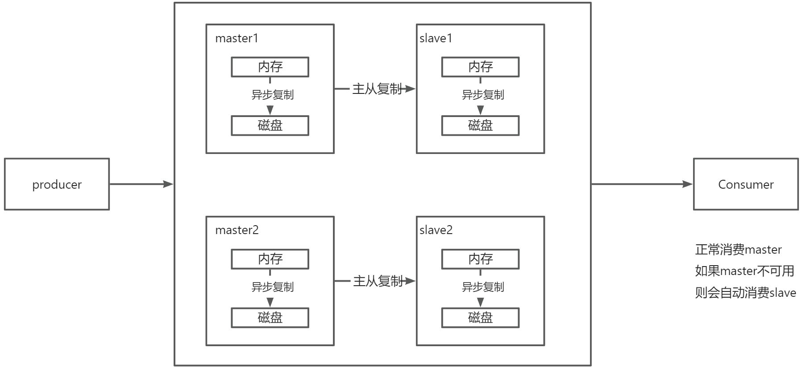

# 👌RocketMQ如何保证消息不丢失？

[此处为语雀卡片，点击链接查看](https://www.yuque.com/jingdianjichi/xyxdsi/lwdp5p7hcrg3ov41#MoA52)

# 口语化回答
好的，面试官，rocketmq 保证消息不丢失，主要是通过持久化机制，主从复制，确认机制来保证的。像持久化机制，主要是刷盘，将内存的消息，刷到磁盘中，采取 raid 策略来完成。刷盘分为同步和异步，可以根据情况选择。其次就是主从复制，从 mq 会复制主服务器的消息，来保证主服务器即使挂了，消息也不丢失的情况。最后就是确认机制，每次消息在消费者消费的情况下，消费者如果消费成功，会发送一个 ack 的信号，来保障消息确实被正确消费。以上。

# 题目解析
重点题，这几种机制其实反复出现过很多次了。大家一定要记住。结合下面的一张图，可以非常清晰的了解到。

# 面试得分点
持久化，主从复制，确认机制，重试机制

# 题目详细答案


## 消息持久化
主要是靠的刷盘机制。RocketMQ 的磁盘消息保存在磁盘上，支持同步刷盘和异步刷盘两种方式，通过刷盘机制可以确保消息在Broker宕机时不会丢失。

**同步刷盘（SYNC_FLUSH）**：消息写入后，立即同步刷盘，确保消息持久化到磁盘。同步刷盘虽然会增加延迟，但极大地提高了消息的可靠性。

```plain
flushDiskType=SYNC_FLUSH
```

**异步刷盘（ASYNC_FLUSH）**：消息写入后，异步刷盘，性能较高，但可靠性略低于同步刷盘。

```plain
flushDiskType=ASYNC_FLUSH
```

## 主从复制
RocketMQ 支持主从复制，通过将消息从主节点复制到从节点来提高消息的可靠性。主节点负责写入和读取，从节点负责复制数据。

**同步复制（SYNC_MASTER）**：消息写入主节点后，立即同步复制到从节点，确保消息在主从节点都存在。同步复制提高了消息的可靠性，但会增加写入延迟。

```plain
brokerRole=SYNC_MASTER
```

**异步复制（ASYNC_MASTER）**：消息写入主节点后，异步复制到从节点，性能较高，但可靠性略低于同步复制。

```plain
brokerRole=ASYNC_MASTER
```

## 消息确认机制
RocketMQ 提供了消息确认机制，确保消息被消费者成功处理。

**消费者确认**：消费者处理完消息后，向 RocketMQ 发送确认（ack）。如果消费者未确认消息（如消费者崩溃），RocketMQ 会将消息重新投递给其他消费者。

```plain
// 消费者处理消息
consumer.registerMessageListener(newMessageListenerConcurrently() {
    @Override
    public ConsumeConcurrentlyStatus consumeMessage(List<MessageExt> msgs, ConsumeConcurrentlyContext context) {
        // 处理消息逻辑
        return ConsumeConcurrentlyStatus.CONSUME_SUCCESS; // 处理成功
    }
});
```

## 重试机制
RocketMQ 提供了消息重试机制，确保消息在处理失败时不会丢失。

**生产者重试**：生产者在消息发送失败时，可以进行重试，确保消息成功发送。

```plain
producer.setRetryTimesWhenSendFailed(3); // 设置重试次数
```

**消费者重试**：消费者在处理消息失败时，RocketMQ 会自动进行重试，直到消息被成功处理或达到最大重试次数。

```plain
consumer.setMaxReconsumeTimes(5); // 设置最大重试次数
```


> 原文: <https://www.yuque.com/jingdianjichi/xyxdsi/lwdp5p7hcrg3ov41>