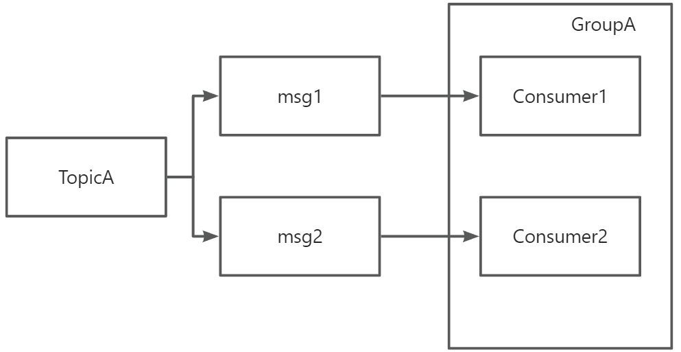
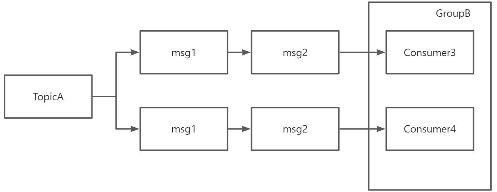

# 👌RocketMQ消费模式有几种？

[此处为语雀卡片，点击链接查看](https://www.yuque.com/jingdianjichi/xyxdsi/uika15af6eghkqg5#Nv0Ui)

# 口语化回答
好的，面试官。rockermq 的消费模式主要有两种，一种是集群模式，一种是广播模式，其实平时最常见的集群模式。在集群模式下，每个消息只会被消费组中的一个消费者实例消费。大多数业务都可以这样，因为自带负载均衡场景，而且每个消息只会被消费一次。广播模式的一个特点就是消息会被消费者，每人都消费一遍。以上。

# 题目解析
常见的一道考题，主要是想问你两种模式的区别是什么，各自的适用场景，大家只要记住，一个是某个消费者消费，一个是大家全部消费即可。

# 面试得分点
集群模式，广播模式

# 题目详细答案
## 集群消费
在集群消费模式下，多个消费者实例组成一个消费组（Consumer Group），每个消息只会被消费组中的一个消费者实例消费。这种模式适用于消息处理需要负载均衡的场景。每个消息只会被消费一次。适合需要处理大量消息的场景。

假设有一个消费组GroupA，包含两个消费者实例Consumer1和Consumer2。当生产者发送消息到主题TopicA时，消息会被分配给Consumer1或Consumer2，但不会同时被两个消费者实例消费。

## 广播消费
在广播消费模式下，多个消费者实例组成一个消费组，每个消息会被消费组中的所有消费者实例消费。这种模式适用于消息需要被多个消费者同时处理的场景。适合需要消息被多个消费者处理的场景，如日志处理、监控数据等。

假设有一个消费组GroupB，包含两个消费者实例Consumer3和Consumer4。当生产者发送消息到主题TopicB时，消息会被Consumer3和Consumer4同时消费。

> 原文: <https://www.yuque.com/jingdianjichi/xyxdsi/uika15af6eghkqg5>