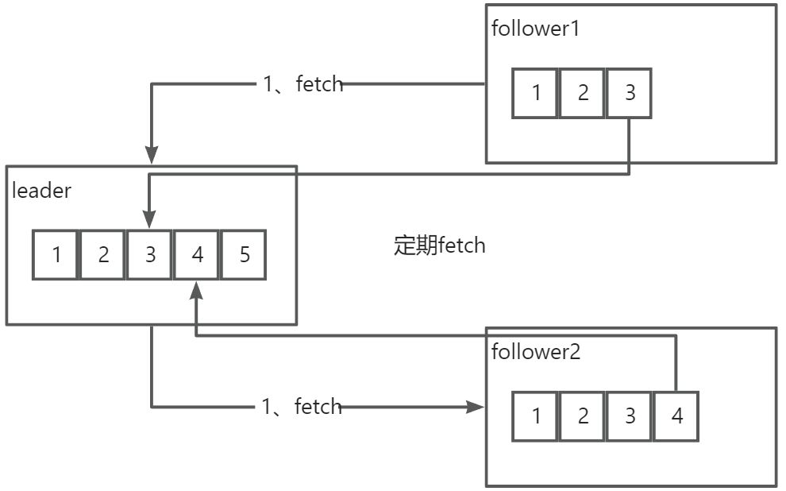

# 👌kafka的follower如何与leader同步数据？

[此处为语雀卡片，点击链接查看](https://www.yuque.com/jingdianjichi/xyxdsi/gxgo9gbdeg6w4g2c#fm4aB)

# 口语化回答
好的，面试管，follower 和 leader 的同步机制主要是拉取和位点相结合的一种方式，follower 在刚启动的时候，就会向 leader 发起一次拉取请求。leader 会将未拉取的数据都发送给 follwer。follower 复制好后，会记录自己复制的位点，然后过一段时间再再次去拉取数据，循环往复，进行同步。以上。

# 题目解析
这个机制如果你简历写了 kafka 还挺常问的。主要是一个拉取的概念和一个位点记录的概念。

# 面试得分点
拉取机制，位点，定时拉取

# 题目详细答案
Follower 副本与 Leader 副本的同步过程通过拉取模式（Pull-based Replication）实现，Follower 副本定期向 Leader 副本发送 Fetch 请求，获取新的数据并追加到本地日志中。

## 同步机制
**1、 拉取数据**：Follower 副本通过周期性地向 Leader 副本发送拉取请求（Fetch Request）来获取新数据。这种方式被称为拉取模式（Pull-based Replication）。

**2、Fetch 请求**：Follower 副本会定期向 Leader 副本发送 Fetch 请求，包含当前的偏移量（Offset），即 Follower 副本已经成功复制的最后一个消息的位置。Leader 副本根据这个偏移量返回从该位置开始的新的消息数据。

**3、 数据传输**：Leader 副本将从指定偏移量开始的消息数据打包成响应（Fetch Response），并返回给 Follower 副本。Follower 副本接收到这些消息后，将其追加到本地日志中。

**4、 确认和更新偏移量**：Follower 副本在成功写入本地日志后，会更新自己的偏移量，并在下一个 Fetch 请求中发送新的偏移量给 Leader 副本，以便获取更多的新数据。

> **常见配置参数**
>
> **replica.fetch.max.bytes**：Follower 副本在一次 Fetch 请求中能够拉取的最大数据量。
>
> **replica.fetch.wait.max.ms**：Follower 副本在等待 Leader 副本返回 Fetch 响应时的最大等待时间。
>
> **replica.lag.time.max.ms**：Follower 副本允许的最大滞后时间，超过这个时间将被认为不同步。
>
> **replica.lag.max.messages**：Follower 副本允许的最大滞后消息数，超过这个数量将被认为不同步。
>

### 示例流程

假设有一个 Kafka 分区有三个副本：Leader 副本（副本 0）和两个 Follower 副本（副本 1 和副本 2）。

**1、 初始同步**：

副本 1 和副本 2 启动并向 Leader 副本 0 发送 Fetch 请求，获取当前最新的日志数据。Leader 副本 0 返回从起始偏移量开始的日志数据，副本 1 和副本 2 将其写入本地日志。

**2、 持续同步**：

副本 1 和副本 2 定期向 Leader 副本 0 发送 Fetch 请求，包含当前的偏移量。

Leader 副本 0 返回从该偏移量开始的新数据，副本 1 和副本 2 将其追加到本地日志。

**3、 处理滞后**：

如果副本 1 或副本 2 的同步滞后超过配置的阈值，它们将被从 ISR 集合中移除，直到重新同步完成。

> 原文: <https://www.yuque.com/jingdianjichi/xyxdsi/gxgo9gbdeg6w4g2c>