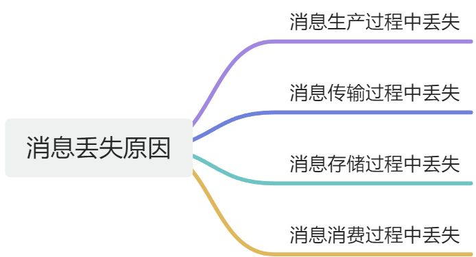

# 👌如何避免消息丢失？

[此处为语雀卡片，点击链接查看](https://www.yuque.com/jingdianjichi/xyxdsi/lskgbf55ax5xm7n8#Dx0k7)

# 口语化回答
好的，面试官，消息丢失是一个经常会讨论的问题，也是一个我们需要重点关注的问题。消息丢失其实主要产生在几个环节，按照消息的生命周期，可能会在生产中丢失，传输中丢失，存储中丢失，消费中丢失。接下来一个个说一下。当生产中消息产生丢失的时候，比如实际消息未发出，但是程序认为发出了，这种主要是要保证我们发送消息的时候不报错。如果发生问题，直接 catch 或者异步未处理，就可能会丢。这里不丢之后，消息会传输到 mq。mq 会通过确认机制告诉，mq 收到了消息，这块可以通过 mq 机制来保障。然后就是持久化，每个 mq 都有自己的持久化机制，比如 raid 策略或者镜像复制等等。最后就是消费者的消费，基本上都是通过 ack 机制来实现的，当消费者正常消费消息后，告诉 mq，我完事了，也就是 ack，mq 才会认为这个消息被正常消费了。

以上。

# 题目解析
消息丢失也是很常见的一道题，这道题比较好记，按照消息的生命周期，从消息生产，到传输，到存储，到消费，就可以达的比较明白，顺序不要乱，容易丢。

# 面试得分点
生产过程，传输过程，存储过程，消费过程，重试，ack，持久化

# 题目详细答案
要避免消息丢失，可以从从消息的生产、传输、存储和消费各个环节入手。

## 消息丢失的原因


## 解决方案
### 消息生产过程中的可靠性保证
确保消息被成功发送到消息队列系统。**比如 Kafka**：使用acks配置，设置为all，确保消息被所有副本确认。**RabbitMQ** 则使用publisher confirms，确保消息被队列接收。

在Kafka中：

```plain
Properties props = new Properties();
props.put("bootstrap.servers", "localhost:9092");
props.put("acks", "all"); // 确保消息被所有副本确认
props.put("key.serializer", "org.apache.kafka.common.serialization.StringSerializer");
props.put("value.serializer", "org.apache.kafka.common.serialization.StringSerializer");
Producer<String, String> producer = new KafkaProducer<>(props);

for (int i = 0; i < 10; i++) {
    producer.send(new ProducerRecord<>("my-topic", "key", "message-" + i), new Callback() {
        public void onCompletion(RecordMetadata metadata, Exception e) {
            if (e != null) {
                e.printStackTrace();
            } else {
                System.out.println("Message sent successfully");
            }
        }
    });
}
producer.close();
```

在RabbitMQ中：

```plain
ConnectionFactoryfactory=newConnectionFactory();
factory.setHost("localhost");try (Connectionconnection= factory.newConnection();
     Channelchannel= connection.createChannel()) {
    
    channel.confirmSelect(); // 启用发布确认

    Stringmessage="Hello World!";
    channel.basicPublish("", "my-queue", null, message.getBytes());

    if (channel.waitForConfirms()) {
        System.out.println("Message sent successfully");
    } else {
        System.out.println("Message send failed");
    }
}
```

### 消息传输过程中的可靠性保证
在网络传输失败时进行重试。同时使用 TCP，确保消息传输的可靠性。 在Kafka中配置重试机制：

```plain
Properties props = new Properties();
props.put("bootstrap.servers", "localhost:9092");
props.put("acks", "all");
props.put("retries", 3); // 设置重试次数
props.put("key.serializer", "org.apache.kafka.common.serialization.StringSerializer");
props.put("value.serializer", "org.apache.kafka.common.serialization.StringSerializer");
Producer<String, String> producer = new KafkaProducer<>(props);
```

### 消息存储过程中的可靠性保证
确保消息在磁盘上持久化存储。**Kafka**默认情况下消息是持久化存储的。**RabbitMQ** 则需要设置队列和消息为持久化。 在RabbitMQ中设置持久化：

```plain
ConnectionFactory factory = new ConnectionFactory();
factory.setHost("localhost");
try (Connection connection = factory.newConnection();
     Channel channel = connection.createChannel()) {
    
    boolean durable = true;
    channel.queueDeclare("my-queue", durable, false, false, null); // 设置队列为持久化

    String message = "Hello World!";
    AMQP.BasicProperties props = new AMQP.BasicProperties.Builder()
            .deliveryMode(2) // 设置消息为持久化
            .build();
    channel.basicPublish("", "my-queue", props, message.getBytes());
}
```

### 消息消费过程中的可靠性保证
**消息确认机制（Consumer Acknowledgment）**：确保消息被成功处理后才从队列中删除。比如 **Kafka**使用手动提交偏移量。**RabbitMQ** 则使用手动确认机制（manual acknowledgment）。

在Kafka中手动提交偏移量：

```plain
Properties props = new Properties();
props.put("bootstrap.servers", "localhost:9092");
props.put("group.id", "my-group");
props.put("enable.auto.commit", "false"); // 禁用自动提交
props.put("key.deserializer", "org.apache.kafka.common.serialization.StringDeserializer");
props.put("value.deserializer", "org.apache.kafka.common.serialization.StringDeserializer");
KafkaConsumer<String, String> consumer = new KafkaConsumer<>(props);
consumer.subscribe(Arrays.asList("my-topic"));

while (true) {
    ConsumerRecords<String, String> records = consumer.poll(Duration.ofMillis(100));
    for (ConsumerRecord<String, String> record : records) {
        System.out.printf("offset = %d, key = %s, value = %s%n", record.offset(), record.key(), record.value());
        // 处理消息
    }
    consumer.commitSync(); // 手动提交偏移量
}
```

在RabbitMQ中使用手动确认机制：

```plain
ConnectionFactory factory = new ConnectionFactory();
factory.setHost("localhost");
Connection connection = factory.newConnection();
Channel channel = connection.createChannel();

boolean autoAck = false; // 禁用自动确认
channel.basicConsume("my-queue", autoAck, (consumerTag, delivery) -> {
    String message = new String(delivery.getBody(), "UTF-8");
    System.out.println("Received '" + message + "'");
    // 处理消息
    channel.basicAck(delivery.getEnvelope().getDeliveryTag(), false); // 手动确认
}, consumerTag -> { });
```

## 其他注意事项
**1、 监控和报警**：实时监控消息队列系统的运行状态，设置报警机制，及时发现和处理消息丢失问题。

**2、 日志记录**：记录消息的生产、传输、存储和消费日志，便于问题排查和恢复。

**3、 消息重试机制**：配置合理的消息重试机制，确保在处理失败时进行重试。

**4、 高可用部署**：部署高可用集群，确保在节点故障时系统能够自动切换，避免消息丢失。


> 原文: <https://www.yuque.com/jingdianjichi/xyxdsi/lskgbf55ax5xm7n8>