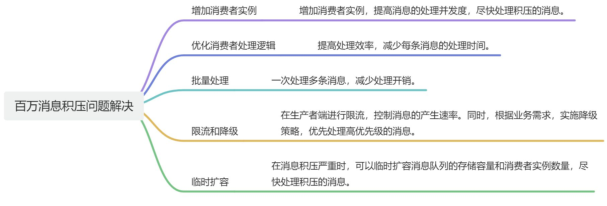

# 👌如果产生了消息积压的问题如何解决？

[此处为语雀卡片，点击链接查看](https://www.yuque.com/jingdianjichi/xyxdsi/tzfycdhxhyflhtd4#ISHUJ)

# 口语化回答
好的，面试官，在一个运行正常的系统中，消息积压通常是因为生产者短时间内产生了大量的消息，而消费方消费相对缓慢导致。从生产者来入手，可以分析是否都是正常的流量，能否做限流和降级，减少消息的生产。从消费方入手，短期方案是增加消费实例来提高消费速度，另外评估是否需要优化消费者的处理逻辑，通过提升代码性能来提高消费速度。

以上

# 题目解析
高频题，考察如何快速解决积压问题，以及后续优化动作

# 面试得分点
增加消费者实例、优化消费者处理、

# 题目详细答案

> 原文: <https://www.yuque.com/jingdianjichi/xyxdsi/tzfycdhxhyflhtd4>