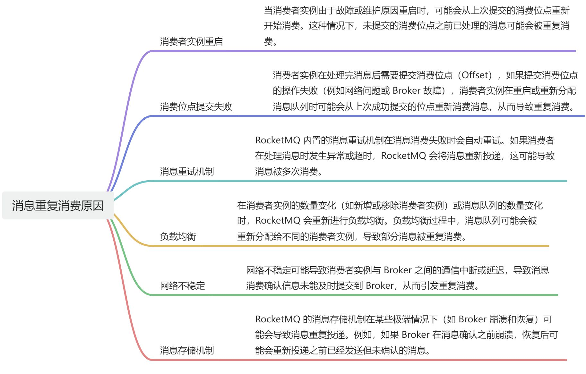

# 👌消息重复消费的原因有哪些？

[此处为语雀卡片，点击链接查看](https://www.yuque.com/jingdianjichi/xyxdsi/gmsr0fa56hfurhep#R5hSs)

# 口语化回答
好的，面试官。重复消费的原因比较多，常见的主要有，发送方逻辑错误或重放，重试机制，实例重启，位点提交失败等。有时会产生发送方因为自身逻辑错误，导致消息重复发送，又或者，某个消费方有问题，导致消息没有正确消费，想让发送方重放这种情况。重试机制是 mq 内置的一种策略，当消费者消费失败，或者迟迟没有收到 ack 的时候，mq 可能认为这次消费有问题，于是进行再次发送。这也是重复的一种常见。还有就是实例重启，或者位点提交失败，导致偏移的时候，mq 会认为位点之后的消息，没有被消费，于是重新发送给消费方。其实无论怎么重复消费，我们的消费方只要做好幂等或者业务逻辑的处理就不会产生问题。以上。

# 题目解析
经典问题，大家只要背会三个问题就 ok 了。

# 面试得分点
位点提交失败，重试机制，网络不稳，发送方错误

# 题目详细答案

> 原文: <https://www.yuque.com/jingdianjichi/xyxdsi/gmsr0fa56hfurhep>