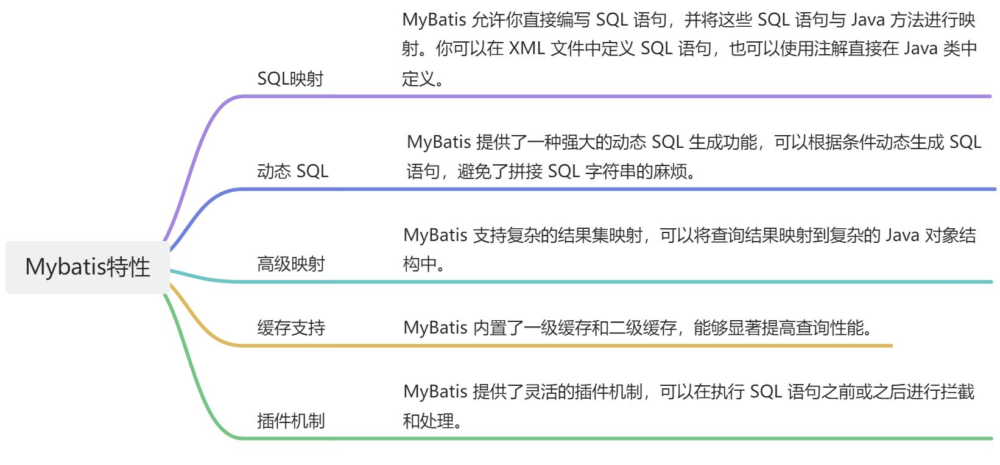

# 👌什么是mybatis框架？

# 口语化回答
好的，面试官。mybatis 是一个持久层框架，帮助我们操作数据库，相比于传统的 jdbc ，使用 myabtis 非常的方便，以前繁琐的配置细节，都被内部进行了封装。处理起来非常的方便。使用 mybatis 只要定义一个接口，同时定一个 xml 文件，在 xml 中写实际的 sql 就可以实现对数据库的查询，提供了动态 sql，属性映射，缓存支持，插件等特性。以上。

# 题目解析
这道题很少问，一般应届生的时候，可能会问你一下，面试官是真怕你没用过 mybatis，还在用 hiberante。大家按照口语化理解一下重点即可。

# 面试得分点
持久层框架，封装繁琐细节，接口与 xml，动态 sql，属性映射

# 题目详细答案
MyBatis 是一个优秀的持久层框架，它支持自定义 SQL、存储过程以及高级映射。MyBatis消除了几乎所有的 JDBC 代码和手动设置参数以及获取结果集的工作。MyBatis可以使用简单的XML或注解来配置和映射原生类型、接口和Java POJO到数据库中的记录。

### MyBatis 特性

> 原文: <https://www.yuque.com/jingdianjichi/xyxdsi/eouc3rts7ug85w9e>