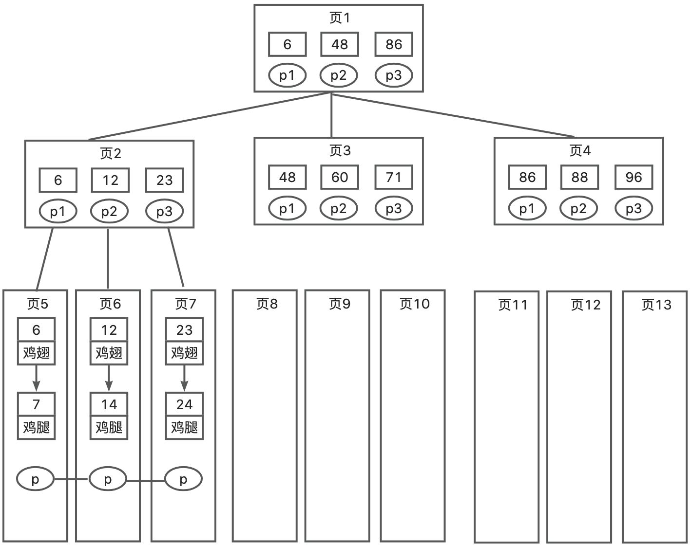
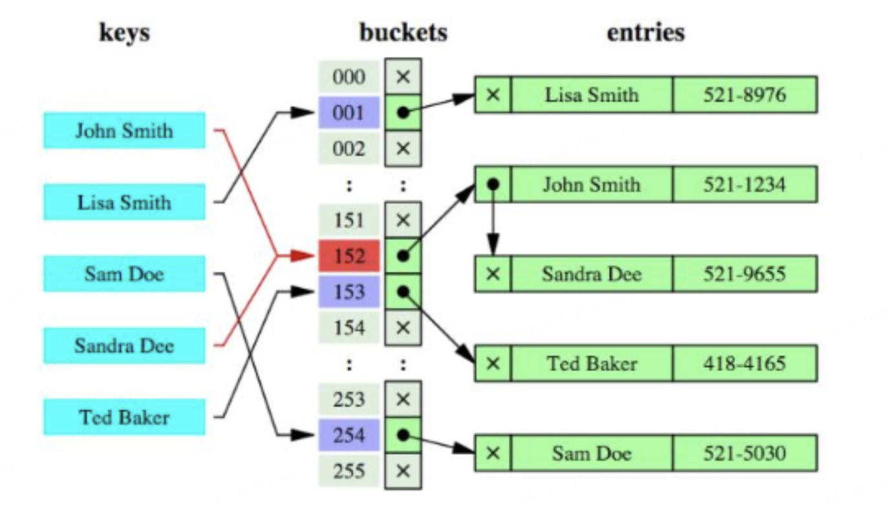

# B+树索引和哈希索引的区别？

# 题目详细答案
## B+树索引
B+树是一种平衡树数据结构，所有数据都存储在叶节点上，叶节点通过指针相连形成一个链表。内部节点只存储键值和子节点指针。

在B+树上的常规检索，从根节点到叶子节点的搜索效率基本相当，不会出现大幅波动，而且基于索引的顺序扫描时，也可以利用双向指针快速左右移动，效率非常高。

B+树的高度较低，通常为2到4层，因此查找操作的时间复杂度为 O(log n)。

### 特点
**有序性**：B+树索引中的数据是有序的，适合范围查询（如BETWEEN、<、>等）。

**节点分裂和合并**：在插入和删除数据时，B+树会保持平衡，通过节点的分裂和合并来维持树的高度。

**磁盘友好**：B+树节点的大小通常与磁盘页大小匹配，减少磁盘 I/O 操作次数。

## 哈希索引
哈希索引基于哈希表实现，通过哈希函数将键值映射到哈希表中的位置。哈希表中的每个位置存储一个指向数据记录的指针。

### 特点
**无序性**：哈希索引中的数据是无序的，不适合范围查询。

**高效等值查询**：哈希索引对于等值查询（如=、IN）非常高效，查找时间复杂度为 O(1)。

**冲突处理**：可能会发生哈希冲突，需要通过链表或其他方法来解决冲突。

**内存友好**：通常哈希索引会将哈希表存储在内存中，以提高访问速度。

### 适用场景
适合等值查询非常频繁的场景。

不适合需要范围查询或排序的场景。

适合单字段查询，不适合多字段组合查询。

## 区别
| 特性 | B+树索引 | 哈希索引 |
| --- | --- | --- |
| 结构 | 基于平衡树结构，数据有序。 | 基于哈希表结构，数据无序。 |
| 查询性能 | 支持等值查询和范围查询；查找时间复杂度为 O(log n)。 | 等值查询性能高；查找时间复杂度为 O(1)，不支持范围查询。 |
| 适用场景 | 适合范围查询、排序操作以及多字段组合查询。 | 适合高频等值查询；不适合范围查询及排序操作。 |
| 维护成本 | 插入和删除时需维护树的平衡状态，可能涉及节点分裂或合并。 | 插入和删除相对简单，但需处理哈希冲突问题。 |
| 存储方式 | 通常存储在磁盘上，且节点大小设计以匹配磁盘页大小。 | 一般位于内存中，以此来加速数据访问过程。 |

如果应用场景中需要频繁的范围查询、排序操作或多字段组合查询，选择 B+树索引。

如果应用场景中等值查询非常频繁且不需要范围查询或排序操作，选择哈希索引。

> 原文: <https://www.yuque.com/jingdianjichi/xyxdsi/hruimp6m9e2duoak>