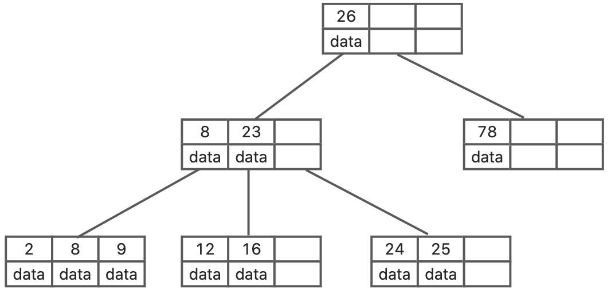
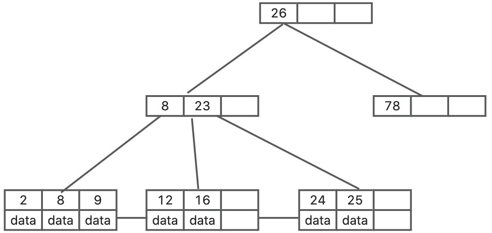

# B树和B+树的区别？

# 题目详细答案
## B树
B树的每个节点都可以包含多个键和子节点指针，所有键和值都存储在内节点和叶节点中。每个节点包含的键值数量有一个上限和下限，确保树的高度保持平衡。B树的叶节点不一定在同一层，可能会有不同的深度。

### 特点
1. **所有节点存储数据**：内节点和叶节点都存储数据。
2. **范围查询效率较低**：由于数据分布在所有节点上，范围查询需要遍历多个节点。

## B+树
B+树是B树的一种变种，所有实际数据都存储在叶节点中，内节点只存储索引键和子节点指针。叶节点通过链表相连，形成一个有序的链表，所有叶节点都在同一层。内节点只用于导航，不存储实际数据。

### 特点
1. **所有数据在叶节点**：内节点只存储索引键，所有实际数据都存储在叶节点中。
2. **高效的范围查询**：由于叶节点通过链表相连，范围查询和顺序访问非常高效。
3. **更简单的内节点**：内节点只存储索引键和指针，结构相对简单。
4. **所有叶节点在同一层**：B+树的叶节点都在同一层，树的高度更加均匀。

## 区别
| 特性 | B树 | B+树 |
| --- | --- | --- |
| 数据存储位置 | 数据存储在内节点和叶节点中。 | 数据只存储在叶节点中，内节点只存储索引键。 |
| 范围查询效率 | 范围查询效率较低，需要遍历多个节点。 | 范围查询效率高，叶节点通过链表相连，可以高效地进行顺序访问。 |
| 树的高度 | 叶节点不一定在同一层，树的高度可能不均匀。 | 所有叶节点都在同一层，树的高度更加均匀。 |
| 结构复杂度 | 内节点和叶节点都存储数据，结构较复杂。 | 内节点只存储索引键，结构相对简单。 |
| 内存使用 | 由于数据存储在所有节点中，内存使用较为分散。 | 数据集中存储在叶节点中，内存使用更为集中。 |

### 选择建议
**B树**：适用于需要频繁进行插入和删除操作的场景，因为其内节点和叶节点都存储数据，插入和删除操作可以直接在任何节点上进行。MongoDB使用B树，所有节点都有Data域，只要找到指定索引就可以进行访问，无疑单次查询平均快于Mysql。

**B+树**：适用于需要高效范围查询和顺序访问的场景，因为其叶节点通过链表相连，范围查询和顺序访问非常高效。Mysql作为一个关系型数据库，数据的关联性是非常强的，区间访问是常见的一种情况，B+树由于数据全部存储在叶子节点，并且通过指针串在一起，这样就很容易的进行区间遍历甚至全部遍历。

> 原文: <https://www.yuque.com/jingdianjichi/xyxdsi/hynf9hfivae0azqt>