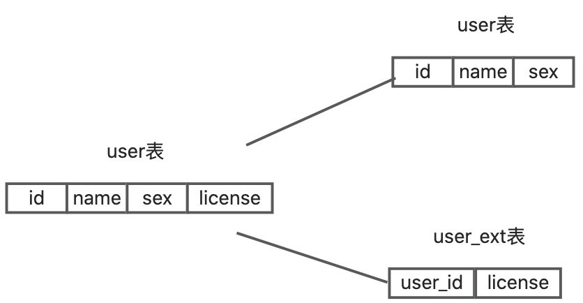
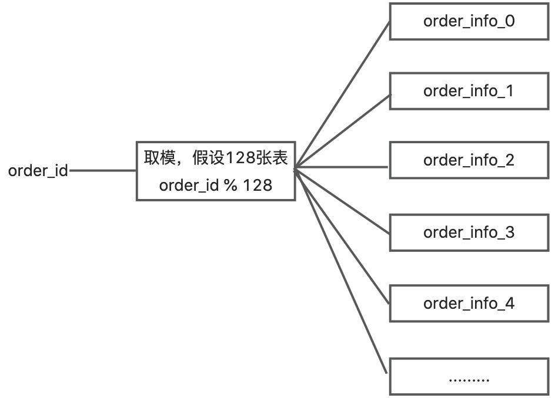

# Mysql如何做分库分表？

# 题目详细答案
MySQL 分库分表主要是为了应对单一数据库或表数据量过大导致的性能瓶颈，通过将数据分散到多个数据库或表中来提高系统的吞吐量和响应速度。

## 垂直分表（Vertical Sharding）
将一个大的表按照列拆分成多个较小的表，每个表只包含部分列。根据业务关系，将不同业务字段的数据分散到不同的表中。例如，用户信息和订单信息可以拆分为用户表和订单表，每个表都只包含其相应的字段。

垂直拆分后业务清晰，数据维护简单。减少了I/O、锁争用和查询的字段数，提高了查询性能。

不过如果单表的数据量、读写压力大，垂直分表可能无法解决问题。部分业务可能无法直接通过 SQL 关联查询，增加了开发复杂度。

举一个例子，原有的一张用户表，user 表，里面有 ID，name，sex，drive_lincense。

像这种情况如果要做到垂直分表，就拆成，user 表和 user_ext 表。drive_lincense 这种信息输入附属的不重要的信息，就可以放在user_ext 内。

## 水平分表（Horizontal Sharding）
将一个大的表按照某个字段的取值范围或哈希值拆分成多个较小的表，每个表存储部分数据。根据业务需求和数据量的分布情况选择合适的字段进行分片。例如，订单表可以按照订单创建时间或订单ID的哈希值拆分为多个表。

这种方式解决了单一表数据量过大的问题，提高了系统性能和可扩展性。但是增加了跨表查询的复杂性。需要考虑数据路由和跨库查询优化。

## 分库分表联合使用
同时进行分库和分表操作，将数据分散到多个数据库和表中。根据业务需求，将数据拆分为多个数据库。在每个数据库中，再根据业务或数据量情况进行水平或垂直分表。

## 实现注意事项
**数据分片策略**：选择合适的分片策略对数据库进行分库分表操作，例如按照用户ID、订单创建时间等字段进行分片。

**数据访问路由**：通过中间件（如 MyCAT、ShardingSphere、Cobar 等）来实现数据访问的路由和分片规则的管理。

**跨库查询优化**：优化跨库查询，减少跨库查询的次数和复杂度，提高查询效率。

> 原文: <https://www.yuque.com/jingdianjichi/xyxdsi/uboqasb02hlcx7mo>