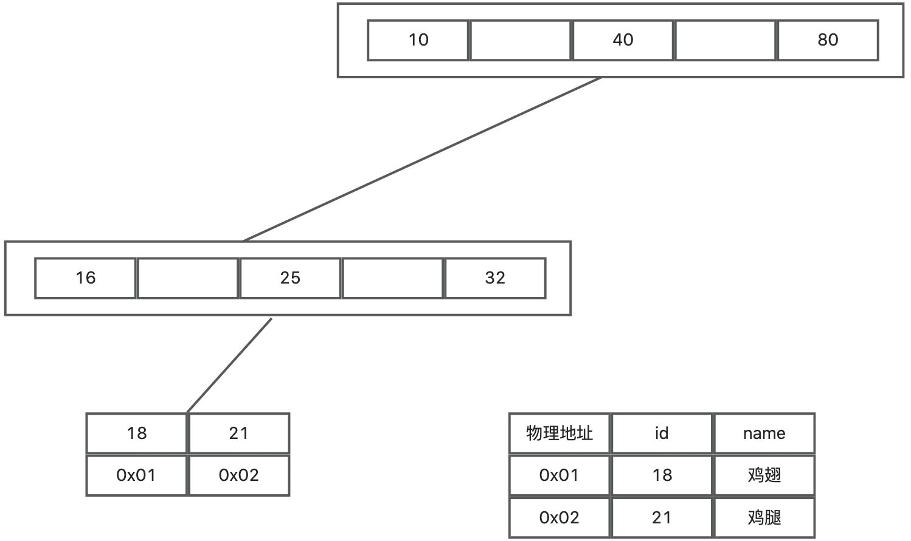
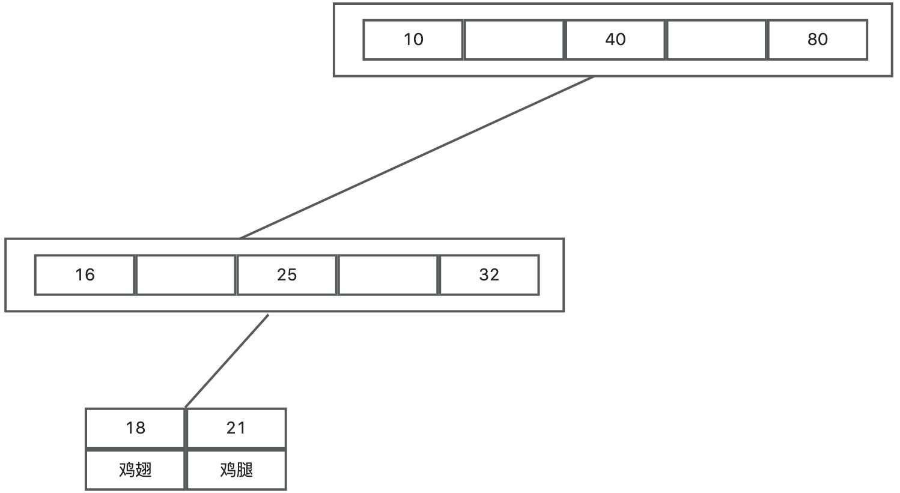

# Mysql存储引擎MyISAM与InnoDB区别？

# 题目详细答案
MyISAM和InnoDB都是mysql的存储引擎。mysql5.5之前，默认的存储引擎是MyISAM，从5.5之后，默认的是InnoDB。MyISAM 适用于读多写少的场景，如数据仓库、日志分析等；InnoDB 适用于事务密集型和高并发场景，如在线交易系统、社交网络等。

## 主要区别
### 数据存储结构
MyISAM 将数据存储在三个文件中（.frm文件存储表结构，.MYD文件存储数据，.MYI文件存储索引）；

InnoDB 将数据和索引存储在表空间文件中，支持自动扩展和多表空间。（.frm文件存储表结构定义，.ibd存储数据和索引）

由于MyISAM的数据和索引是分开存储的，所以查询的时候，MyISAM的叶子节点存储的是数据所在的地址，而不是直接存储数据。

#### myisam

#### innodb

## 事务支持
MyISAM 不支持事务，无法进行回滚和提交操作；InnoDB 支持事务，提供 ACID 特性（原子性、一致性、隔离性、持久性）。

### 锁机制
MyISAM 使用表级锁，每次操作都会锁定整个表，适合读多写少的应用；InnoDB 使用行级锁，每次操作只锁定相关的行，适合高并发和写操作频繁的应用。

### 外键支持
MyISAM 不支持外键，无法在表间建立引用完整性约束；InnoDB 支持外键，可以在表间建立引用完整性约束，保证数据的一致性和完整性。

### 全文索引
MyISAM 原生支持全文索引，适合需要全文搜索的应用；InnoDB 从 MySQL 5.6 开始支持全文索引，但性能和功能上仍不如 MyISAM。

### 存储空间
MyISAM 存储空间效率较高，数据文件较小；InnoDB 可能占用更多存储空间，特别是需要存储事务日志和外键约束信息。

### 表的大小限制
MyISAM 受文件系统限制，单个表最大可达 256TB（取决于文件系统）；InnoDB 最大表大小可达 64TB，适合处理大规模数据集。

> 原文: <https://www.yuque.com/jingdianjichi/xyxdsi/gp50q3kfx1pxipww>