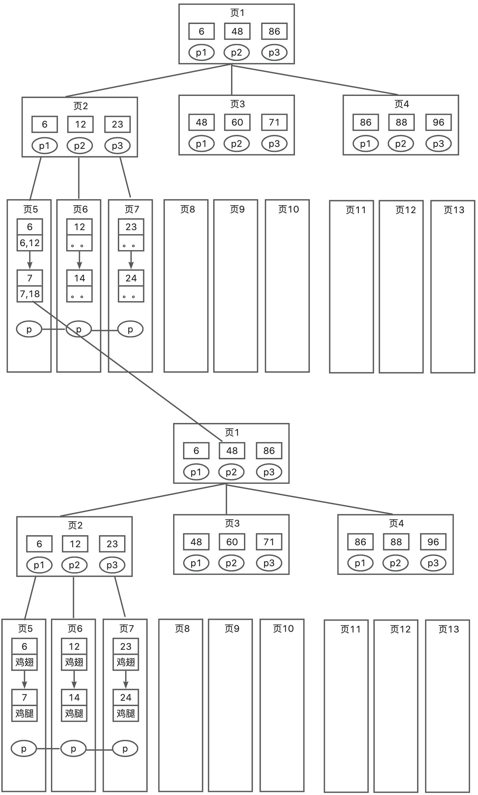

# Mysql的回表查询是什么？

# 题目详细答案
有了前面聚集索引和非聚集索引基础的小伙伴，可以发现聚集索引叶子结点会存数据，非聚集索引存的是主键值。知道这个前提后，在 MySQL 中，回表查询（也称为回表操作）是指在使用非聚集索引进行查询时，需要从索引中获取行的指针（通常是主键值），然后再根据这些指针访问实际的数据行。这种操作通常发生在查询中需要访问的列不完全包含在索引中的情况下。如果查询的列，包含在索引中，那么就是覆盖索引的概念了，后面会说。

## 回表查询的过程
1. **使用非聚簇索引查找**：首先，MySQL 使用非聚簇索引查找满足查询条件的索引项。
2. **获取行指针**：从非聚簇索引的叶节点获取指向实际数据行的指针（例如主键值）。
3. **访问数据行**：根据获取的指针，访问实际的数据行以获取所需的列数据。



按照上面这个图来理解，上面的是我们的非聚集索引，下面的是我们的聚集索引。我们从非聚集索引查到 7 之后，发现对应的主键值是 18，于是我们回到聚集索引去查询 18 对应的真正的行记录。由于这种情况会扫描两次索引树，效率会降低，所以一般我们希望走聚集索引，或者尽量找需要的列，走索引覆盖。

## 示例
假设有一个表employees，并在last_name列上创建了一个非聚簇索引：

```sql
CREATE TABLE employees (
  emp_id INT PRIMARY KEY,
  first_name VARCHAR(50),
  last_name VARCHAR(50),
  hire_date DATE
) ENGINE=InnoDB;

CREATE INDEX idx_last_name ON employees(last_name);
```

现在我们执行一个查询：

```sql
SELECT first_name, hire_date FROM employees WHERE last_name ='Smith';
```

### 回表查询的步骤
1. **使用索引查找**：MySQL 使用idx_last_name索引查找last_name为 'Smith' 的索引项。
2. **获取主键值**：从索引项中获取对应的emp_id（因为emp_id是主键）。
3. **访问数据行**：根据emp_id，访问实际的数据行以获取first_name和hire_date列的数据。


> 原文: <https://www.yuque.com/jingdianjichi/xyxdsi/hgqcdsdfmsv3c8i4>