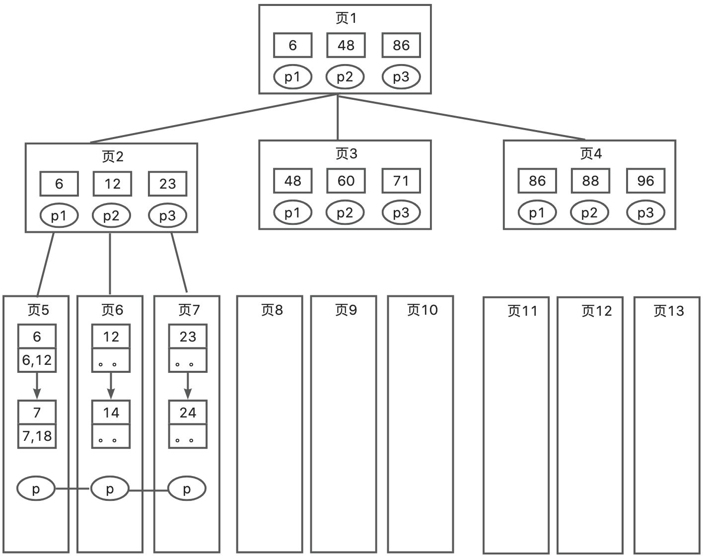

# Mysql的非聚集索引是什么？

MySQL 的非聚集索引（Non-Clustered Index），也称为辅助索引或二级索引，是指索引的叶节点不包含实际的数据行，而是包含指向数据行的指针（通常是聚集索引键）。通俗理解，以主键以外的列作为键值构建的B+树索引。非聚集索引的主要作用是加速特定列上的查询操作，而不改变数据行的物理存储顺序。记录的物理顺序与逻辑顺序没有必然的联系。

非聚集索引表数据存储顺序与索引数据无关，叶节点包含索引字段值及指向数据页数据行的逻辑指针（其行数量与数据表数据量相同），所以想要查找数据还需要根据主键再去聚集索引中查找，根据聚集索引查找数据的过程就称为回表。

一个表中可以拥有多个非聚集索引。实际上每个表最多可以建立249个非聚集索引，但是每次给字段建一个新索引，字段中的数据就会被复制出来一份用于生成索引，因此给表添加索引会增加表的体积，占据大量磁盘空间和内存。所以若磁盘空间和内存有限，应限制非聚集索引数量。每当你改变了一个建立非聚集索引的表中数据时，必须同时更新索引，所以非聚集索引会降低插入和更新速度。



比如查找数据 7，是用两个数字表示，前面那个数字 7 代表的是索引的键值，后面那个 18 代表的是数据的主键。所以说我们找到 7 后，并没有拿到数据，还要根据它对应的主键去到聚集索引表中去查找数据。

## 特点
1. **独立于数据存储顺序**：非聚集索引不会改变数据行的物理存储顺序，数据行的顺序由聚集索引决定。
2. **叶节点包含指针**：非聚集索引的叶节点存储的是指向实际数据行的指针（如聚集索引键），而不是数据行本身。
3. **可以有多个**：一个表可以有多个非聚集索引，每个非聚集索引加速不同列上的查询操作。

## 优点
**加速查询**：非聚集索引可以显著加速特定列上的查询操作，特别是那些经常出现在 WHERE 子句中的列。

**多样性**：可以在多个列上创建非聚集索引，以满足不同查询需求。

## 缺点
**占用空间**：非聚集索引需要额外的存储空间来维护索引结构。

**维护成本**：在插入、更新和删除操作时，需要维护非聚集索引，可能会增加开销。

## 示例
假设有一个表employees，包含以下列：

```sql
CREATE TABLE employees (
  emp_id INT PRIMARY KEY,
  first_name VARCHAR(50),
  last_name VARCHAR(50),
  hire_date DATE
) ENGINE=InnoDB;
```

在这个表中，emp_id是聚集索引。如果我们在last_name列上创建一个非聚集索引：

```sql
CREATE INDEX idx_last_name ON employees(last_name);
```

## 查询示例
```sql
SELECT * FROM employees WHERE last_name ='Smith';
```

MySQL 会使用idx_last_name非聚集索引来查找last_name为 'Smith' 的记录。非聚集索引的叶节点包含指向实际数据行的指针（即emp_id），MySQL 会根据这些指针访问实际的数据行。


> 原文: <https://www.yuque.com/jingdianjichi/xyxdsi/idmhmy5cqifw1do1>