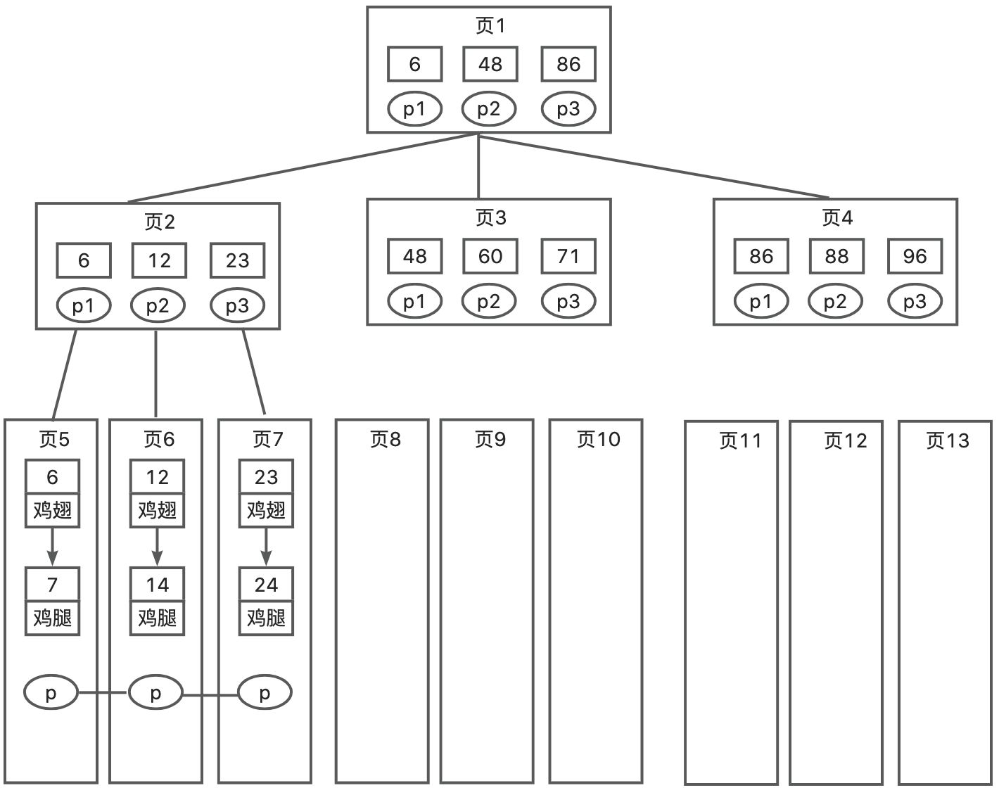

# Mysql聚集索引是什么？

# 题目详细答案
MySQL 中的聚集索引是指数据表的记录按照索引的顺序进行物理存储。也就是说，表中的数据行和索引行一起存储，并且数据行的顺序与索引的顺序相同。聚集索引的特点是索引的叶节点包含了实际的数据行。一个表中只能有一个聚集索引，因为只能以一种物理顺序存放。

在 MySQL 中，InnoDB 存储引擎默认使用聚集索引。InnoDB 表必须有一个聚集索引，如果没有显式定义主键，InnoDB 会选择一个唯一的非空索引作为聚集索引。如果没有这样的索引，InnoDB 会自动生成一个名为row_id隐藏的聚集索引。

我们通过InnoDB把数据存放到B+树中，而B+树中的键值就是主键，那么在B+树中的叶子节点存储的就是表中的所有数据（即该主键对应的整行数据），数据文件和索引文件是同一个文件，找到了索引便找到了数据，所以称之为聚集索引。



比如查询id>=6 并且id<20 的数据：通常根节点常驻在内存中（即页1已在内存），首先在页1找到了键值 6 及其对应指针P1，通过P1 读 P2（此时页 2 不在内存中，需要从磁盘中加载），然后在页 2 查找键值 6 的指针P1，又定位到页 5（同样的从磁盘加载到内存），因为数据是按链表进行顺序链接的，可以通过二分找到键值 6 对应数据。

找到键值 6 后，因为是范围查找，这时可以在叶子节点里进行链表的查询，依次遍历并匹配满足的条件，一直找到键值 14，到最后一个数据仍不能满足我们的要求，此时会拿着页 5 的指针P去读取页 6 的数据，页 6 不在内存中同样需要磁盘加载读进内存，然后依此类推，直到匹配到键值 23 时不满足条件则终止，这就是通过聚集索引查找数据的一种方法。

## 特点
1. **物理顺序存储**：数据行按照索引键的顺序存储在数据页中。
2. **叶节点包含数据**：聚集索引的叶节点包含了实际的数据行。
3. **只能有一个**：每个数据表只能有一个聚集索引，因为数据行只能按一种顺序存储。

## 优点
1. **查询效率高**：对于基于聚集索引的范围查询（between、<、<=、>、>=）和排序操作（group by、order by），效率较高，因为数据行是按索引顺序存储的。因为聚集索引找到包含第一个值的行后，后续索引值的行在物理上毗连在一起而不必进一步搜索，避免大范围扫描，大大提高查询速度。
2. **覆盖索引**：在某些查询中，聚集索引可以充当覆盖索引，从而减少读取数据的次数。

### 缺点
1. 插入速度较慢：在插入新记录时，可能需要移动大量数据行以保持索引顺序。
2. 更新代价高：更新聚集索引键值时，可能导致数据行的重新排序。移动行可能还会面临页分裂问题（即页已满），存储引擎会将该页分裂成两个页面来容纳，页分裂会占用更多磁盘空间。即索引重排，造成资源浪费。
3. 占用更多存储空间：由于数据行和索引一起存储，可能占用更多的存储空间。

假设有一个表employees，包含以下列：

```sql
CREATE TABLE employees (
  emp_id INT PRIMARY KEY,
  first_name VARCHAR(50),
  last_name VARCHAR(50),
  hire_date DATE
) ENGINE = InnoDB;
```

在这个表中，emp_id是主键，并且默认情况下，InnoDB 会将emp_id列作为聚集索引。数据行将按照emp_id的顺序存储。


> 原文: <https://www.yuque.com/jingdianjichi/xyxdsi/hpx7rs0b4uz0azeu>