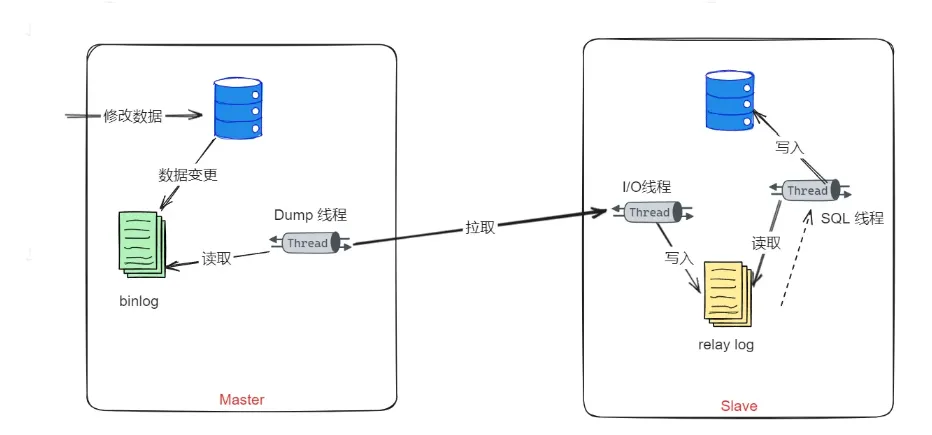

# 👌mysql主从同步原理?

MySQL 主从同步（Replication）是一种将数据从一个 MySQL 数据库服务器（称为主服务器）复制到一个或多个 MySQL 数据库服务器（称为从服务器）的过程。这种机制通常用于提高数据冗余、负载均衡和数据备份。以下是 MySQL 主从同步的基本原理：



### 1. 主服务器（Master）
主服务器负责处理写入操作（INSERT、UPDATE、DELETE 等）并记录这些操作的日志（称为二进制日志，Binary Log）。

### 2. 二进制日志（Binary Log）
在主服务器上，每次数据更改操作都会被记录到二进制日志文件中。二进制日志包含了所有对数据库进行的更改操作的详细记录。

### 3. 从服务器（Slave）
从服务器连接到主服务器，并从主服务器获取二进制日志。它会将这些日志应用到自己的数据库中，以保持与主服务器的数据一致。

### 4. 中继日志（Relay Log）
从服务器将从主服务器获取的二进制日志写入到中继日志文件中，然后再从中继日志中读取并应用这些更改。

### 5. 复制过程
复制过程主要包括以下几个步骤：

#### 5.1 主服务器记录更改到二进制日志
当主服务器上的数据发生更改时，这些更改会被记录到二进制日志文件中。

#### 5.2 从服务器读取二进制日志
从服务器上的 I/O 线程负责连接到主服务器并读取二进制日志，将其写入到从服务器上的中继日志文件中。

#### 5.3 从服务器应用中继日志
从服务器上的 SQL 线程读取中继日志文件，并将其中的更改应用到从服务器的数据库中。

### 6. 复制的配置
配置 MySQL 主从复制通常包括以下步骤：

#### 6.1 配置主服务器
+ 启用二进制日志记录（在my.cnf文件中设置log_bin）。
+ 设置服务器唯一 ID（在my.cnf文件中设置server-id）。

#### 6.2 配置从服务器
+ 设置服务器唯一 ID（在my.cnf文件中设置server-id）。
+ 配置从服务器连接到主服务器（使用CHANGE MASTER TO语句）。
+ 启动从服务器的复制线程（使用START SLAVE语句）。

### 7. 复制类型
MySQL 支持多种复制类型，包括：

+ **异步复制**：从服务器异步地从主服务器获取二进制日志，这意味着主服务器不需要等待从服务器确认已收到日志。
+ **半同步复制**：主服务器在提交事务后会等待至少一个从服务器确认已收到并写入二进制日志。
+ **组复制**：一种多主复制方式，提供更高的可用性和数据一致性。

### 8. 复制监控与管理
可以使用SHOW SLAVE STATUS命令在从服务器上查看复制状态，包括延迟、当前正在处理的二进制日志文件等信息。

### 示例配置
以下是一个简单的主从复制配置示例：

#### 主服务器配置（my.cnf）：
```plain
[mysqld]
server-id = 1
log_bin = /var/log/mysql/mysql-bin.log
```

#### 从服务器配置（my.cnf）：
```plain
[mysqld]
server-id = 2
relay_log = /var/log/mysql/mysql-relay-bin.log
```

#### 从服务器连接到主服务器：
```plain
CHANGE MASTER TO
  MASTER_HOST='master_host',
  MASTER_USER='replication_user',
  MASTER_PASSWORD='replication_password',
  MASTER_LOG_FILE='mysql-bin.000001',
  MASTER_LOG_POS=4;
START SLAVE;
```

## 总结：
（1）master服务器将数据的改变记录二进制binlog日志，当master上的数据发生改变时，则将其改变写入二进制日志中；

（2）slave服务器会在一定时间间隔内对master二进制日志进行探测其是否发生改变，如果发生改变，则开始一个I/OThread请求master二进制事件

（3）同时主节点为每个I/O线程启动一个dump线程，用于向其发送二进制事件，并保存至从节点本地的中继日志中，从节点将启动SQL线程从中继日志中读取二进制日志，在本地重放，使得其数据和主节点的保持一致，最后I/OThread和SQLThread将进入睡眠状态，等待下一次被唤醒。


> 原文: <https://www.yuque.com/jingdianjichi/xyxdsi/ofhxvcw15nd40i33>