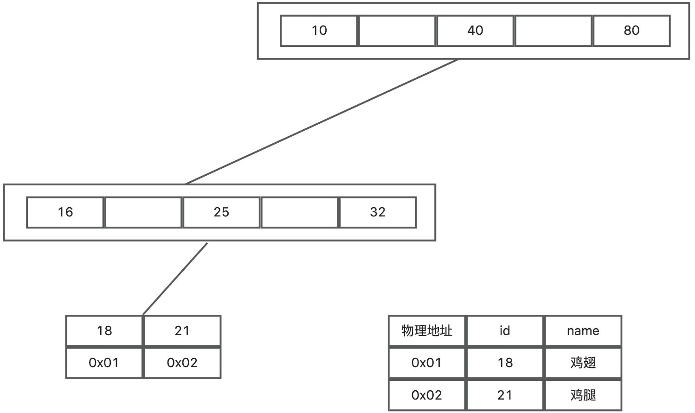

# mysql的innodb和myisam索引的区别?

# 题目详细答案
## 聚簇索引
InnoDB 使用聚簇索引，主键索引和行数据存储在一起，查询主键时效率高；MyISAM 使用非聚簇索引，索引和数据分开存储，主键索引只包含指向数据文件的指针。

### innodb 索引
innodb 的表数据文件是按B+Tree组织的一个索引结构文件，数据文件是和索引放在一起的。叶子节点包含了完整的数据记录。同时必须要有主键，通过主键索引效率高。如果建表时未创建主键，MySQL会从表中找到一列全部不相等的数据，作为主键，维护索引树，如果找不到，则维护一个隐藏列，用于维护索引树。

innodb主键索引的查询过程：

1、将根节点，加载到内存中，在内存中通过二分查找算法，快速找出要查询数据的位置，找到对应的页；

2、再将这一页数据，加载到内存中，快速找出要查询的位置，找到对应的页；

3、最后定位到叶子节点，对应位置，从叶子节点中取出数据data。

### myisam 索引
MyISAM是非聚簇索引，索引和数据分开存储，也是使用B+Tree作为索引结构，索引保存的是数据文件的指针。

叶子节点只包含索引地址，不包含数据，数据在另外一个文件MYD文件。

MyISAM 查找数据流程：

1 从MYI文件中，查找索引树，定位数据所在的叶子节点，通过叶子节点中包含的数据地址；

2 在MYD文件中，找出具体的数据。

## 辅助索引
辅助索引，大家可以这么理解，比如一张表，我们除了主键索引外，针对其中的比如 age 列，建立了一个索引，这个索引的叶子结点是不会存数据的。存的是主键值。那么查询的时候，其实就是先查到主键，再通过上面的过程去二次索引查询。innodb 就是上面的这个过程，然而 myisam 本身就是索引和数据分离开的，所以辅助索引最终也是存的实际数据的物理地址。

所以 innodb 又一个操作就是回表，myisam 就不需要了。

## 主键区别
innodb 必须要有主键，通过主键索引效率高。如果建表时未创建主键，MySQL会从表中找到一列全部不相等的数据，作为主键，维护索引树，如果找不到，则维护一个隐藏列，自动生成一个6字节的主键(用户不可见)，用于维护索引树。

MyISAM 允许没有任何索引和主键的表存在，索引都是保存行的地址。

## 索引大小
InnoDB 的索引由于包含行数据和事务日志，占用更多存储空间；MyISAM 的索引文件较小，存储空间利用率较高。

## 索引锁定机制
InnoDB 使用行级锁，允许更高的并发性和更细粒度的锁定；MyISAM 使用表级锁，索引操作时可能会锁定整个表，影响并发性能。

> 原文: <https://www.yuque.com/jingdianjichi/xyxdsi/buygigkcozhtx70q>