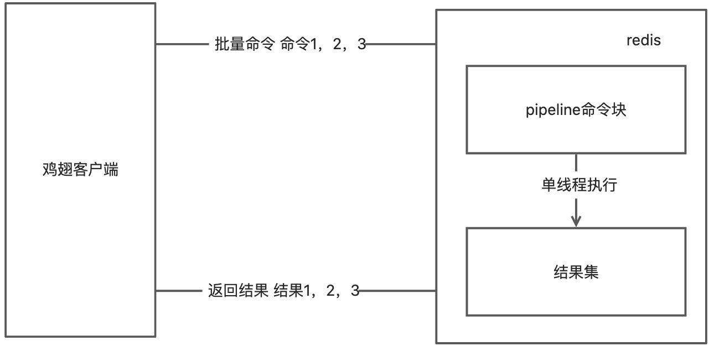

# 👌redis中的管道有什么用？

[此处为语雀卡片，点击链接查看](https://www.yuque.com/jingdianjichi/xyxdsi/up08zdobgdy47zo0#xyIGi)

# 口语化回答
好的，面试官。管道 pipeline 主要是为了解决批量查询问题而诞生的。如果说没有管道，我们查 10 个信息，就要发送 10 次命令，与 redis 进行往返 10 次的交互，这对性能的影响是很大的。如果通过管道，将 10 个命令放在一块传递给 redis，结果再一次性返回，性能会得到提升。这种思想可以用到很多地方，包括在 mysql 进行查询的时候，也可以考虑。以上。

# 题目解析
管道这道题还比较常问，因为在公司中还是很多场景都在使用的。比较考察你对于性能的提升优化有没有考虑，代码写的好的小伙伴，肯定会考虑到批量这一点。

# 面试得分点
批量，网络消耗，顺序返回

# 题目详细答案
Redis中的管道（Pipeline）主要用于批量执行多个命令，用来提高性能和效率。管道可以将多个命令一次性发给服务器，然后返回多个结果。

## 为什么会有管道
按照平时开发的过程，假设要查询 10 个用户的信息，用户的信息正好存在 redis 里面。这个时候客户端需要发送 10 次命令到服务器，服务器处理命令并返回结果，这个过程会涉及多次网络往返，尤其是在高延迟网络环境中，频繁的网络通信会降低性能。管道通过将多个命令打包在一起，一次性发送到服务器，从而减少网络往返次数，提高性能。

## 工作原理


管道的工作原理是将多个Redis命令批量发送到服务器，而不等待每个命令的单独响应。

**客户端批量发送命令**：客户端将一系列Redis命令放入管道中。

**一次性发送命令**：客户端将所有命令一次性发送到Redis服务器。

**服务器批量处理命令**：Redis服务器依次处理这些命令。

**批量返回结果**：服务器将所有命令的结果一次性返回给客户端。

## 适用场景
**1、 批量写入数据**：如批量插入大量数据到Redis中，可以显著提高写入速度。类似 mysql 里面的批量插入。

**2、 批量读取数据**：如一次性获取大量键值对，可以减少网络延迟。类似 mysql 可以通过 in 的方式来查询多个数据。但是不想 mysql 那么死，redis 的管道什么命令都可以放一起。

**3、 减少网络开销**：在高延迟网络环境中，管道可以显著减少网络往返次数，提高性能。

## Java中使用Redis管道


```java
//批量发送1000个SET命令，最后执行管道中的命令并关闭连接。

import redis.clients.jedis.Jedis;
import redis.clients.jedis.Pipeline;

public class RedisPipelineExample {
    public static void main(String[] args) {
        // 创建Jedis对象，连接到Redis服务器
        Jedis jedis=new Jedis("localhost", 6379);

        // 开始管道操作
        Pipeline pipeline= jedis.pipelined();

        // 批量发送命令
        for (int i=0; i < 1000; i++) {
            pipeline.set("key" + i, "value" + i);
        }

        // 执行管道中的命令
        pipeline.sync();

        // 关闭Jedis连接
        jedis.close();
    }
    
}
```

## 特性
管道中的命令是按顺序执行的，结果也按顺序返回。管道中的某个命令失败不会影响其他命令的执行，需要注意如何处理返回的结果。


> 原文: <https://www.yuque.com/jingdianjichi/xyxdsi/up08zdobgdy47zo0>