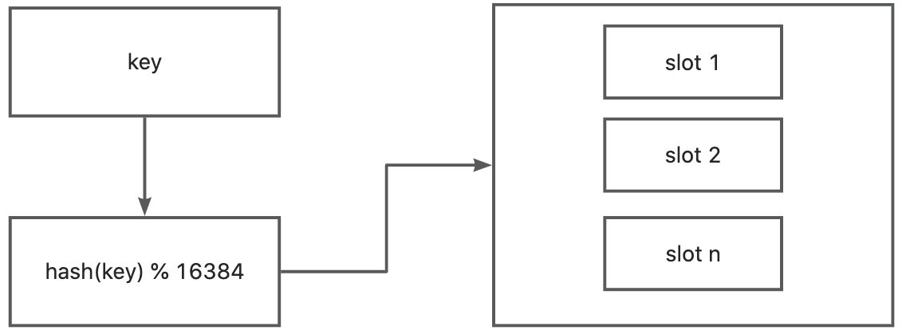

# 👌redis在集群中查找key的时候，怎么定位到具体的节点?

[此处为语雀卡片，点击链接查看](https://www.yuque.com/jingdianjichi/xyxdsi/sbgvpfksacsmgzrz#bb5Jb)

# 口语化回答
好的，面试官。这个问题主要涉及到一个哈希槽的概念，redis 集群，会将键划分为 16384 个槽。每个槽分配一个或多个节点。比如一个集群，三个节点，每个节点负责一定范围的槽。当 key 来了的时候，首先做 hash 算法获得数值后，与 16384 进行取模。得到的值就是槽的位置，然后再根据槽的编号，就可以找到对应的节点。以上。

# 题目解析
算是进阶点的一道题了，年限低的小伙伴不必太在意，在集群模式下，这个知识点是必须要掌握的。

# 面试得分点
slot 机制，取模 hash 槽，16384，节点范围机制

# 题目详细答案
Redis集群采用了一种哈希槽的机制用于数据存储和获取。每个 redis 集群节点会分布在一个槽范围内，我们通过对 key 进行的 hash 计算，就可以确定 key 落在哪个槽上。

## 哈希槽机制
Redis集群将整个键空间划分为16384个哈希槽。每个键根据其哈希值被映射到其中一个哈希槽上，每个哈希槽被分配给一个节点或多个节点（主从复制的场景）。计算过程如下：

1. **计算哈希值**：Redis使用MurmurHash算法对键进行哈希计算，得到一个整数哈希值。
2. **映射到哈希槽**：将哈希值对16384取模（即hash(key) % 16384），得到对应的哈希槽编号。
3. **定位节点**：根据哈希槽编号找到负责该哈希槽的节点。



看了上面的图，你对 slot 有了解了，那么你会产生疑问，slot 又是如何和 redis 进行关联的呢？

## 哈希槽分配
集群的配置时，哈希槽会被分配给不同的节点。每个节点负责一定范围的哈希槽。例如，节点A可能负责哈希槽0-5000，节点B负责哈希槽5001-10000，节点C负责哈希槽10001-16383。这样就实现了集群、节点、slot 三者联动。

## 查找流程
当客户端需要查找某个键时，流程如下：

1. **计算哈希槽**：客户端根据键计算出对应的哈希槽编号。
2. **查找节点**：客户端查询集群的哈希槽分配表，找到负责该哈希槽的节点。
3. **发送请求**：客户端将请求发送到对应的节点，获取或存储数据。

## 代码实现
一般这种都需要我们操心，很多都帮我们封装好了。

```java
import redis.clients.jedis.HostAndPort;
import redis.clients.jedis.JedisCluster;
import java.util.HashSet;
import java.util.Set;

public class RedisClusterExample {
    public static void main(String[] args) {
        // 定义集群节点
        Set<HostAndPort> nodes = newHashSet<>();
        nodes.add(newHostAndPort("127.0.0.1", 7000));
        nodes.add(newHostAndPort("127.0.0.1", 7001));
        nodes.add(newHostAndPort("127.0.0.1", 7002));

        // 创建JedisCluster对象
        JedisCluster jedisCluster=new JedisCluster(nodes);

        // 存储键值对
        jedisCluster.set("mykey", "myvalue");

        // 获取键值对
        String value= jedisCluster.get("mykey");
        System.out.println("Value for 'mykey': " + value);

        // 关闭JedisCluster连接
        jedisCluster.close();
    }
}
```


> 原文: <https://www.yuque.com/jingdianjichi/xyxdsi/sbgvpfksacsmgzrz>