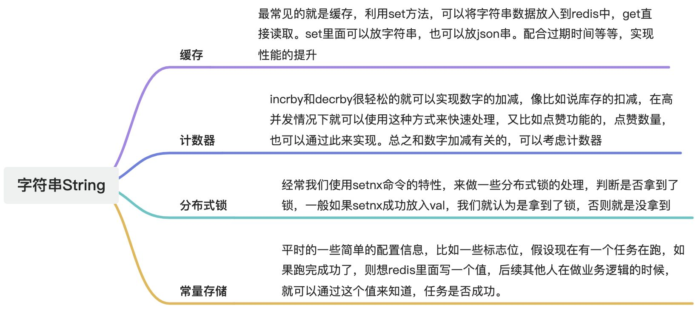
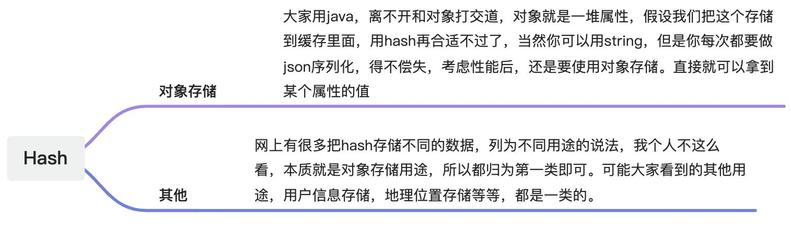
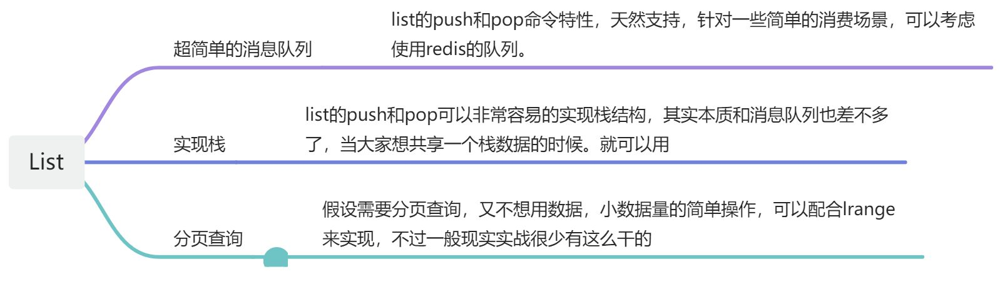
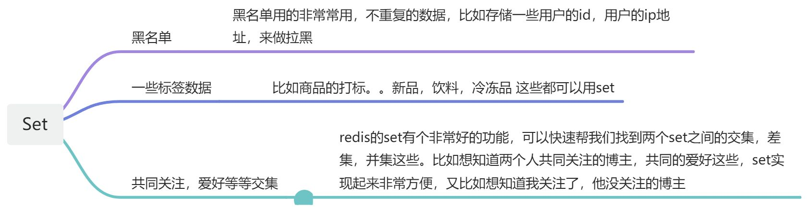
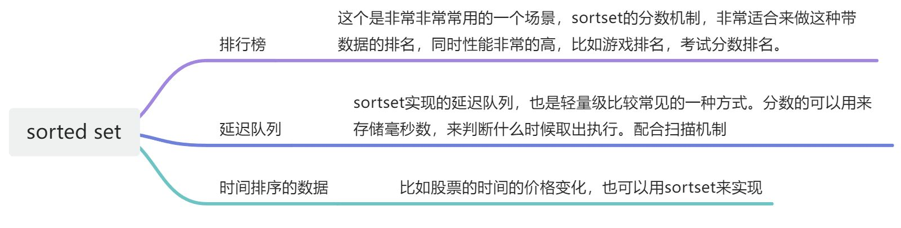

# 👌redis常用类型的应用场景？

[此处为语雀卡片，点击链接查看](https://www.yuque.com/jingdianjichi/xyxdsi/rselbwel9tt08iwz#XwGKv)

# 口语化回答
好的，面试官，redis 的常用类型的应用场景，最常见的就是用来做各种各样的缓存，主要是 string 和 hash 用的会比较多。string 支持了各种方式的缓存，配合过期时间，非常的方便，string 的 value 可以存 json 等等这些东西，用起来也非常灵活。还有一个大的场景就是基于 redis 实现的分布式锁，setnx 命令 天然支持锁的机制。针对一些对象的处理，hash 结构就比较常用，省去了 json 序列化的性能消耗。另一种常用的就是 sortset，经常用来实现排行榜功能，也可以做一些延迟队列的操作。还有就是 set 可以用来做黑名单，list 可以实现一些简单的消息队列！

# 题目解析
这道题问到的时候，其实就是面试官考察你的应用情况。大家要注意答的时候，一定要准备好你说的场景的实际应用，面试官听完之后，基本都会深入问你使用的那个场景，比如排行榜的 redis 实现，分布式锁的Redis 实现，这是大家一定要注意的~

# 面试得分点
分布式锁，缓存，排行榜，延迟队列

# 题目详细答案
## 字符串（String）

### **哈希（Hash）**

### **列表（List）**

### **集合（Set）**

### **有序集合（Sorted Set）**

> 原文: <https://www.yuque.com/jingdianjichi/xyxdsi/rselbwel9tt08iwz>