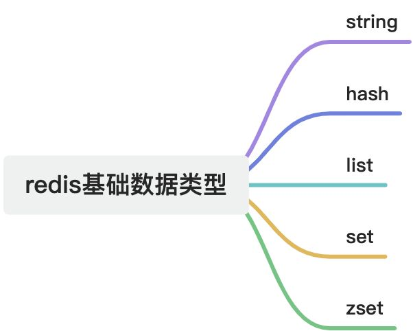

# 👌redis支持哪几种数据类型?

[此处为语雀卡片，点击链接查看](https://www.yuque.com/jingdianjichi/xyxdsi/xac8obblzuwh66a5#kqBpz)

# 口语化回答
好的面试官，redis 的基础数据类型，主要有五种，string ，hash，list，set 和 zset。平时最常用的就是 string，可以缓存内容、做分布式锁等等，其次就是 hash，比如缓存一些对象结构的数据，hash 就比较合理。假设缓存一个个人信息，姓名，年龄，头像这些。传统的 string 需要进行序列化转 json，hash 则可以直接拿到。zset 也用过，主要是做排行榜功能，利用分数的特性进行排序。主要就是这些，以上。

# 题目解析
这道题比较简单，一般面试切入到 redis 的时候，会问一下这道，但是你的目的是在这五种基础数据类型中，选出钩子，让面试官继续针对某一个类型来进行问，比如你对分布式锁准备的很充分，你答 string 类型的时候，就往上面引入，你用 zset 做过排行榜，那么就 zset 上面多说一些。

# 面试重点词
五种类型、string 的分布式锁、hash 存储对象、zset 做排行榜。

# 题目详细答案
Redis支持的数据类型主要有五种。



### **String（字符串）**
1、字符串是 Redis 中最简单和最常用的数据类型。可以用来存储如字符串、整数、浮点数、图片（图片的base64编码或图片的路径）、序列化后的对象等。

2、每个键（key）对应一个值（value），一个键最大能存储512MB的数据。

3、命令用法

```plain
SET key "value"
GET key
```

### **Hash（哈希）**
1、Redis Hash是一个String类型的field和value的映射表，类似于Java中的Map<String, Object>。

2、Hash特别适合用于存储对象，如用户信息、商品详情等。

3、 每个Hash可以存储2^32 - 1个键值对。

4、命令用法

```plain
HSET user:1000 name "John"
HGET user:1000 name
```

### **List（列表）**
1、 列表是一个有序的字符串集合，可以从两端压入或弹出元素，支持在列表的头部或尾部添加元素。

2、 列表最多可存储2^32 - 1个元素。

```plain
LPUSH mylist "world"
LPUSH mylist "hello"
LRANGE mylist 0 -1
```

### **Set（集合）**
1、Set是一个无序的字符串集合，不允许重复元素。集合适用于去重和集合运算（如交集、并集、差集）。Set的添加、删除、查找操作的复杂度都是O(1)。

2、常用命令

```plain
SADD myset "hello"
SADD myset "world"
SMEMBERS myset
```

### **Zset（有序集合）**
Zset和Set一样也是String类型元素的集合，且不允许重复的成员。有序集合类似于集合，但每个元素都会关联一个double类型的分数（score），redis正是通过分数来为集合中的成员进行从小到大的排序。


> 原文: <https://www.yuque.com/jingdianjichi/xyxdsi/xac8obblzuwh66a5>