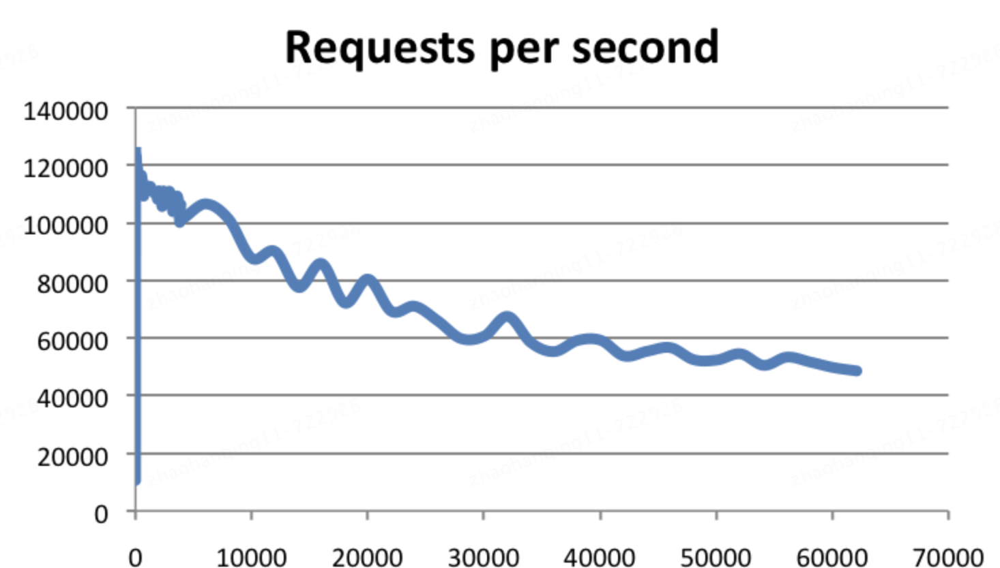

# 👌redis是单进程单线程的吗？

[此处为语雀卡片，点击链接查看](https://www.yuque.com/jingdianjichi/xyxdsi/kp7sst4ug3z4nuxa#APeEi)

# 口语化回答
好的，面试官。这个问题其实是两个角度来看，我们通常说 redis 说单线程，是因为从接收到客户端的请求，然后 redis 进行内部操作，再返回结果。这个过程是单线程的。单线程的吞吐量可以达到 10w/s，来自 redis 的官方数据，由于 redis 的操作都是在内存中完成，所以性能的瓶颈时内存和带宽，而不是 cpu。如果在这种情况下，使用多线程，反而又要去处理线程安全和数据竞争的问题，还有上下文切换的消耗。那么另一个角度就是除了 redis 执行命令的时候，像持久化数据操作，内存释放操作，这些是由多线程来进行实现的。在 redis6.0 之后，为了减轻网络的性能瓶颈，还增加了多个 io 线程来处理请求。也是一个比较大的优化。所以这个问题，两个角度来看，以上。

# 题目解析
还是问的比较常见的，一道陷阱题。如果你单纯的说，是单线程的，基本就 gg，面试官会认为的你广度是有问题的。所以说大家一定要答出另一个角度。

# 面试得分点
操作单线程、多线程异步、多路 io

# 题目详细答案
Redis核心操作是单线程的。Redis在处理并发请求时有简单、高效和一致性的优点。但是Redis在某些方面使用了额外的线程来处理后台任务。

Redis的主要操作，包括网络IO和键值对读写，确实是由一个线程来完成的。这保证了Redis在处理客户端请求时的简单性和一致性，避免了多线程可能带来的上下文切换开销和竞争条件。利用队列技术将并发访问变为串行访问，消除了传统数据库串行控制的开销。这意味着，虽然多个客户端可能同时发送请求，但Redis会将这些请求放入队列中，并逐个处理它们。

Redis 单线程性能高的原因：

1、 高效的 I/O 多路复用：Redis使用网络IO多路复用技术（如epoll）来同时处理多个客户端连接。这使得Redis能够高效地利用系统资源，为大量并发连接提供高性能的服务。官网数据 10w/qps。

2、 由于Redis基于内存操作，并且采用了单线程模型，不需要处理线程切换问题和多线程之间资源竞争，以及锁的问题。

Redis 多线程主要做的事情：

持久化（例如，在保存RDB快照时，Redis会自动fork一个子进程去处理）、异步删除和集群数据同步等。这些任务不会阻塞Redis的主线程，从而确保Redis能够持续地为客户端提供服务。

> 原文: <https://www.yuque.com/jingdianjichi/xyxdsi/kp7sst4ug3z4nuxa>