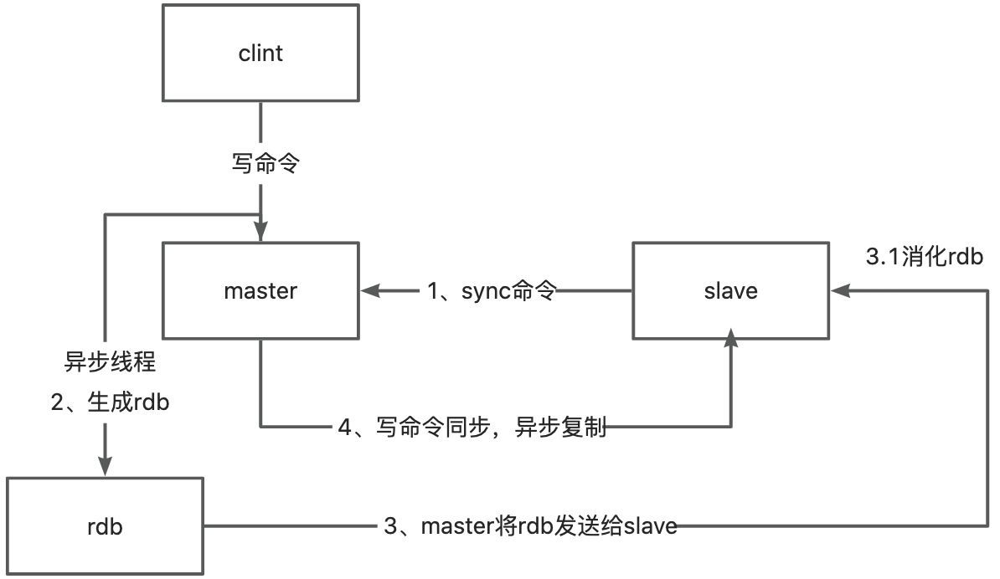

# 👌redis的同步机制是什么?

# 口语化回答
好的，面试官。redis 的同步机制主要是主从同步，一开始从服务器发送同步命令，主服务器接收到之后，就会生成一个 rdb 的文件，然后传输给从服务器，从服务器接收到之后，立马进行数据的恢复。然后当主服务器再次接收到写命令的时候，会发给从服务器。这个过程是一个异步复制，主服务器不会等待结果。这样就完成了主从复制，主要的核心步骤就是这些。如果同步机制发生问题的话，从服务器可以进行断线重连。还可以做集群、哨兵，来自动切换。以上。

# 题目解析
主要还是考主从同步原理和如何进行配置，还可以带一点故障的处理。面试官主要是想看看你对集群有没有一定的了解，redis 主从的数据复制有没有了解。

# 面试得分点
rdb 快照，增量同步，故障机制

# 题目详细答案
redis的同步机制主要涉及主从复制，主从复制机制允许一个服务器（主服务器）将数据复制到一个或多个服务器（从服务器）。从服务器可以是只读的，也可以接受写操作，但这些写操作不会被同步回主服务器。

## 同步机制的工作原理


### 初次同步
当从服务器第一次连接到主服务器时，或者当从服务器与主服务器的连接中断后重新连接时，会触发一次全量同步过程。

1. **从服务器发送SYNC命令**：从服务器向主服务器发送SYNC命令，请求进行同步。
2. **主服务器生成RDB快照**：主服务器接收到SYNC命令后，会生成一个RDB（Redis Database）快照文件，并在生成过程中将所有新写入的命令记录到一个缓冲区中。
3. **传输RDB文件**：主服务器将生成的RDB文件发送给从服务器。从服务器接收到RDB文件后，会清空自身的数据库并加载这个RDB文件。
4. **传输缓冲区中的命令**：主服务器将缓冲区中的所有写命令发送给从服务器，从服务器依次执行这些命令，以确保数据完全同步。

### 增量同步
在初次同步完成后，主从服务器会保持连接状态，主服务器会将后续的所有写命令实时发送给从服务器，从服务器执行这些命令以保持数据的一致性。

## 同步机制如何配置
### 主服务器配置
主服务器的配置通常不需要特别设置，只需要确保其能够接受从服务器的连接请求。

### 从服务器配置
在从服务器的配置文件中，需要指定主服务器的IP地址和端口号：

```plain
replicaof <master-ip> <master-port>
replicaof 192.168.1.100 6379
```

## 同步机制的故障处理
#### 断线重连
当从服务器与主服务器的连接中断时，从服务器会自动尝试重连。在重连成功后，从服务器会根据情况选择进行全量同步或增量同步。

#### 主从切换
在高可用环境中，可以使用Redis Sentinel或Redis Cluster来实现自动主从切换。当主服务器发生故障时，Sentinel或Cluster会自动选举一个新的主服务器，并通知其他从服务器进行同步。


> 原文: <https://www.yuque.com/jingdianjichi/xyxdsi/lg0v5wiqcxvawqkv>