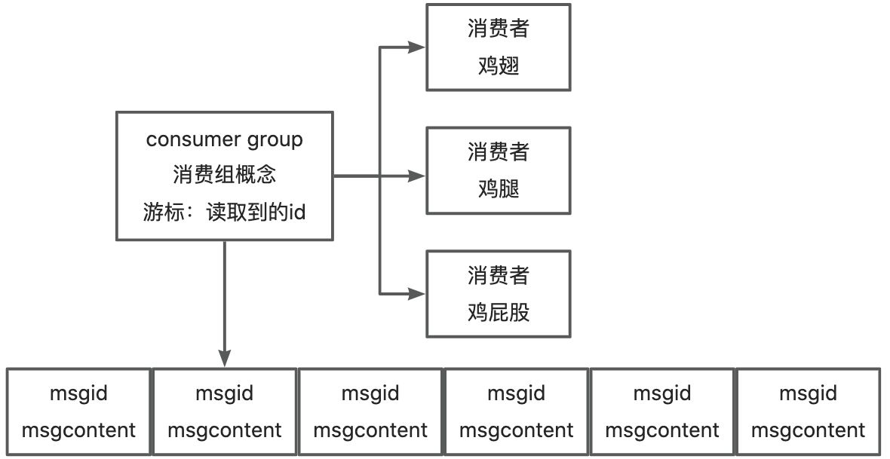

# 👌redis的高级数据类型有哪些？

[此处为语雀卡片，点击链接查看](https://www.yuque.com/jingdianjichi/xyxdsi/wfqkn5izd8q9lrp2#tkdjg)

# 口语化回答
好的，面试官，面对一些复杂的场景，redis提供了一些高级数据类型，来进行了功能的扩展。主要有四种，bitmaps，hyperloglog，geo，stream。stream 不是非常常用，主要是用来实现消息队列功能。常用的就是 bitmap，bitmap 的 0，1 特性，非常实用于签到，或者存在，不存在这种类型判断，以及在大量数据下，快速统计是否结果。bitmap 非常节省空间，相比于传统的存储数据后，在 mysql 等层面统计，bitmap 更加适用。其次就是hyperloglog 主要是用于一些数量的统计，不过要允许误差，他不会存具体的内容，会帮助我们进行数据的统计，像常见的网站访问统计，就非常适合这个数据结构。geo 主要是做地理位置的计算，通过经度和纬度来定位位置，经过运算可以得到距离，附近范围的坐标等等。像比如美团外卖的附近商家，地图的距离测算，都可以通过 geo 的结构来进行实现，以上。

# 题目解析
这道题问的比较少，如果在问你基础数据类型的时候，你补了一句，还有三种高级类型，如果面试官感兴趣的话，会继续的追问你。不过三种里面最常用的就是 bitmap，其他用的比较少，重点关注 bitmap 即可。hyperloglog，geo 都不常见，无需关注。作为了解即可。

# 面试得分点
bitmap，二进制位统计，签到功能，hyperloglog，大数据量统计，geo，地理位置，经纬度，附近的人

# 题目详细答案
## 一、 Bitmaps
位图就是一个用二进制位（0和1）来表示数据的结构。可以把它想象成一排开关，每个开关只能是开（1）或者关（0）。这些开关排成一行，从左到右编号，编号从0开始。

目的就是操作某一个位置的数据变成 1 或者 0。

整体效果是下面这种


### 主要操作命令
```plain
SETBIT jichi 4 1
```

按照上图，我们其实就是把 4 位设置成了 1。

```plain
GETBIT jichi 4
```

```plain
BITCOUNT jichi  //获取bitmap里面有多少个1
```

### 举个例子
基于上面我们按照大家常见的比如用户签到系统，来做一个例子的说明。

<font style="color:#2F8EF4;">假设我们有一个用户签到系统，我们可以用 bitmap 来记录每个用户每天是否签到。比如，一个月有30天，我们可以用30个位来表示这个月的签到情况，我们就可以如此设计。</font>

<font style="color:#2F8EF4;">第1天签到：第0位设为1。第2天没签到：第1位设为0。第3天签到：第2位设为1。以此类推...</font>

这个例子就用上面三个命令即可完成，setbit 设置签到位置，getbit 判断某一天有没有签到，bitcount 获取总共签了多少次到。

假设用户在第1天和第3天签到，那么 bitmap 的值就是下面这样的：

```plain
101000000000000000000000000000
```

### 为什么用 bitmap
**类似签到，活跃情况，这些场景，假设我们用数据库存储，可能是一条一条的，统计起来也费时和麻烦，如果使用 bitmap，可以进行非常快速的统计，并且 bitmap 每个位只是二进制位，非常节省空间。**

**扩展起来，其实比如判断用户有没有权限，假设把某个权限作为一个位置，新增作为 1，删除作为 2，那么这种场景也是可以很快知道用户是否有权限的一种方式。**

**总之涉及单位置判断的，是否的场景，bitmap 比较靠谱。**

****

## 二、HyperLogLog
HyperLogLog 用于计算数据集中不重复元素的数量，是 Redis 提供的一种基数统计的数据结构。当我们需要统计大量数据中有多少不同的元素时，直接存储所有元素会占用大量内存。例如，统计一个网站一天内有多少不同的IP地址访问。如果直接存储所有IP地址，内存消耗会非常大。HyperLogLog通过巧妙的数学方法，可以在很小的内存占用下，提供一个非常接近的估算值。在 Redis 里面，每个 HyperLogLog 键只需要花费 12 KB 内存，就可以计算接近 2^64 个不同元素的基 数。这和计算基数时，元素越多耗费内存就越多的集合形成鲜明对比。

> 什么是基数？？
>
> <font style="color:rgb(51, 51, 51);">比如数据集 {1, 3, 5, 7, 5, 7, 8}， 那么这个数据集的基数集为 {1, 3, 5 ,7, 8}, 基数(不重复元素)为5。 基数估计就是在误差可接受的范围内，快速计算基数。</font>
>

### <font style="color:rgb(51, 51, 51);">常用命令</font>
HyperLogLog 在 Redis 中以字符串的形式存在，但是只能作为计数器来使用，并不能获取到集合的原始数据。

主要涉及三个命令：

**添加元素**：

```plain
PFADD key element1 element2 ...
例如：PFADD jichihll jichi jitui
```

**估算基数**：

```plain
PFCOUNT key
PFCOUNT jichihll

返回的就是 2
```

**合并多个HyperLogLog**：

```plain
PFMERGE destkey sourcekey1 sourcekey2 ...
```

### 应用场景
凡是大量的数据下，统计不同数据的数量的情况都可以使用，非常的方便，同时要接受误差的场景。比如

**网站访问统计**：估算鸡翅 club 网站每天有多少独立访客。

**日志分析**：估算日志文件中有多少不同的错误类型。

## 三、 Geospatial Indexes
Geo数据指的是与地理位置相关的数据。简单来说，就是关于“东西在哪里”的数据。它可以描述物体的位置、形状和关系，比如城市的坐标、商店的位置、路线的路径等等。

有主要的三个要素，经度，纬度，和位置名称。

比如鸡哥所在的位置

```plain
GEOADD jichi 16.281231 37.1231241 jd
```

### 常用命令
**添加地理位置**：

```plain
GEOADD key longitude latitude member [longitude latitude member ...]
GEOADD cities 116.4074 39.9042 "Beijing"
```

**获取地理位置**：

```plain
GEOPOS key member
GEOPOS cities "Beijing"
会返回
116.4074
39.9042
```

**计算距离**：

```plain
GEODIST key member1 member2 [unit]
GEODIST cities "Beijing" "Shanghai" km（计算北京和上海之间的距离，单位为公里）
```

**查找附近的位置**：

```plain
GEORADIUS key longitude latitude radius [unit]
GEORADIUS cities 116.4074 39.9042 100 km（查找北京附近100公里内的所有城市）
```

**查找某个位置附近的位置**：

```plain
GEORADIUSBYMEMBER key member radius [unit]
GEORADIUSBYMEMBER cities "Beijing" 100 km（查找北京附近100公里内的所有城市）
```

georadius 以给定的经纬度为中心， 返回键包含的位置元素当中， 与中心的距离不超过给定最大距离的所有位置元素。

georadiusbymember 和 GEORADIUS 命令一样， 都可以找出位于指定范围内的元素， 但是 georadiusbymember 的中心点是由给定的位置元素决定的， 而不是使用经度和纬度来决定中心点。

### 应用场景
附近的人：比如类似微信的附近的人，以自己为中心，找其他的人，这种场景，就可以使用GEORADIUS 。

基于地理位置推荐：比如推荐某个位置附近的餐厅，都可以实现

计算距离：大家会遇到这种场景，比如当你购物的时候，美团外卖会告诉你商家距您多远，也可以通过 geo 来进行实现。

## 四、Stream（不是重点）
stream 是 redis5.0 版本后面加入的。比较新，以至于很多老八股题目，都没有提到这个类型。还有就是本身应用度的场景真的不多，类似 mq，但是如果 mq 的场景，大家一般会选择正宗的 rokcetmq 或者 rabbit 或者 kafka，所以这种类型，大家稍微知道即可。

Redis中的流结构用来处理**连续不断到达的数据**。你可以把它想象成一条流水线，数据像流水一样源源不断地流过来，我们可以在流水线的不同位置对这些数据进行处理。

主要目的是做消息队列，在此之前 redis 曾经使用发布订阅模式来做，但是发布订阅有一个缺点就是消息无法持久化。非常脆弱，redis 宕机，断开这些，都会产生造成丢失。stream 提供了持久化和主备同步机制。

### stream 的结构



### 概念解析
**消息（Message）**：流中的每一条数据。每条消息都有一个唯一的ID和一组字段和值。

**流（Stream）**：存储消息的地方。可以把它看作一个消息队列。

**消费者组（Consumer Group）**：一个或多个消费者组成的组，用来处理流中的消息。

**消费者（Consumer）**：处理消息的终端，可以是应用程序或服务。

### 应用场景
如果需要轻量级，很轻很轻，没有 mq 的情况下，可以使用 redis 来做，适合处理需要**实时处理**和**快速响应**的数据。比如做成用户消息实时发送和接收、服务器日志实时记录和分析、传感器数据实时收集和处理。

不过需要注意的是，正常来说 mq，mqtt 等等在各自场景有比较好的应用。

### 常见命令
**添加消息到流**：

```plain
XADD stream-name * field1 value1 [field2 value2 ...]
XADD mystream * user jichi message "Hello, world!"
他会向流mystream添加一条消息，消息内容是user: jichi, message: "Hello, world!"。
```

**读取消息**：

```plain
XREAD COUNT count STREAMS stream-name ID
XREAD COUNT 2 STREAMS mystream 0
会从流mystream中读取前两条消息，也就是读取到jichi 的hello world
```

**创建消费者组**：

```plain
XGROUP CREATE stream-name group-name ID
XGROUP CREATE mystream mygroup 0
会为流mystream创建一个名为mygroup的消费者组。
```

**消费者组读取消息**：

```plain
XREADGROUP GROUP group-name consumer-name COUNT count STREAMS stream-name ID
XREADGROUP GROUP mygroup consumer1 COUNT 2 STREAMS mystream >
会让消费者组mygroup中的消费者consumer1读取流mystream中的前两条消息。
```

**确认消息处理完成**：

消费者处理完成，应该进行 ack。

```plain
XACK stream-name group-name ID
XACK mystream mygroup 1526569495631-0
确认消费者组mygroup已经处理完了ID为1526569495631-0的消息。
```


> 原文: <https://www.yuque.com/jingdianjichi/xyxdsi/wfqkn5izd8q9lrp2>