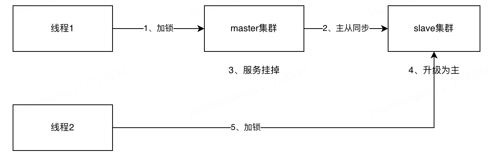

# redlock的分布式锁是什么？

之前大家了解的分布式锁都是单机的，那么redis在大型项目中，一半都是集群的形式。

如果线程一在master节点上加锁，但是加锁的key没同步到slave。然后master挂掉，slave升级为master。线程二就可以再次加锁，但线程一也已经拿到锁了，就造成了重复加锁问题。

为了解决这个问题，Redis作者 antirez提出一种高级的分布式锁算法：Redlock。

其实redlock在实际场景，没人去用这个东西，大家稍微了解一下即可。

redlock的核心理念是做一个redis集群，集群有多个master的节点，每个master节点做完全独立，之间不存在数据同步。

假设我们有五个redis的master节点，当加锁的时候，我们从master1到master5开始进行加锁。系统只有在获得了大多数 Redis 实例的锁（即 N/2 + 1 个节点，N 为节点总数）之后，才认为成功获取了分布式锁。这样即使部分 Redis 实例发生故障，整体锁服务仍然可用。如果获取锁失败，客户端需要向所有实例发送释放锁的命令，以避免留下未释放的锁。

> 原文: <https://www.yuque.com/jingdianjichi/xyxdsi/ufcpnl85ieiqev4k>