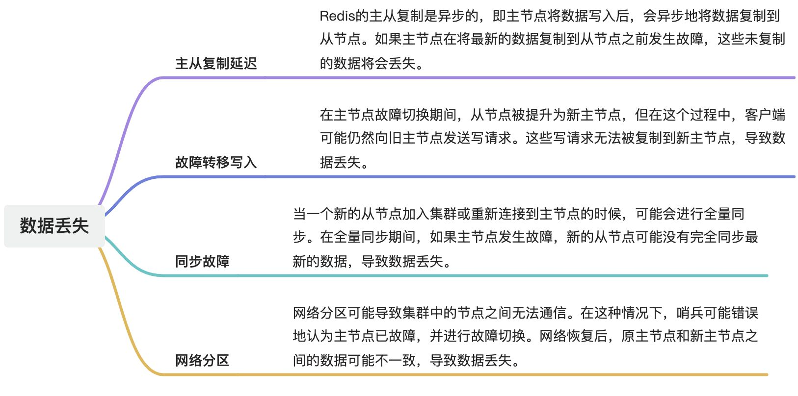

# 👌什么情况下redis哨兵模式会产生数据丢失?

[此处为语雀卡片，点击链接查看](https://www.yuque.com/jingdianjichi/xyxdsi/ayg02hgoacfeoe8p#aEn9j)

# 口语化答案
好的，面试官，其实 redis 在这种情况下的数据丢失，主要就是 4 点，第一点是主从复制的延迟，如果本身复制的过程存在延迟，然后数据还没有从节点的时候，就发生故障，会导致数据丢失。第二个就是故障转移，比如在从节点升级为新主节点的过程中，可能还有部分数据请求写入老节点。也会造成数据丢失。第三代呢就是同步故障，比如一个新的节点刚加入，正同步数据呢，结果主节点挂了，也会丢失。最后一个就是万恶的网络，网络分区会导致集群节点无法通信。以上。

# 题目解析
这个主要是看你对数据丢失这块，是否有过一定的完整性思考。常见的问题，无非总结就是 延迟，切换，网络三大点。其他的数据丢失题，其实也可以用这个往上套。

# 面试得分点
主从复制延迟，故障转移写入，同步故障，网络分区

# 题目详细答案

## 预防措施
为了尽量减少哨兵模式下的数据丢失，可以采取以下措施：

**1、 尽量使用半同步复制**：通过配置min-slaves-to-write和min-slaves-max-lag参数，确保主节点在写入数据时，至少有一定数量的从节点已同步数据。

**2、 优化故障检测和切换参数**：根据实际情况优化哨兵的故障检测和切换参数，确保能够及时、准确地进行故障检测和切换。

> 原文: <https://www.yuque.com/jingdianjichi/xyxdsi/ayg02hgoacfeoe8p>