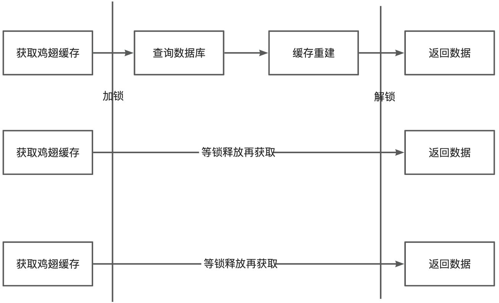
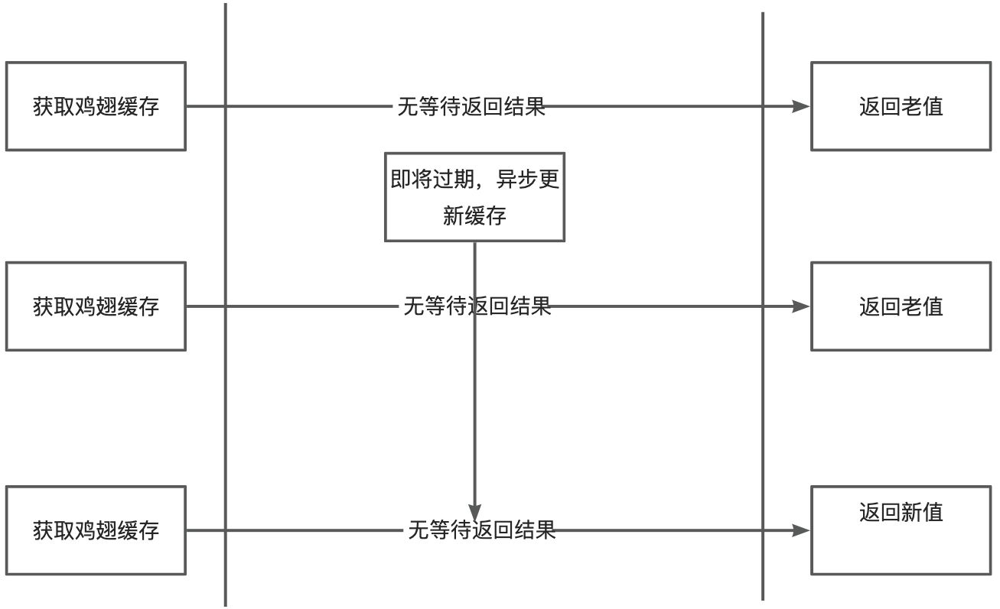

# 👌什么是缓存击穿？

[此处为语雀卡片，点击链接查看](https://www.yuque.com/jingdianjichi/xyxdsi/vyczt7wirn56b6kf#VO77w)

# 口语化回答
好的，面试官，缓存击穿主要是高并发情况下，某个热点key突然失效或者未被缓存，导致大量请求直接穿透到后端数据库，从而使得数据库负载过高，甚至崩溃的问题。经常会有小伙伴和缓存穿透弄混，一个比较好的区分点就是可以理解为单 key，同时重建缓存需要时间。解决这个问题，一般常见的两种方案，一个是互斥锁，在多请求情况下，只有一个请求会去构建缓存，其他的进行等待，这种主要是要考虑好死锁的问题和请求阻塞的问题。另一种就是设置一个逻辑过期时间，去进行异步的缓存更新，缓存本身永远不会过期，这样也就避免了击穿的问题。但是复杂性和逻辑时间的设置就比较考验设计。一般情况下互斥锁方案即可。以上。

# 题目解析
redis 经典三问之一，要注意和穿透的区分，很多小伙伴分不清，这是不行的。主要是考核大家对于互斥锁的死锁隐患的考虑以及数据一致性的考虑。看是否有这些方面的一些思考。一定要细致理解其中的图和数据。

# 面试得分点
互斥锁，不过期，一致性，高并发吞吐量

# 题目详细答案
缓存击穿是指在高并发的情况下，某个热点key突然失效或者未被缓存，导致大量请求直接穿透到后端数据库，从而使得数据库负载过高，甚至崩溃的问题。

这里要注意一个点就是比如构建这个 key 的缓存需要一定的时间，例如当缓存没有，查询数据后，重新放入缓存的过程需要一定的时间，如果这个时候，不进行控制，可能有很多请求都在做同一件事构建缓存，可能会引发数据库的压力剧增，或者影响到第三方服务。

## 解决方案
### 1、互斥锁
在缓存失效时，通过加锁机制保证只有一个线程能访问数据库并更新缓存，其他线程等待该线程完成后再读取缓存。核心重点 ：只有一个线程访问数据库和建立缓存。



根据上面的流程图，我们可以看到一个非常具体的实现步骤：

1. 当缓存失效时，尝试获取一个分布式锁。
2. 获取锁的线程去数据库查询数据并更新缓存。
3. 其他未获取锁的线程等待锁释放后，再次尝试读取缓存。

代码实现

```java
public String getValue(String key) {
    String value = redis.get(key);
    if (value == null) {
        // 尝试获取锁
        boolean lockAcquired = redis.setnx("lock:" + key, "1");
        if (lockAcquired) {
            try {
                // 双重检查锁，防止重复查询数据库
                value = redis.get(key);
                if (value == null) {
                    value = database.query(key);
                    redis.set(key, value, 3600);  // 1小时过期
                }
            } finally {
                // 释放锁
                redis.del("lock:" + key);
            }
        } else {
            // 等待锁释放，再次尝试获取缓存
            while ((value = redis.get(key)) == null) {
                try {
                    Thread.sleep(100);  // 等待100毫秒
                } catch (InterruptedException e) {
                    Thread.currentThread().interrupt();
                }
            }
        }
    }
    return value;
}
```

**注意：**锁的实现要确保高效和可靠，避免死锁和性能瓶颈。可以设置锁的过期时间，防止因异常情况导致锁无法释放。

### <font style="color:rgb(5, 7, 59);background-color:rgb(253, 253, 254);">2、不过期</font>
<font style="color:rgb(36, 41, 47);">设置一个较长的缓存过期时间，同时在缓存中存储一个逻辑过期时间。当逻辑过期时间到达时，后台异步更新缓存，而不是让用户请求直接穿透到数据库。这种方案可以彻底防止请求打到数据库，不过就是造成了代码实现过于复杂，因为你需要尽可能的保持二者的一致。</font>



**实现步骤**：

1. 在缓存中存储数据时，附带一个逻辑过期时间。
2. 读取缓存时，检查逻辑过期时间是否到达。
3. 如果逻辑过期时间到达，异步线程去数据库查询新数据并更新缓存，但仍返回旧数据给用户，避免缓存失效时大量请求直接访问数据库。

```java
class CacheEntry {
    private String value;
    private long expireTime;

    public CacheEntry(String value, long expireTime) {
        this.value = value;
        this.expireTime = expireTime;
    }

    public String getValue() {
        return value;
    }

    public boolean isExpired() {
        return System.currentTimeMillis() > expireTime;
    }
}

public String getValue(String key) {
    CacheEntry cacheEntry = redis.get(key);
    if (cacheEntry == null || cacheEntry.isExpired()) {
        // 异步更新缓存
        executorService.submit(() -> {
            String newValue = database.query(key);
            redis.set(key, new CacheEntry(newValue, System.currentTimeMillis() + 3600 * 1000));  // 1小时逻辑过期
        });
    }
    return cacheEntry != null ? cacheEntry.getValue() : null;
}
```

### 方案对比
互斥锁要注意的点是，阻塞等待可能会存在死锁或者请求阻塞的情况，降低了高并发的吞吐量。

不过期这种方式，设置逻辑时间是一个非常考验功底的情况，设置的过程，数据不一致性的时间就越长，所以要考虑好方案和业务情况。互斥锁，就不存在这种问题。各有优势，按照情况来进行选择。


> 原文: <https://www.yuque.com/jingdianjichi/xyxdsi/vyczt7wirn56b6kf>