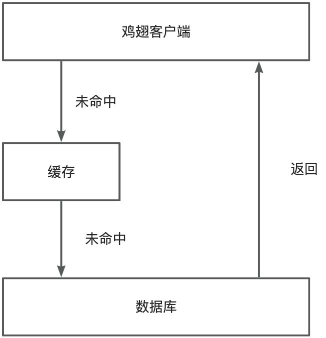
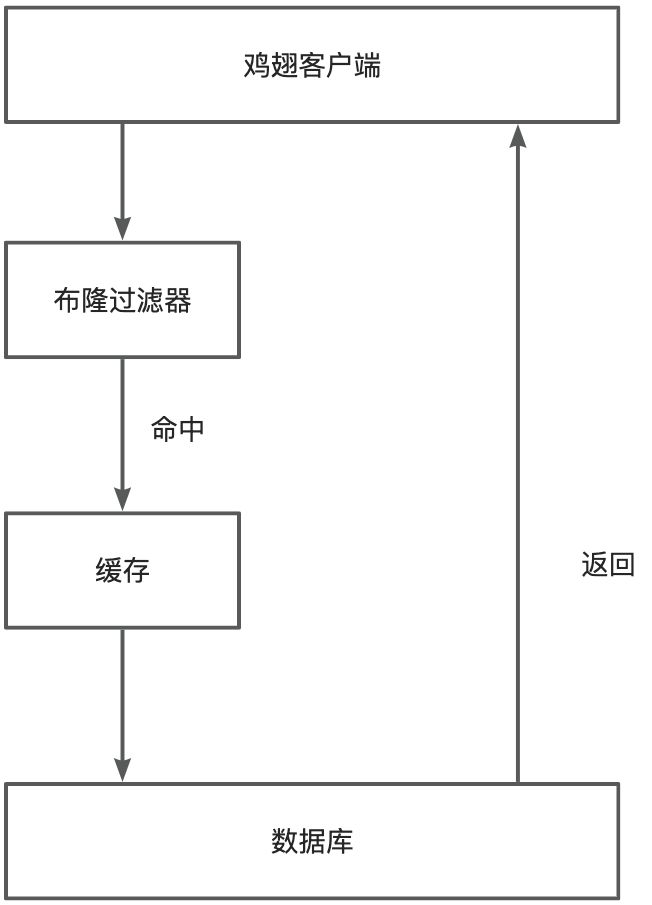

# 👌什么是缓存穿透?

[此处为语雀卡片，点击链接查看](https://www.yuque.com/jingdianjichi/xyxdsi/kpg4wl17nc3vn3wz#CeUJ2)

# 口语化回答
好的，面试官，缓存穿透的最核心就是当高并发请求来的时候，但是 key 在缓存中不存在的时候，就会请求数据库，如果数据库还是没有的话，就会返回，但是这个时候，由于没有数据，也不会存入到缓存中，下次请求过来还会重复这个操作。如果说这个 key 一直没有数据，就会不断的打到数据库中。这就是缓存穿透。缓存穿透主要可以通过缓存空值，布隆过滤器的方式来进行解决。常用的就是缓存空值，当数据库也查询不到的时候，在缓存中将空值写入，这样后面的请求就会命中缓存，不会造成数据库的大压力。布隆过滤器比较适合一些固定值，来进行初步的过滤，这样可以减少误判率，同时减轻压力，以上。

# 题目解析
redis 算是必问的三个概念之一，其他两个是缓存击穿和缓存雪崩，后面也有介绍。这道题很多人容易把缓存穿透和缓存击穿来弄乱。要注意好识别，还有就是三种常见的解决方案要理解透彻。

# 面试得分点
穿透的核心概念，缓存空对象解决，布隆过滤器，缓存预热。

# 题目详细答案
**缓存穿透**是指在高并发场景下，如果某一个key被高并发访问，但该key在缓存中不存在，那么请求会穿透到数据库查询。如果这个key在数据库中也不存在，就会导致每次请求都要到数据库去查询，给数据库带来压力。严重的缓存穿透会导致数据库宕机。可以根据图看到核心的重点在于不命中和返回空。解决方案也围绕这些即可。



## 解决方案
### **1、 缓存空对象**
当数据库中查不到数据时，缓存一个空对象（例如一个标记为空或不存在的对象），并给这个空对象的缓存设置一个过期时间。这样，下次再查询该数据时，就可以直接从缓存中拿到空对象，从而避免了不必要的数据库查询。

这种解决方式有两个缺点：

需要缓存层提供更多的内存空间来缓存这些空对象，当空对象很多时，会浪费更多的内存。

会导致缓存层和存储层的数据不一致，即使设置了较短的过期时间，也会在这段时间内造成数据不一致问题。比如缓存还是空对象，这个时候数据库已经有值了。这种引入复杂性，当数据库值变化的时候，要清空缓存。

```plain
String key = "jichiKey";
String value = redis.get(key);
if (value == null) {
    value = database.query(key);
    if (value == null) {
        // 缓存空结果，设置短过期时间
        redis.set(key, "", 60);  // 60秒过期
    } else {
        redis.set(key, value, 3600);  // 1小时过期
    }
}
```

### **2、 使用布隆过滤器**
布隆过滤器用于检测一个元素是否在集合中。访问缓存和数据库之前，先判断布隆过滤器里面有没有这个 key，如果 key 存在，可以继续往下走，如果 key 不存在，就不用往下进行走了。比较适合数据 key 相对固定的场景。可以减少误识别率。



代码示例：

```plain
BloomFilter<String> bloomFilter = new BloomFilter<>(expectedInsertions, falsePositiveProbability);
// 初始化布隆过滤器，插入所有可能存在的键
for (String key : allPossibleKeys) {
    bloomFilter.put(key);
}

// 查询时使用布隆过滤器
String key = "jichiKey";
if (!bloomFilter.mightContain(key)) {
    // 布隆过滤器判断不存在，直接返回
    return null;
} else {
    // 布隆过滤器判断可能存在，查询缓存和数据库
    String value = redis.get(key);
    if (value == null) {
        value = database.query(key);
        redis.set(key, value, 3600);  // 1小时过期
    }
    return value;
}
```

### **3、缓存预热**
在系统启动时，提前将热门数据加载到缓存中，可以避免因为请求热门数据而导致的缓存穿透问题。需要根据系统的实际情况和业务需求来判断是否需要对缓存进行预热。比如在一些高并发的系统下，提前预热可以大大减少毛刺的产生，以及提高性能和系统稳定。

缓存预热的经典代码:

```plain
package com.jingdianjichi.redis.init;

import org.springframework.stereotype.Component;

@Component
public abstract class AbstractCache {

    public void initCache(){}

    public <T> T getCache(String key){
        return null;
    }

    public void clearCache(){}

    public void reloadCache(){
        clearCache();
        initCache();
    }

}

```

```plain
@Component
public class InitCache implements CommandLineRunner {

    @Override
    public void run(String... args) throws Exception {
        //我要知道哪些缓存需要进行一个预热
        ApplicationContext applicationContext = SpringContextUtil.getApplicationContext();
        Map<String, AbstractCache> beanMap = applicationContext.getBeansOfType(AbstractCache.class);
        //调用init方法
        if(beanMap.isEmpty()){
            return;
        }
        for(Map.Entry<String,AbstractCache> entry : beanMap.entrySet()){
            AbstractCache abstractCache = (AbstractCache) SpringContextUtil.getBean(entry.getValue().getClass());
            abstractCache.initCache();
        }
    }

}
```

```plain
@Component
public class CategoryCache extends AbstractCache {

    private static final String CATEGORY_CACHE_KEY = "CATEGORY";

    @Autowired
    private RedisUtil redisUtil;

    @Autowired
    private RedisTemplate redisTemplate;

    @Override
    public void initCache() {
        //跟数据库做联动了，跟其他的数据来源进行联动
        redisUtil.set("category","知识");
    }

    @Override
    public <T> T getCache(String key) {
        if(!redisTemplate.hasKey(key).booleanValue()){
            reloadCache();
        }
        return (T) redisTemplate.opsForValue().get(key);
    }

    @Override
    public void clearCache() {
        redisTemplate.delete(CATEGORY_CACHE_KEY);
    }
}
```


> 原文: <https://www.yuque.com/jingdianjichi/xyxdsi/kpg4wl17nc3vn3wz>