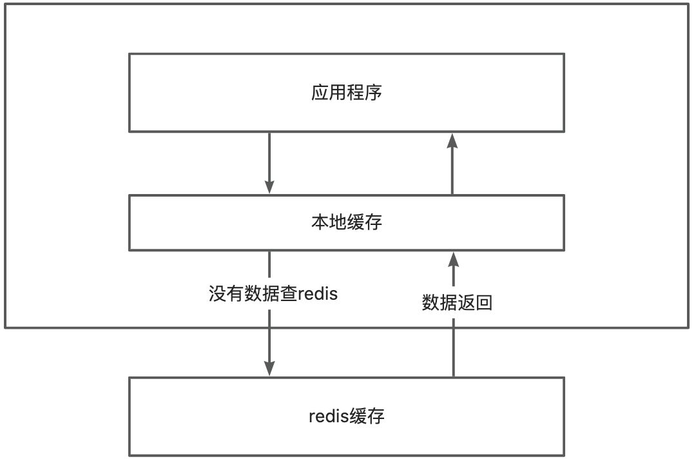

# 👌本地缓存与分布式缓存的区别?

[此处为语雀卡片，点击链接查看](https://www.yuque.com/jingdianjichi/xyxdsi/cbxv564ebbqk0rzp#JjtX1)

# 口语化回答
好的，面试官，本地缓存与分布式缓存的本质区别在于一个是存在应用内部，一个是独立于应用外，大家共享。本地缓存比如 caffine，guava cache 这些都是比较常用的，本地缓存的优点就是速度非常快，没有网络消耗，缺点就是应用重启后，缓存就会丢失。分布式缓存像 redis 这种，也很快，但是多了一些网络的开销。在高并发的情况，有时候 redis 这种会成为性能瓶颈，就需要我们上一个本地缓存，配合 redis 做多级缓存架构来进行处理和优化，以上。

# 题目解析
主要是想看你用没用过本地缓存，考察你对两种缓存的特性区别和在实际场景下的选型，如果能答出来什么情况下用本地缓存，会比较加分。

# 面试得分点
重启丢失，速度快，caffine，网络开销，水平扩展。

# 题目详细答案
## 概念
本地缓存：是指将数据缓存在应用程序所在的服务器或客户端的内存中。本地缓存的数据存储在应用程序的单个节点上。比如大家启动的应用里面用 hashmap 存储的数据，或者一些三方缓存，caffine，guava cache 这些都是本地缓存，特性在于缓存只存在这台机器。其他机器不知道。本地缓存重起之后，缓存就会失效。

分布式缓存：像 redis 这种就是分布式缓存，一个 redis 存储后，多个应用都可以来进行访问。同时自身支持集群模式，缓存数据可以分散存储在多个节点上。

## 区别对比
| | 本地缓存 cacffine/guava cache | redis |
| --- | --- | --- |
| 速度 | 位于应用程序所在的内存中，因此访问速度非常快 | 在网络上进行数据传输，可能会增加额外的网络开销，导致访问速度略低于本地缓存。 |
| 存储 | 存储在一个节点中，多个应用实例之间无法共享缓存数据。数据随应用进程的重启而丢失。 | 通过将数据分片存储在多个节点上，提高了缓存的容量和可扩展性。部分数据会被复制到多个节点上，以提高数据的可靠性和可用性 |
| 容量 | 容量受到内存大小的限制，一旦超过容量限制，可能会导致性能下降或者数据丢失。无法动态扩展。 | 根据需求动态添加和删除节点，以适应数据量的变化和访问负载的增加。redis 水平扩展。 |

## 扩展
当并发巨大的时候，如果 redis 的网络和 cpu 成为了瓶颈，一般可以增加一层本地缓存来进行缓冲。也就是我们说的多级缓存。

> 原文: <https://www.yuque.com/jingdianjichi/xyxdsi/cbxv564ebbqk0rzp>