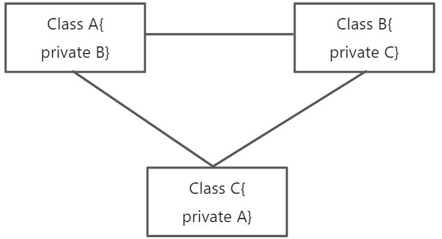

# 👌Spring 循环依赖是如何解决的？

# 口语化回答
好的，面试官。循环依赖问题的解决主要是靠三级缓存机制来解决的。其中一级缓存用于存储完全初始化好的单例 Bean，二级缓存用于存储早期暴露的 Bean 实例，部分初始化的 Bean。三级缓存用于存储 Bean 工厂，主要用于创建 Bean 的代理对象。假设现在有两个对象 A 依赖 B，B 依赖 A。那么在A创建过程中发现需要属性 B，查找发现 B 还没有在一级缓存中，于是先将 A 放到三级缓存中，此时的 A 不完整，没有属性，但是可以引用。接下来就去实例化B。B 开始创建，此时发现需要A，于是B先查一级缓存寻找A，如果没有，再查二级缓存，如果还没有，再查三级缓存，找到了A，然后把三级缓存里面的这个A放到二级缓存里面，并删除三级缓存里面的A。B顺利初始化完毕，将自己放到一级缓存里面（此时B里面的A依然是创建中的状态）。然后回来接着创建A，此时B已经创建结束，可以直接从一级缓存里面拿到B，这样 A 就完成了创建，并将A放到一级缓存。以上。

# 题目解析
循环依赖经典问题，近年考的频率越来越高。大家一定重点理解三级缓存解决的问题，为什么会产生三层，每一层的作用缺了的话，会产生什么样的后果，同时要背一个小例子，给面试官进行解释。

# 面试得分点
三级缓存的过程，三级缓存存的是什么，二级缓存解决的问题，没有三级是否可以

# 题目详细答案
循环依赖是指两个或多个Bean相互依赖，形成一个闭环。例如，Bean A 依赖于 Bean B，而 Bean B 又依赖于 Bean A。又或者 Bean A 依赖于 Bean B，而 Bean B 又依赖于 Bean C，Bean A 依赖于 Bean A。



## 循环依赖的两种情况
### 1、构造器注入的循环依赖
Spring 无法直接解决通过构造器注入引起的循环依赖，因为在这种情况下，Spring 无法创建任何一个 Bean 实例而不先创建另一个 Bean 实例。这会导致一个无限循环。因此，通常建议避免在构造器注入中引入循环依赖。

#### 代码
```java
public class ClassA {
    private ClassB b;
    public ClassA() {
    }
    public ClassA(ClassB b) {
        this.b = b;
    }
}

public class ClassB {
    private ClassC c;
    public ClassB() {
    }
    public ClassB(ClassC c) {
        this.c = c;
    }
}

public class ClassC {
    private ClassA a;
    public ClassC() {
    }
    public ClassC(ClassA a) {
        this.a = a;
    }
}

```

```java
<!--声明A-->
<bean id="a" class="com.jichi.ClassA">
<!--构造注入b依赖-->
<constructor-arg name="b" ref="b"></constructor-arg>
</bean>
<!--声明B-->
<bean id="b" class="com.jichi.ClassB">
<!--构造注入c依赖-->
<constructor-arg name="c" ref="c"></constructor-arg>
</bean>
<!--声明C-->
<bean id="c" class="com.jichi.ClassC">
<!--构造注入a依赖-->
<constructor-arg name="a" ref="a"></constructor-arg>
</bean>
```

### 2、Setter 注入的循环依赖
对于通过 setter 方法注入引起的循环依赖，Spring 采用三级缓存机制来解决问题。

> #### 三级缓存机制
> Spring 使用三级缓存来处理循环依赖：
>
> 1. **一级缓存（singletonObjects）**：用于存储完全初始化好的单例 Bean。类型：Map<String, Object>
> 2. **二级缓存（earlySingletonObjects）**：用于存储早期暴露的 Bean 实例，部分初始化的 Bean。Map<String, Object>
> 3. **三级缓存（singletonFactories）**：用于存储 Bean 工厂，主要用于创建 Bean 的代理对象。Map<String, ObjectFactory<?>>
>

#### 解决循环依赖的过程
我们拿 A 依赖 B，B 依赖 A 来进行举例

1、在创建 A 对象放入到 spring 容器的过程，先看一级缓存，能否可以直接获取到 A，如果可以，直接获取，如果不可以，则开始创建 A 对象，A创建过程中发现需要属性 B，查找发现 B 还没有在一级缓存中，于是先将 A 放到三级缓存中，此时的 A 不完整，没有属性，但是可以引用。接下来就去实例化B。

2、B 实例化的过程，也是先从一级缓存，看自己有没有，没有的话，开始创建，此时发现需要A，于是B先查一级缓存寻找A，如果没有，再查二级缓存，如果还没有，再查三级缓存，找到了A，然后把三级缓存里面的这个A放到二级缓存里面，并删除三级缓存里面的A。

3、B顺利初始化完毕，将自己放到一级缓存里面（此时B里面的A依然是创建中的状态）。然后回来接着创建A，此时B已经创建结束，可以直接从一级缓存里面拿到B，去完成A的创建，并将A放到一级缓存。

#### 假设我们没有三级缓存，只有一级缓存，那么我们会怎样进行处理呢？
首先A对象进行实例化，A要进行属性填充B。但是B还没有创建，于是开始B进行实例化，同样的B也要进行属性填充，发现他需要A。然而我们的一级缓存的Map里面还没有A，所以他有创建A，于是就产生了死循环。循环往复，最后栈溢出。那么小伙伴们会问，我的A我不进行属性填充，我直接扔一级缓存里面，那不就可以了吗？这样就会造成map里面存的A是个假A，缺胳膊少腿，当你真正用到他的时候，啪一个空指针异常。而且我们的一级缓存规定是完全初始化好的bean。给我们的程序进行使用。那么大家这会都理解了，一级缓存行不通

#### 二级缓存解决了什么问题？
首先我们还是实例化A开始，注意这个地方，我们实例化后，还没有进行属性填充的时候，就把A对象的引用放入到了map2备用。然后进行属性填充，A去填充B，发现B没有实例化，于是B同样实例化后，把自己的半成品放入到map2。B开始进行填充，发现Map1中没有A，又去Map2中进行寻找，发现map2里面有。于是B直接拿到map2中的A使自己变得非常完整。这个时候B就把自己放入Map1。并把Map2的半成品删除了。回到刚才A的阶段，A发现Map1中已经有B了。那么A也就完成了属性的创建。于是双方都完成了自己的创建。这就是二级缓存解决的问题。

#### 不需要三级缓存可以吗？
主要是因为Spring的Aop机制所产生的代理对象问题。首先要了解一个前置就是Spring的代理对象产生阶段是在填充属性后才进行的，原理通过后置处理器BeanPostProcessor来实现。如果说我们用二级缓存来解决，那么就要在属性填充的时候，将代理对象生成好，放入二级缓存。那么就与我们spring的对象生命周期相悖。所以这种方式不好，于是我们引入了三级缓存。


> 原文: <https://www.yuque.com/jingdianjichi/xyxdsi/rxq5piad5tigr9l4>