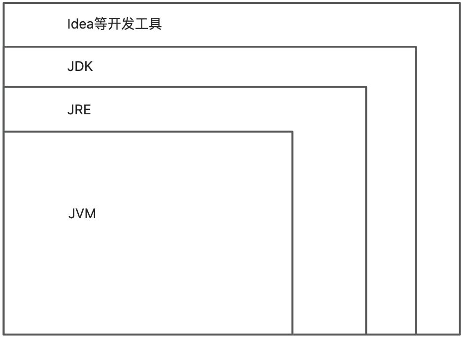

# 👌说说JVM、JRE和JDK的关系？

JVM、JRE 和 JDK 是 Java 生态系统中的三个核心组件，它们在 Java 开发和运行时环境中扮演着不同的角色。



### JVM (Java Virtual Machine)
**Java 虚拟机**是一种抽象计算机，它为 Java 程序提供了运行环境。JVM 的主要职责是执行 Java 字节码，并将其转换为机器代码，以便在特定平台上运行。JVM 是实现 Java 平台无关性的关键组件。

主要负责：**字节码执行**：JVM 负责加载、验证和执行 Java 字节码。**内存管理**：JVM 管理堆内存和栈内存，并执行垃圾回收（Garbage Collection）。**安全性**：JVM 提供了安全机制，确保 Java 应用在受控环境中运行。

### JRE (Java Runtime Environment)
**Java 运行时环境**是一个软件包，它提供了运行 Java 应用程序所需的所有组件。JRE 包含 JVM 以及 Java 类库和其他支持文件。JRE 是运行 Java 应用程序的最低要求。JRE 包含 JVM，用于执行 Java 字节码。JRE 包含 Java 标准类库（如java.lang、java.util等），这些类库为 Java 应用提供基础功能。

### JDK (Java Development Kit)
**Java 开发工具包**是为 Java 开发者提供的完整开发环境。JDK 包含 JRE 以及开发 Java 应用程序所需的工具和库。JDK 是开发和编译 Java 程序的必备工具。JDK 包含一个完整的 JRE 环境。包括编译器（javac）、调试器（jdb）、打包工具（jar）等，用于开发、编译和调试 Java 程序。提供了额外的库和头文件，用于开发 Java 应用程序。

### 关系
**JVM 是 JRE 的一部分**：JVM 是 JRE 中的核心组件，负责执行 Java 字节码。

**JRE 是 JDK 的一部分**：JRE 提供了运行 Java 应用程序所需的环境，而 JDK 则在此基础上添加了开发工具和额外的库。

### 图示关系
```plain
JDK
 ├── JRE
 │    ├── JVM
 │    ├── 核心类库
 │    └── 其他支持文件
 ├── 开发工具（javac、jdb、jar 等）
 └── 额外的库和头文件
```


> 原文: <https://www.yuque.com/jingdianjichi/xyxdsi/zcscx8u0f3c7vb9i>