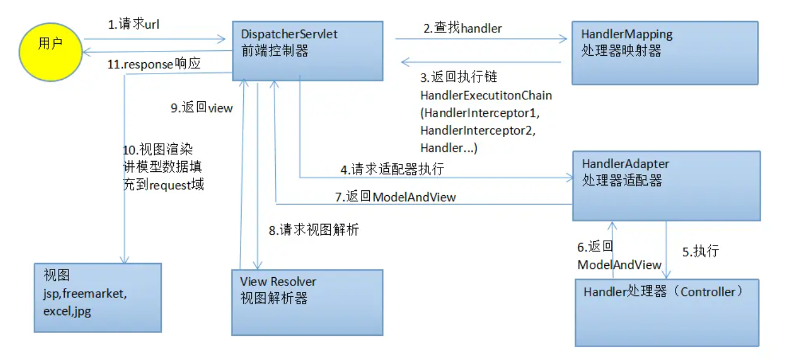

# 👌SpringMVC的原理及执行流程？

# 题目详细答案

## 组件
Spring MVC是一个基于Java的实现了MVC设计模式的请求驱动类型的轻量级Web框架，它大量使用了Spring框架中提供的设计模式。Spring MVC框架的核心组件包括：

1. DispatcherServlet：前端控制器，负责接收请求并根据映射关系调用相应的控制器。
2. HandlerMapping：负责根据请求的URL到HandlerMapping中找到映射的处理器（Controller）。
3. HandlerAdapter：负责根据处理器，生成处理器适配器，通过适配器调用实际的处理器。
4. Controller：处理器，执行相应的业务逻辑操作，并返回ModelAndView对象。
5. ModelAndView：包含了视图逻辑名和模型数据的对象，是连接控制器和视图的桥梁。
6. ViewResolver：负责解析视图名到具体视图实现类的映射，根据视图名称找到对应的视图实现类。
7. View：视图，负责渲染数据并展示给用户。

## 执行流程
Spring MVC 的执行流程大致可以分为以下几个步骤：

1. 发送请求到DispatcherServlet：用户向服务器发送请求，请求被DispatcherServlet捕获。
2. 查找Handler：DispatcherServlet根据请求URL到HandlerMapping中查找映射的处理器（Controller）。
3. 调用HandlerAdapter：DispatcherServlet根据处理器，到HandlerAdapter中找到对应的处理器适配器。
4. 执行Controller：处理器适配器调用实际的处理器（Controller）执行业务逻辑操作，并返回ModelAndView对象。
5. 处理ModelAndView：DispatcherServlet根据ModelAndView中的视图名称，到ViewResolver中找到对应的视图实现类。
6. 渲染视图：视图实现类根据ModelAndView中的数据和视图模板渲染视图。
7. 返回响应到客户端：DispatcherServlet将渲染后的视图返回给客户端。

> 原文: <https://www.yuque.com/jingdianjichi/xyxdsi/yzng2s56vambfhi6>