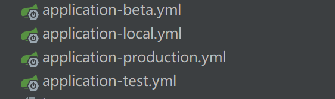

# 👌如何做环境隔离？

[此处为语雀卡片，点击链接查看](https://www.yuque.com/jingdianjichi/xyxdsi/mz0crzpmzwds77vp#A90dQ)

# 背景
从我们的日常工作中来看，一个项目的开发，基本上要分为线上、预发、开发、测试四个环境。

线上环境：真正的上线环境。

预发环境：和线上极相似的环境，代码分支只能是这次要合并的代码。有些公司会直连线上环境，有些会自己造环境。

开发环境：程序员本地开发的环境，配置比较随意。

测试环境：测试人员进行测试的环境，可以随意进行调整数据。

# 如何隔离
spring有一种方案，就是配置文件的profile的特性。



我们可以搞对应环境的文件，然后通过启动时加的参数，来决定加载哪些配置。

例如 -Dspring.profiles.active=beta 

这是一种方式。但这样的话，我们每次在linux部署，运维人员需要知道是什么环境，如果没有自动化的话，那么我们是否可以在打maven包的时候，就做好环境的处理呢。

# 基于 maven的profile特性
我们可以把这个启动参数，放到配置文件里进行加载，然后maven打包的时候，根据环境来进行替换。

比如我们的主配置文件，可以增加如下配置

```plain
spring:
 profiles:
 active: ${env-flag}
```

可以看到env-flag是一个变量的形式。那么他从哪里读取呢，我们就要利用到maven的profile特性。activeByDefault就是我们默认的变量值。

```plain
        <profiles>
            <profile>
                <id>local</id>
                <properties>
                    <env-flag>local</env-flag>
                </properties>
                <activation>
                    <activeByDefault>true</activeByDefault>
                </activation>
            </profile>
            <profile>
                <id>beta</id>
                <properties>
                    <env-flag>beta</env-flag>
                </properties>
            </profile>
            <profile>
                <id>production</id>
                <properties>
                    <env-flag>production</env-flag>
                </properties>
            </profile>
            <profile>
                <id>test</id>
                <properties>
                    <env-flag>test</env-flag>
                </properties>
            </profile>
        </profiles>
```

maven的pom文件增加如下配置之后，我们就要解决如何读取的问题。

```plain
    <resources>
        <resource>
            <directory>src/main/resources</directory>
            <filtering>true</filtering>
        </resource>
        <resource>
            <directory>src/main/java</directory>
            <includes>
                <include>**/*.xml</include>
            </includes>
        </resource>
    </resources>
```

用filering来指定哪些配置文件需要进行替换。如上，这样的话，我们的主配置文件就会替换变量。

那么为什么是${}分隔符呢。因为是maven默认的， 我们也可以使用自定义的替换符来进行替换，就要用到下面这个标签。

```plain
<resource.delimiter>@@</resource.delimiter>
```

如果我们自己声明了，上面的文件就需要更改成如下格式。

```plain
spring:
 profiles:
 active: @env-flag@
```

打包的时候，我们可以用如下命令来指定打什么环境的包

```plain
mvn clean package -Pbeta
```


> 原文: <https://www.yuque.com/jingdianjichi/xyxdsi/mz0crzpmzwds77vp>