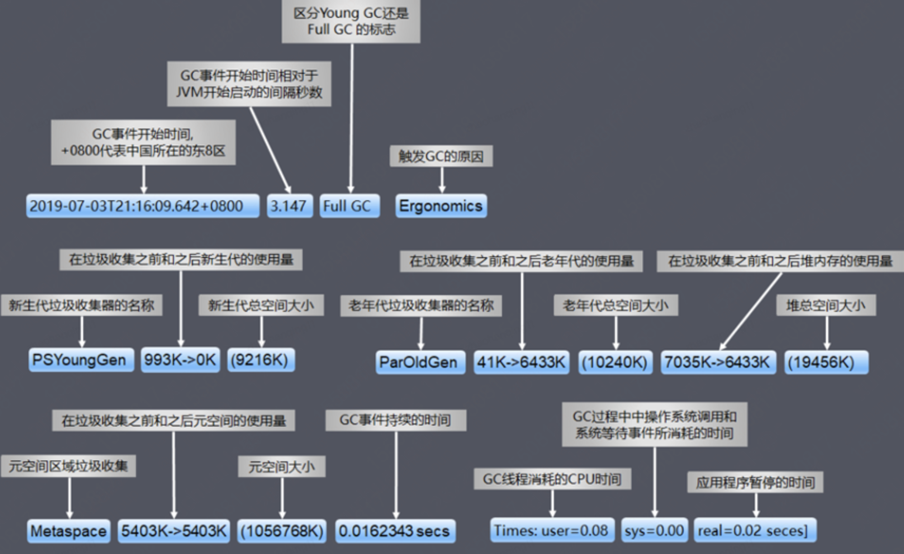

# 👌你对jvm调优有自己的理解吗？

[此处为语雀卡片，点击链接查看](https://www.yuque.com/jingdianjichi/xyxdsi/ssbvlylqfgfodkqf#G3r6e)

这道题是很多人简历上如果写了，有 jvm 调优经验的人准备的。

本案例为：一次 fullgc 时间的优化，从 30s 到 180ms。

本性能优化案例是通用的！大家消化完成，直接套到自己项目即可！

本题配备了视频助于理解。

# 口语化答题
有的，之前我在公司参与过一次性能优化，其中正好涉及了这个案例，当时我们组的一个 xx 系统，在例行巡检的时候发现，full gc 的时候，经常性的耗费大量的时间，整体完成下来大概要 30 多s 完成。会触发监控平台配置的 500ms 的阈值。我就通过监控平台和 gc 日志开始入手。主要是看 gc 日志的几个关键指标，例如 real 指标。然后就是按照监控上 gc 超时的时间点，与机器整体的状态进行一下对比。对比那一刻的流量 qps 情况，任务情况，磁盘情况，cpu 情况，内存情况，线程情况等等。在发生 fullgc 的时候，cpu 和内存均有上升，磁盘内部的 swap 空间有下降。基本就是认为 swap 造成的，于是去看了 swap 的使用情况，最终发现 fullgc 超时的确实和 swap 息息相关，进行了内存交换导致，关闭后，fullgc 正常，达到了 180ms。

# 背景
之前在做例行巡检的时候，通过监控平台发现，我们的一个 xxx 应用（套到你自己的项目上）在进行 full gc 的时候，经常性的耗费大量的时间，整体完成下来大概要 30 多s 完成，会触发监控平台配置的 500ms 的阈值，产生了报警的情况，观察了之前的频率，发现时间不长，10 天左右产生一次。正好赶上我们的性能优化周，于是我去查看了这个问题，避免服务不可用。

# 排查步骤
要排查 jvm 的情况，我的思路首先是看机器的规格和 jvm 相关的配置。机器是 4c8g，老年代 6g，正常的配置，无特殊参数的处理和调整。jvm 参数也配置开启了 gc 日志。所以直接从日志入手。

## gc 日志解读图
所有的 gc 日志都可以根据这张图来进行读，会了这张图，你就能知道其中的各种意思。

观察了我们的线上日志，结果的现象情况就是 real 时间非常的高。疯狂的暂停了，那么罪魁祸手基本找到，为何暂停，又是一个命题。

首先是按照监控上 gc 超时的时间点，与机器整体的状态进行一下对比。对比那一刻的流量 qps 情况，任务情况，磁盘情况，cpu 情况，内存情况，线程情况等等。

初步得到的结论是在发生 gc 的时候，没有大量的 qps，也没有定时任务在疯狂的跑。排除流量相关的。

反而是发现机器自身的情况有变化。在发生 fullgc 的时候，cpu 和内存均有上升，但是有意思的是，磁盘内部的 swap 空间有下降。

于是开始找三者的关系，看看是否有什么的关系？

首先第一件事看看 swap 的空间都是谁在用，找到占用最多的进程。这一块是让运维小伙伴有 linux 命令，配合 ps 来做的。我发现其中我们的 java 程序占用 swap 空间名列前茅！

> swap指的是一个交换分区或文件，主要是在内存使用存在压力时，触发内存回收，这时可能会将部分内存的数据交换到swap空间，以便让系统不会因为内存不够用而导致oom或者更致命的情况出现。
>
> 当某进程向OS请求内存发现不足时，OS会把内存中暂时不用的数据交换出去，放在swap分区中，这个过程称为swap out。
>
> 当某进程又需要这些数据且OS发现还有空闲物理内存时，又会把swap分区中的数据交换回物理内存中，这个过程称为swap in。
>

为了验证GC耗时与swap操作有必然关系，我抽查了十几台机器，重点关注耗时长的GC日志，通过时间点确认到GC耗时的时间点与swap操作的时间点确实是一致的。

进一步查看虚拟机各实例 swappiness 参数，一个普遍现象是，凡是发生较长Full GC的实例都配置了参数 vm.swappiness = 30（值越大表示越倾向于使用swap）；而GC时间相对正常的实例配置参数 vm.swappiness = 0（最大限度地降低使用swap）。

> swappiness 可以设置为 0 到 100 之间的值，它是Linux的一个内核参数，控制系统在进行swap时，内存使用的相对权重。
>
> Ø swappiness=0: 表示最大限度使用物理内存，然后才是 swap空间
>
> Ø swappiness=100: 表示积极的使用swap分区，并且把内存上的数据及时的交换到swap空间里面
>
> 通过cat swappiness 命令可以查看。
>

至此，初步断定 swap 导致的full gc时间延长。

当内存使用率达到水位线(vm.swappiness)时，linux会把一部分暂时不使用的内存数据放到磁盘swap去，以便腾出更多可用内存空间；

当需要使用位于swap区的数据时，再将其换回内存中，当JVM进行GC时，需要对相应堆分区的已用内存进行遍历；

假如GC的时候，有堆的一部分内容被交换到swap空间中，遍历到这部分的时候就需要将其交换回内存，由于需要访问磁盘，所以相比物理内存，它的速度肯定慢的令人发指，GC停顿的时间一定会非常非常恐怖；

进而导致Linux对swap分区的回收滞后（内存到磁盘换入换出操作十分占用CPU与系统IO），在高并发/QPS服务中，这种滞后带来的结果是致命的(STW)。

# 问题解决
1、设置vm.swappiness=0（重启应用释放swap后生效），表示尽可能不使用交换内存

2、关闭交换分区swapoff –a

首先要保证内存剩余要大于等于swap使用量，否则会报Cannot allocate memory！swap分区一旦释放，所有存放在swap分区的文件都会转存到物理内存上，可能会引发系统IO或者其他问题。

关闭之后，我们通过内部监控发现机器的指标，内存升高了，swap立马降到了0。

持续观察下次gc，发现时间缩短到180ms。此次优化完成。  

> 原文: <https://www.yuque.com/jingdianjichi/xyxdsi/ssbvlylqfgfodkqf>