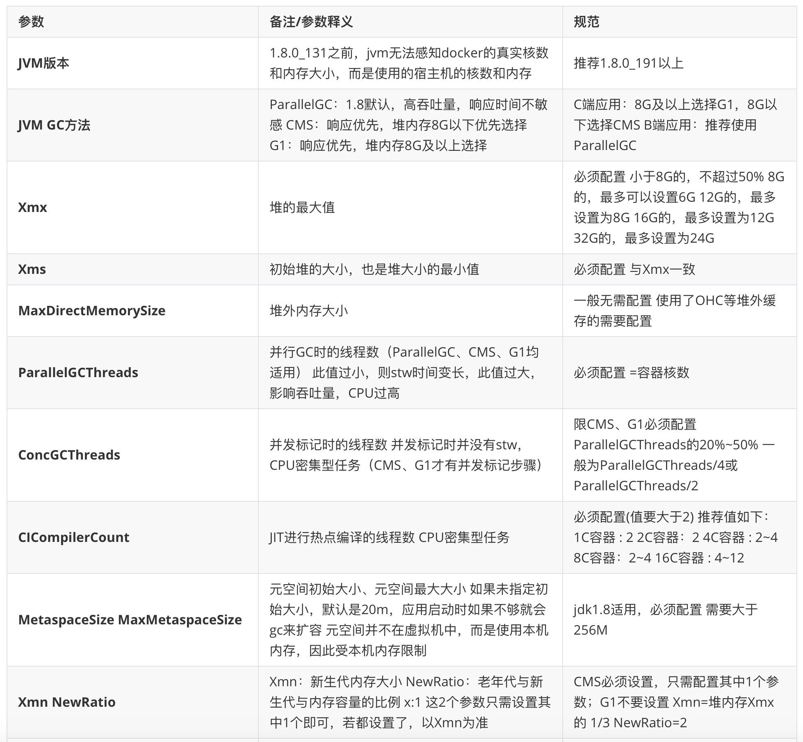
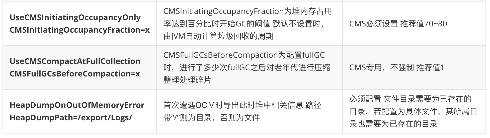

# 👌你知道一些jvm常用参数调优参数吗？

[此处为语雀卡片，点击链接查看](https://www.yuque.com/jingdianjichi/xyxdsi/yntrug40p3uzgz2g#I7Q20)

本性能优化案例是通用的！大家消化完成，直接套到自己项目即可！

本题配备了视频助于理解。

鸡翅老哥给大家带来一个我们内部探索出来的重点参数的最佳实践，面试出去吹牛逼，秒杀一大片。

不需要大家全背，要求大家背其中几个重点。给大家整理一个口语化的回答。

当面试问到这个问题的时候，你可以这样的进行回答。

# 面试口语化回答
是的，面试官，我熟悉一些比较常见的 jvm 调用参数，他们可以对我们的 jvm 有很大的一部分提升。比如从 jvm 的版本上来说，推荐使用 1.8.0_191 以上。再往前的版本无法感知 docker 的真实核数，可能会产生一些问题。其次就是 gc 的一个选择。正常的话，如果是 c 端， 8g 以上，推荐 g1，以下推荐 cms。如果是 b 段 推荐 parallelgc。还有就是常见的 xmx 和 xms 设置一致（这里说完下个问题，面试官可能会问你为啥一致了就）。xmx 的配置，不要配最大值，一定要按照比例。常见的 8g 服务器，配置 6 g 即可。还有一个比较常见的就是 parallelgcthreads，这个最好是等于容器核数，值太小就会 stw 时间变长。太大，又会影响吞吐量。以上就是我对常见的 jvm 调用参数的一些理解。

# 详细的一个参数对比表格
如果还有自己比较熟悉的想往上面补充的，可以自己选择一些，一般上面的这些和面试官回答就够了。

  

> 原文: <https://www.yuque.com/jingdianjichi/xyxdsi/yntrug40p3uzgz2g>