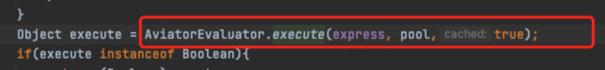

# 👌动态类导致的fullgc频繁案例

[此处为语雀卡片，点击链接查看](https://www.yuque.com/jingdianjichi/xyxdsi/mikudgt4d28fwa4q#vF4rI)

这道题也是一样的，当你简历写了 jvm 调优，ok，好好背这几个案例！阅读完本篇，你会对 jvm 的元空间有一定的理解！

本案例为：动态类导致的fullgc频繁案例

本性能优化案例是通用的！大家消化完成，直接套到自己项目即可！

本题配备了视频助于理解。

# 背景
还是可以沿用上道题的一个背景，我手里当时负责了一个运营系统，这个系统主要是承担营销活动相关配置的一个功能系统。还算是比较重要，毕竟活动配置不了也会影响整体的运营功能。最近发现，这个系统每 1 小时会产生一次 fullgc，这个频率有点高，还是要继续看一下。

> 知识点：
>
> fullgc 触发的条件有哪些？主要是以下几种。
>
> 1.Minor GC触发条件：当Eden区满时，触发Minor GC。
>
> 2.Full GC触发条件：
>
> 1.（1）调用[System.gc](http://system.gc/)()时，系统建议执行Full GC，但是不必然执行
>
> 2.（2）老年代空间不足
>
> 3.（3）方法区空间不足
>
> 4.（4）通过Minor GC后进入老年代的平均大小大于老年代的可用内存
>
> 5.（5）由Eden区、From Space区向To Space区复制时，对象大小大于To Space可用内存，则把该对象转存到老年代
>

通过观察，我发现代码没有调用，第一种排除，老年代空间也 ok，第二种也排除。接下来看第三种，一看就发现元空间在频繁变动，而且达到300M左右时会触发一次FullGC释放掉。

排查发现，这里没有配置元空间的大小，也没有配置元空间，理论上元空间无限大，不会满，查询资料后解释是，元空间也会根据当前已使用进行动态调整，当达到上次调整值90%后就会FullGC，所以每次FullGC元空间大小在200M到500M不等。

# 排查猜测
这时猜测可能是代码中出现了大量的动态类的声明，想要定位哪些类需要jvm启动参数加上打印类加载和卸载的参数,顺带把GC日志开关也打开

-XX:+TraceClassUnloading -XX:+TraceClassLoading -XX:+PrintGCDetails

打开后查看日志发现一个频繁加载和卸载的类[com.googlecode.aviator.Expression], 经查询资料,这个是aviator 工具的一个规则引擎类，在加载规则时会动态加载一个类，默认不使用缓存，可以打开缓存防止频繁声明新类 

修改代码后重新部署，一小时一次的FullGC也没了。 

> 原文: <https://www.yuque.com/jingdianjichi/xyxdsi/mikudgt4d28fwa4q>