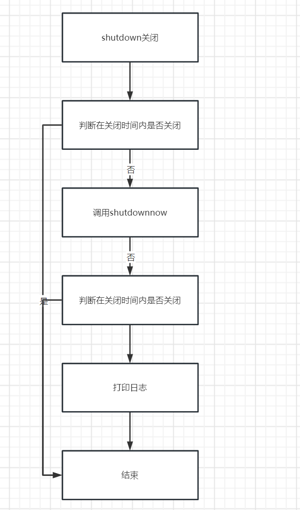

# 👌线程池关闭优化的优雅实现

[此处为语雀卡片，点击链接查看](https://www.yuque.com/jingdianjichi/xyxdsi/ctl1t35tpync7f16#t7A4u)

在之前，我们介绍了线程池关闭涉及的几种api，那么我们如何把它们结合起来进行线程池关闭呢？这里鸡翅老哥给大家写了一个工具类。整体的思路是，我们的入参要传入线程池pool，线程关闭时间，立即关闭线程的时间，还有时间单位。其中线程关闭和立即关闭线程的时间是为了应对shutdown与shutdownnow来进行调整。

整体思路如下：除了流程图的主干流程，我们还要考虑，假设当前的线程正在使用工具类的关闭，但是当前线程被中断了。我们同样的也考虑这种情况，catch住后，对其进行shutdown操作。

  




```plain
public class ThreadPoolUtils {
        private ThreadPoolUtils() {
        }
        
        public static void shutdownPool(ExecutorService pool, int shutdownTimeout, int shutdownNowTimeout, TimeUnit timeUnit) {
            pool.shutdown();
            try {
                if (!pool.awaitTermination(shutdownTimeout, timeUnit)) {
                    pool.shutdownNow();
                    if (!pool.awaitTermination(shutdownNowTimeout, timeUnit)) {
                        log.error("ThreadPoolUtils.shutdownPool.error");
                    }
                }
            } catch (InterruptedException ie) {
                log.error("ThreadPoolUtils.shutdownPool.interrupted.error:{}", ie.getMessage(), ie);
                pool.shutdownNow();
                Thread.currentThread().interrupt();
            }
        }
    }
```

  


> 原文: <https://www.yuque.com/jingdianjichi/xyxdsi/ctl1t35tpync7f16>