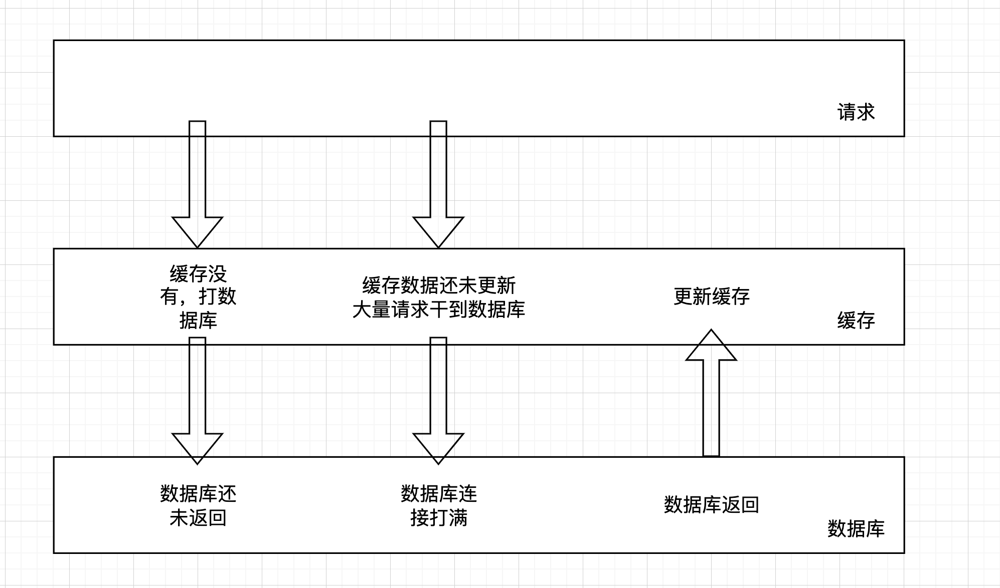
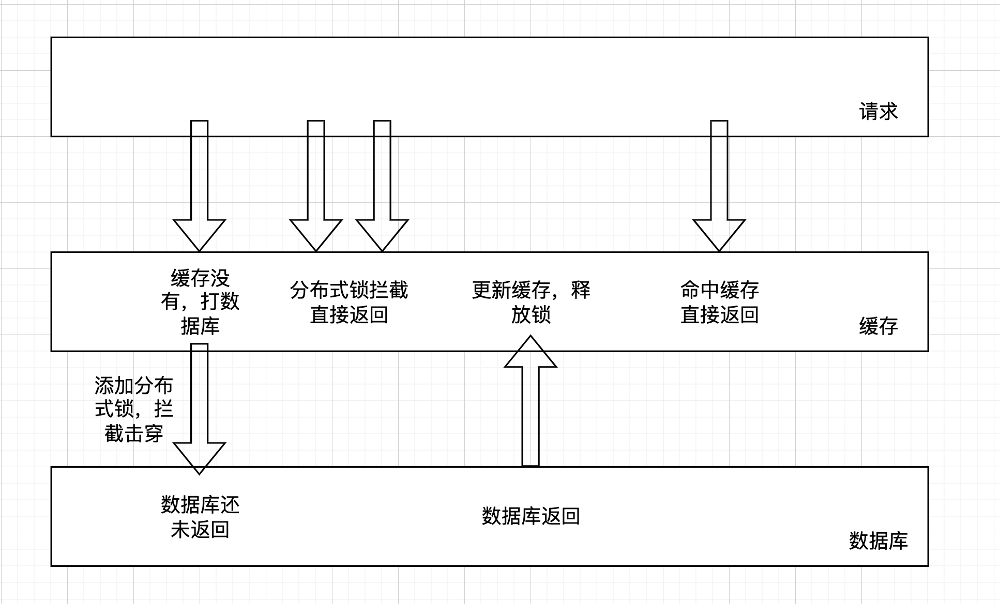

# 👌商品场次变更造成的缓存击穿问题排查

[此处为语雀卡片，点击链接查看](https://www.yuque.com/jingdianjichi/xyxdsi/twa9gl6wze2poitn#gIUHf)

# 背景
想到一个缓存击穿的案例，大家应该或多或少听说过社区团购，比如多多买菜。

点进去一个商品之后，会发现他的模式是当天23点之前购买，第二天16点取货。

这个23点的概念，其实比较有意思，每到23点相当于今天卖完结束了，会更新出一批新品，来进行展示，回想刚才的首页商品列表，其实是昨天场次的商品。一旦到了23点会进行品类的刷新。这个时候23点就会进行大量的商品信息查询，假设现在一个热销商品会展示在大部分用户的商品列表里面。但是商品的其中一个信息，比如他的一个标签【最近300人买过】，这个数据没有提前进行数据缓存的预热。此时就会造成在切换商品的一瞬间，大量的请求都来请求这个商品的标签，又没有缓存，就会到数据库，这个就叫缓存击穿。

很多小伙伴会说，这个很穿透差不多吧。二者的区别在于，一瞬间请求全部过来，虽然有查询数据库后，放入缓存的逻辑，但是数据库查询和放入缓存是需要时间的，在这之前，请求会全部干到数据库，这叫击穿。没有时间限制，有不存在的数据打到数据库，这叫穿透。

#   
方案解决
那么如何解决呢？为了避免缓存击穿，可以在数据库返回结果到缓存数据更新这个间隙期间增加分布式锁来解决，当缓存数据更新完成释放分布式锁，在加锁期间所有请求直接返回起到保护数据库的作用，这里特别注意的是对分布式锁要设置合理地过期时间，比如可能这个业务请求在1s内可以完成，那么可以设置5s，在较长的时间内确保可以完成缓存更新操作即可，完成后主动移除分布式锁，所有的分布式锁都要设置合理的过期时间避免产生“死锁”使业务逻辑产生问题。

  

除了分布式锁来控制防止缓存穿透问题的出现，还可以在查询缓存没有时直接将缓存更新成空值，确保其他线程请求后直接返回空值起到保护数据库的作用，之后当前线程查询到数据库数据直接返回更新缓存成真实数据，如果没查到也不进行缓存更新了。

  

  

  

  

> 原文: <https://www.yuque.com/jingdianjichi/xyxdsi/twa9gl6wze2poitn>