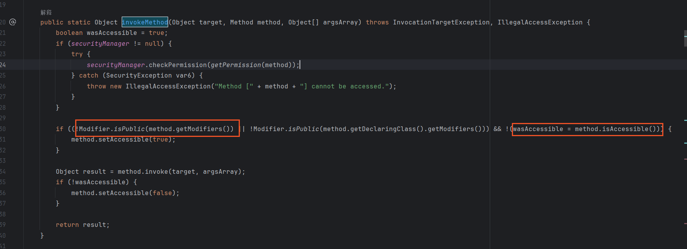

# 👌排查出Mybatis老版本的源码bug

# <font style="color:rgba(0, 0, 0, 0.85);">问题背景</font>
<font style="color:rgb(47, 48, 52);">我们有这样一个场景，先去查符合条件的商户 id，然后再根据商户 id 去查订单信息，采取的是 sql 的 in 的方式，来查询。</font>

<font style="color:rgb(47, 48, 52);">select * from order where shop_id in (xx,xx,xx);</font>

<font style="color:rgb(47, 48, 52);">类似上面的这个情况。in 中的数据比较大。在这个过程中外面业务层，通过ist.partition对数据进行拆分。</font>

<font style="color:rgb(47, 48, 52);">然后执行 sql。发现偶然会产生报错。</font>

```plain
List<List<Long>> splitList = Lists.partition(shopIdList, 50);
for (List<Long> shopIds : splitList ) {
   List<PO> shopInfoList = mapper.query(shopIds);
}
```

其中的 sql 判断如下：

```plain
 <if test="shopIds != null and shopIds.size() > 0">
 </if>
```

<font style="color:rgb(47, 48, 52);">报错信息</font>

```plain
Error evaluating expression 'shopIds != null and shopIds.size() > 0'. 
 Cause: org.apache.ibatis.ognl.MethodFailedException: 
 Method "size" failed for object [123，456，789] 
 [java.lang.IllegalAccessException: Class org.apache.ibatis.ognl.OgnlRuntime can not access a member of class java.util.ArrayList$SubList with modifiers "public"]
```

# <font style="color:rgba(0, 0, 0, 0.85);">具体分析</font><font style="color:rgb(47, 48, 52);"></font>
先给大家附上 github 的 bug 原地址～

[https://github.com/mybatis/mybatis-3/pull/384](https://github.com/mybatis/mybatis-3/pull/384)

<font style="color:rgb(47, 48, 52);">1、报错信息分析</font>

类org.apache.ibatis.ognl.OgnlRuntime不能访问类java.util的成员。ArrayList$SubList与修饰符"public"]

<font style="color:rgb(47, 48, 52);">2、奇怪的点</font>

<font style="color:rgb(47, 48, 52);">既然无法访问对象subList，应当每次报错，而不是偶发性。</font>

<font style="color:rgb(47, 48, 52);">3、源码分析</font>

<font style="color:rgb(47, 48, 52);">myBatis版本3.2.3</font>



<font style="color:rgb(47, 48, 52);">  
</font><font style="color:rgb(47, 48, 52);">subList 对象修饰符为private，size() 方法修饰符为public。</font>

<font style="color:rgb(47, 48, 52);">java.lang.reflect.Method.getModifiers()方法返回由此Method对象表示的方法的Java语言修饰符转为的整数值。</font>

<font style="color:rgb(47, 48, 52);">java.lang.reflect.AccessibleObject#isAccessible返回改对象的 accessible 修饰符</font>

<font style="color:rgb(47, 48, 52);">例如：</font>

<font style="color:rgb(47, 48, 52);">线程1执行完Modifier.isPublic(method.getModifiers()为true,setAccessible（true）, 暂停线程1</font>

<font style="color:rgb(47, 48, 52);">线程2执行 method.isAccessible()为false, setAccessible（false）</font>

<font style="color:rgb(47, 48, 52);">线程1继续执行method.invoke导致报错。  
</font>


```plain
     if (syncInvoke) {
        synchronized(method) {
            method.setAccessible(true);
            try {
                result = method.invoke(target, argsArray);
            } finally {
                method.setAccessible(false);
            }
        }
    } else {
        result = method.invoke(target, argsArray);
    }
```

<font style="color:rgb(47, 48, 52);">myBatis版本3.5.0新增synchronized(method)避免线程并发问题，解决这个问题。</font>

# <font style="color:rgba(0, 0, 0, 0.85);">总结</font><font style="color:rgb(47, 48, 52);"></font>
1、mybatis传入对象的方法和类修饰符不一致，会存在并发问题

2、解决方法：升级 mybatis 版本 or 使用hutool拆分数组方法 or 其他方法new ArrayList()，避免传入subList


> 原文: <https://www.yuque.com/jingdianjichi/xyxdsi/fspp108ycbh7lons>