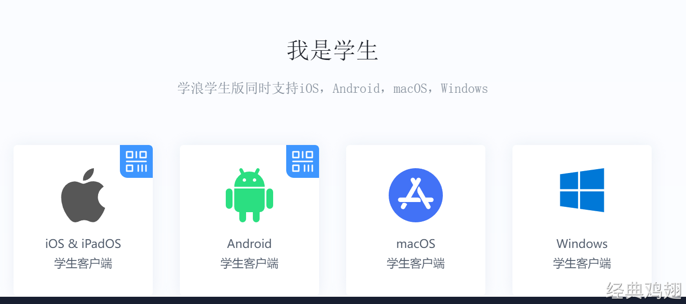

# 👌九股文的学习方式

[此处为语雀卡片，点击链接查看](https://www.yuque.com/jingdianjichi/xyxdsi/ob5xvlv1ou6c2iuc#ZXidN)

好了好了，hold on hold on～～。

大家看到这里，刚才的必读已经读过了吧！没读过的话，读一下，再看这篇！

[必读！致即将上岸小伙伴们的一封信](https://www.yuque.com/jingdianjichi/zh4784/uwgw5llqam78pr4u)

那么我拿到这份资料之后，到底应该如何学习呢？

首先为了避免像其他面试文档一样，给你一份全是题目的文档，你看也不知道看哪，也不知道从哪下手，也不知道哪里是重点。我给大家规划了各个步骤的时间节点。

# 定位自己年限
首先大家在准备面试的时候，对自己一定要做一个最清晰的定位。不同的年限，看的东西一定是不一样的。很多题你的年限没必要看，也不会考。所以基于自身情况可以快速突击。

大家一定要选择一个自己的年限。然后就可以快速的找到自己应该看什么。

# 加鸡哥
这个步骤很重要，因为这个九股文，不仅仅是一份题目一份学习资料，更多的是一个社群服务，一个大家沟通与交流的桥梁，一个组织过程资产的传承。

# 进入一个社群
加了鸡哥之后，备注为 九股文。说明一下自己在上面选择的年限情况，比如 1 年经验，鸡哥会给你拉入社群中。

同时鸡哥还会定时发布训练营打卡学习社群群聊，直接在鸡哥朋友圈扫码加入即可。

比如你这周想学习，就可以直接加入，你这周不想学习，就可以等下一周再进行学习。

# 按照时间表制定一个计划
之前做过一个调研，大多数人不希望在八股文上花太多的时间，因为背了也会忘，忘了还要继续背。短时间快速突击，比战线拉长好的很多。所以我根据不同年限的人，准备了一份，每个专题，每个题要花多少时间的一个时间表，大家要按照自己预计介入的时间，来进行制定。

比如时间表上，jvm 需要 1 天的时间学完。

你是打算 7 月 1 号介入学习，那么你自己的时间规划表，应该就是 7 月 1 号～7 月 2 号，专攻这个 jvm！其他专题也是以此类推，按照鸡哥给大家设计的时间表走。就会拿到一个很好的结果。

# 每周与鸡哥交流经验情况
我为什么做了一个这个东西呢？因为大多数市面上的八股文，只是一份文档，一份资料。没有人带你，也没有人愿意花精力和你交流。鸡哥打算突破这个模式！每周周末会花 1～2 个小时，进行交流相关情况。每周会采取直播的形式发给大家，让大家加入。

在面试过程中，其实是会遇到各种各样的问题，并不是一份文档就能解决的。看的时候，哪里不懂，哪里不明白，这都需要大家的介入和学习。

# 观看视频的方式
是的，九股文，不只是文档，还有视频。视频的目的是讲重点和难点。解决文字的晦涩难懂。

观看视频两种方式，第一种：抖音订单去学习 第二种 学浪 学生版（支持电脑看）

学浪下载地址：

[学浪官网](https://www.xuelangapp.com/download)

祝大家早日上岸！！！！

> 原文: <https://www.yuque.com/jingdianjichi/xyxdsi/ob5xvlv1ou6c2iuc>