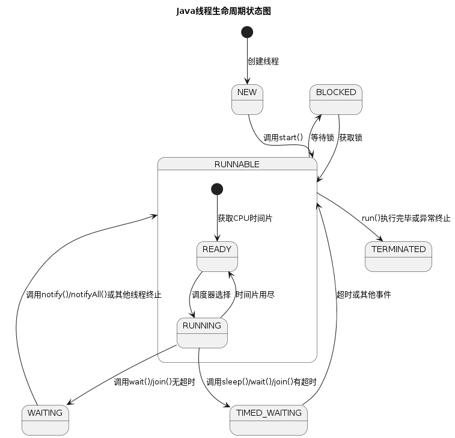

# 👌Java多线程的生命周期是什么

# 题目详细答案


在Java中，线程的生命周期包括多个状态，每个状态表示线程在其生命周期中的不同阶段。线程的生命周期状态主要包括：

1. **新建（New）**
2. **就绪（Runnable）**
3. **运行（Running）**
4. **阻塞（Blocked）**
5. **等待（Waiting）**
6. **超时等待（Timed Waiting）**
7. **终止（Terminated）**

## 线程状态详解
### 新建（New）
当一个线程对象被创建时（例如，通过new Thread()），线程处于新建状态。此时，线程还没有开始运行。

### 就绪（Runnable）
当调用start()方法后，线程进入就绪状态。线程在就绪状态下等待操作系统的线程调度器将其调度到CPU上执行。注意：在Java中，Runnable状态包括了运行状态（Running），即线程可以运行，也可能正在运行。

### 运行（Running）
当线程获得CPU时间片并开始执行其run()方法时，线程进入运行状态。线程在这个状态下实际执行任务。

### 阻塞（Blocked）
线程在等待一个监视器锁（monitor lock）时进入阻塞状态。例如，线程试图进入一个synchronized方法或块，但其他线程已经持有了该对象的锁。

### 等待（Waiting）
线程无限期地等待另一个线程显式地唤醒它时进入等待状态。例如，调用Object.wait()方法，或者Thread.join()方法（不带超时时间），或者LockSupport.park()方法。

### 超时等待（Timed Waiting）
线程在等待另一个线程显式地唤醒它，或者等待特定的时间段后自动唤醒时进入超时等待状态。例如，调用Thread.sleep(long millis)方法，Object.wait(long timeout)方法，Thread.join(long millis)方法，或者LockSupport.parkNanos(long nanos)方法。

### 终止（Terminated）
当线程的run()方法执行完毕或者抛出未捕获的异常时，线程进入终止状态。线程在这个状态下不再执行任何任务。

## 线程状态转换示意图
```plain
+-------+    start()    +---------+  CPU调度  +---------+
| New   | ------------> | Runnable| --------> | Running |
+-------+               +---------+           +---------+
                           ^  |                    |
                           |  |     进入锁池       |
                           |  +--------------------+
                           |                       |
                           |                       v
                           |                   +--------+
                           |                   | Blocked|
                           |                   +--------+
                           |                       ^
                           |                       |
                           |    释放锁，进入就绪    |
                           |                       |
                           +-----------------------+
```

## 代码 Demo
```plain
public class ThreadLifecycleDemo {
    public static void main(String[] args) {
        Thread thread = new Thread(() -> {
            try {
                // 运行状态
                System.out.println("Thread is running");
                // 进入超时等待状态
                Thread.sleep(1000);
                // 运行状态
                System.out.println("Thread woke up");
            } catch (InterruptedException e) {
                e.printStackTrace();
            }
        });

        // 新建状态
        System.out.println("Thread state: " + thread.getState());
        thread.start();
        
        // 就绪状态
        System.out.println("Thread state after start: " + thread.getState());
        
        try {
            // 主线程等待子线程完成，超时等待状态
            thread.join();
        } catch (InterruptedException e) {
            e.printStackTrace();
        }
        
        // 终止状态
        System.out.println("Thread state after completion: " + thread.getState());
    }
}
```


> 原文: <https://www.yuque.com/jingdianjichi/xyxdsi/sokhb00wxsdymp59>