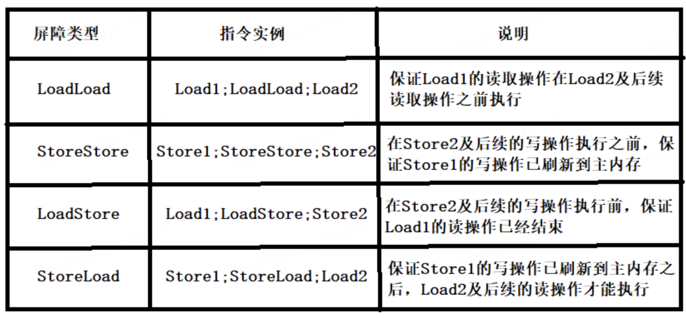

# 👌volatile如何防止了指令重排

# 题目详细答案
在Java中，volatile关键字用于修饰变量，以确保对该变量的读写操作具有可见性和有序性。具体来说，volatile变量的读写操作会有以下两个主要特性：

1. **可见性**：当一个线程修改了volatile变量的值，新的值对于其他所有线程立即可见。
2. **有序性**：volatile关键字可以防止指令重排，从而保证代码执行的顺序性。

## 防止指令重排
volatile关键字防止指令重排的机制主要依赖于内存屏障（Memory Barriers，也称为内存栅栏）。内存屏障是一种指令，用于限制处理器和编译器对指令的重排序行为。

### 内存屏障的作用
内存屏障分为四种类型：

**LoadLoad Barrier**：确保在此屏障之前的所有读操作在屏障之后的读操作之前完成。

**StoreStore Barrier**：确保在此屏障之前的所有写操作在屏障之后的写操作之前完成。

**LoadStore Barrier**：确保在此屏障之前的所有读操作在屏障之后的写操作之前完成。

**StoreLoad Barrier**：确保在此屏障之前的所有写操作在屏障之后的读操作之前完成。

在Java中，volatile变量的读写操作会插入特定的内存屏障，以确保有序性：

**读屏障**

**在每个volatile读操作的后面插入一个loadload屏障，禁止处理器把上面的volatile读与下面的普通读重排序。**

**在每个volatile读操作的后面插入一个loadstore屏障，禁止处理器把上面的volatile读与下面的普通写重排序。**

**写屏障**

**在每个volatile写操作的前面插入一个storestore屏障，可以保证在volatile写之前，其前面的所有普通写操作都已经刷新到主内存中。**

**在每个volatile写操作的后面插入一个storeload屏障，作用是避免volatile写与后面可能有的volatile读/写操作重排）**

> 原文: <https://www.yuque.com/jingdianjichi/xyxdsi/fbu92tf6up3ik2bm>