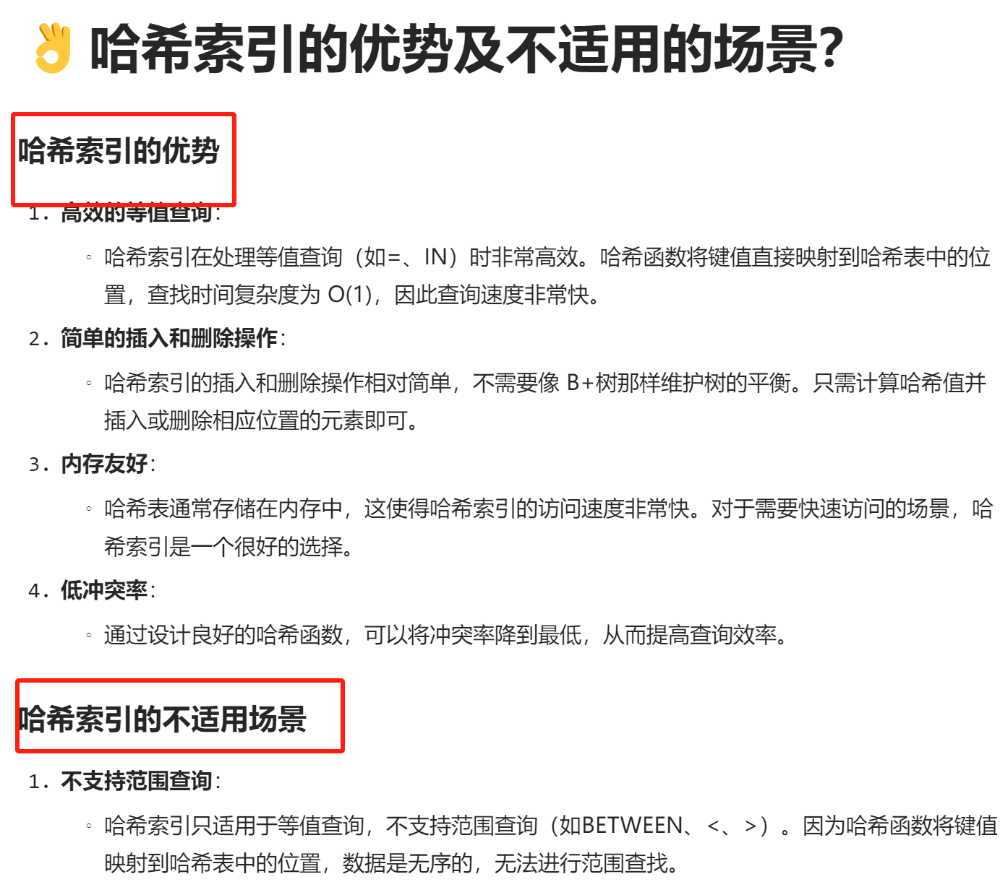
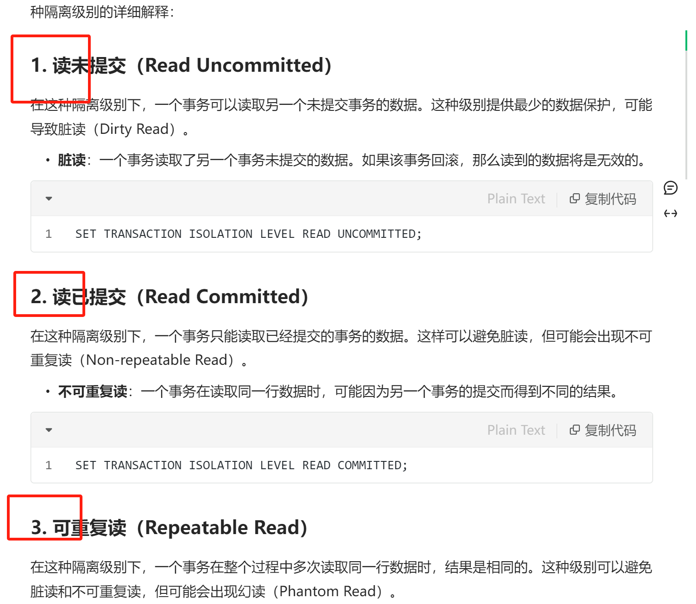
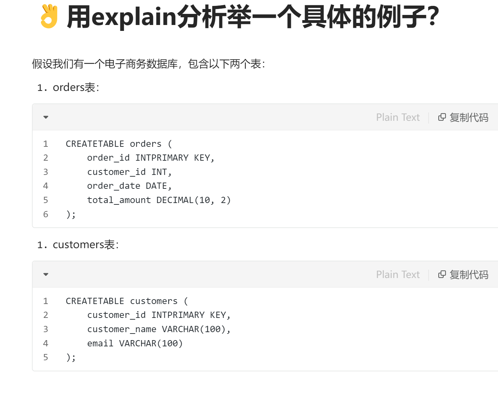
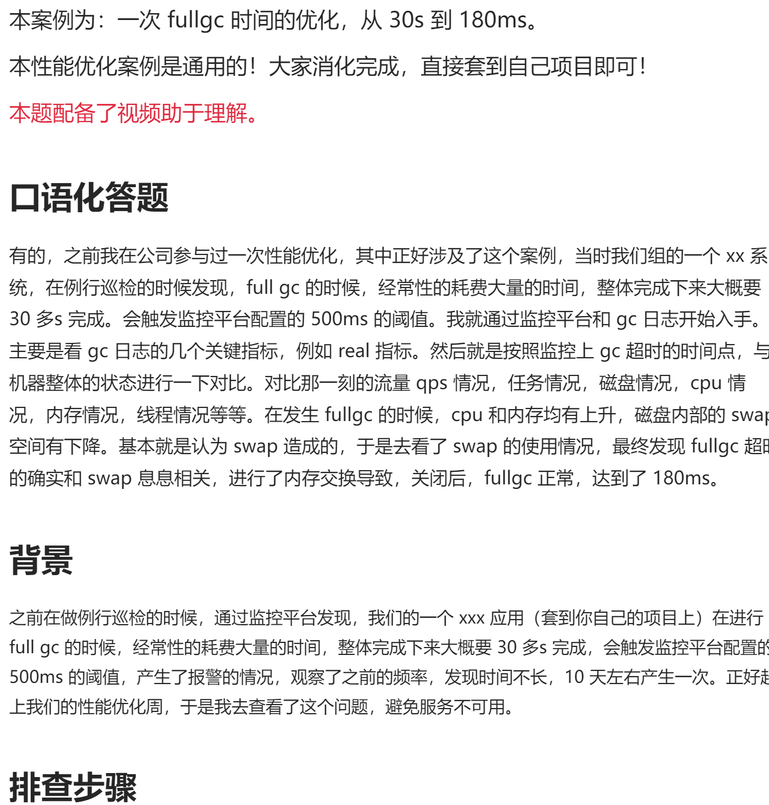
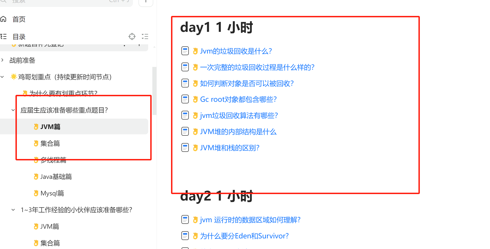

# 👌文档食用说明

一份好的文档应该是什么样子的，在做这个之前，我调研了很多，也参考了平时公司的文档规范。

发现大家针对八股文的学习，主要的几个吐槽点就是

1. 其他产品的字太多了，密密麻麻，不分点写。
2. 要么就是内容放到一坨，需要仔细的读完一坨，才知道这道题的内容在讲什么
3. 废话有点多，比如很多文档为了，让自己的字数看起来多，或者看起来很“真诚”，写了一堆废话的例子，画蛇添足。
4. 文档格式不统一，很多竞品是很多人组建起来的，发起者没有制定规范，导致风格不同，这个专题是一个风格，另一个专题，又是另一个风格。

鸡哥希望可以解决这个问题。

为此，我做了以下几点

1. 每道题的内容按知识点进行拆分，比如熟悉一个知识点的优势和劣势，会拆分两个来进行讲解。

2. 所有的知识点，尽量按照 1,2,3,4 这种数字的方式来进行讲解。

3. 配备必要的代码讲解

4. 场景题配备口语化答案和详细的背景

5. 会给大家根据不同的年限画好重点

# 最后大家有什么问题，都可以及时联系鸡哥哦

> 原文: <https://www.yuque.com/jingdianjichi/xyxdsi/glxd5yr2gwvkqbwe>