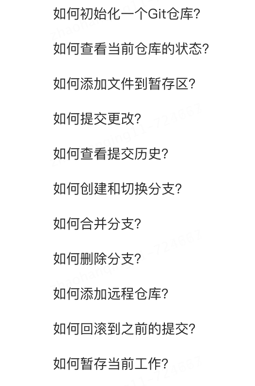

# 版本release公告

| 版本 | 更新内容 | 状态 |
| --- | --- | --- |
| 设计模式题目 | 
 | 完成 |
| spring 框架 1.1 版本 | 口语化内容+题目解析+面试得分点 | 完成 |
| git 分类更新 |  | 完成 |
| 补充新题目 |  | 完成 |
| mq 画重点 | 不同年限的重点突击内容 | 完成 |
| mq1.1 版本 | 视频 | 完成 |
| mq1.1 版本 | 口语化内容 | 完成 |
| mq 1.1 版本 | 详细答案 | 完成 |
| java 基础 | 1.1 版本 | 完成 |
| redis 1.1 版本 | 口语化内容+29 个视频 | 完成 |
| 九股文整体 1.0 版本 | 700 多道题 | 完成 |

> 原文: <https://www.yuque.com/jingdianjichi/xyxdsi/ugt1ayuyxdgd132i>